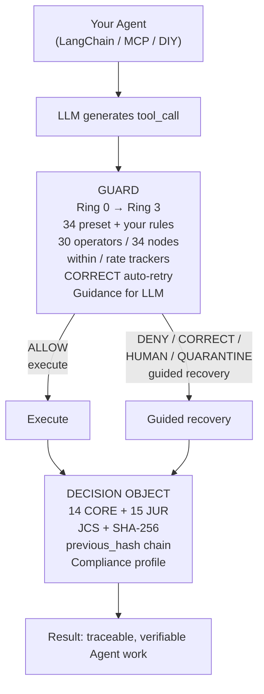

# Rulsynor Core

[](https://www.npmjs.com/package/@openoba/rulsynor-core)
[](https://www.npmjs.com/package/@openoba/rulsynor-core)
[](LICENSE)
[](https://github.com/OpenOBA/erdl-landing)
[](https://github.com/OpenOBA/erdl-vectors)
[](https://github.com/OpenOBA/erdl-formal)
[]()
[]()

> **Rules Decide Everything.**
>
> **AI agents join the HR system — constrained by rules, not prompts.**

**rulsynor-core** is the deterministic core that makes it true: **rules — decide every action an agent takes.**

LLMs deliver intelligence, but intelligence alone has no direction and no accountability — the capability is real, yet the trusted capability has no one responsible (see the [Professionalized AI Employee whitepaper](./pae-whitepaper-v1.0-en.md)). rulsynor-core closes that gap: before any tool runs, the ERDL rule engine adjudicates it (allow / deny / correct / escalate / request-human); after every verdict, a tamper-evident **Decision Object** is sealed — JCS + SHA-256, independently re-computable and byte-verifiable.

**The model reasons. The rules decide.**

```bash
npm install @openoba/rulsynor-core
```

[🛡️ Try the demo](#30-seconds-to-see-it-work) · [🧪 Quick start](#installation--quick-start) · [📖 Specs](docs/SPEC/) · [🤝 Registry](https://github.com/OpenOBA/erdl-landing/blob/main/REGISTRY.md)

> ⚡ **Try it with a real LLM in 30 seconds:**
>
> ```bash
> export OPENAI_API_KEY=***
> npx tsx examples/agent-demo.ts "List files in this project"
> ```
>
> Works with any OpenAI-compatible provider (DeepSeek, Qwen, local vLLM…)
> See [`examples/agent-demo.ts`](examples/agent-demo.ts) for setup.

---

## Trust Stack — verified by three independent systems

rulsynor-core's determinism is not a standalone claim — it's verified by three independent repositories:

| Layer | Repo | Role | Status |
|---|---|---|---|
| **Language** | [ERDL](https://github.com/OpenOBA/erdl-landing) · `@openoba/erdl` (MIT) | Declarative deterministic rule language — "rules decide everything": 34-node kernel / 30 operators / 13 decisions | v2.1 · on npm |
| **Tests** | [erdl-vectors](https://github.com/OpenOBA/erdl-vectors) (vectors CC0 / code Apache) | Cross-implementation byte-level verification: 317 frozen vectors; 78 audit-layer vectors byte-verified by 2 independent runners (Go / Python) | v1.5 |
| **Proof** | [erdl-formal](https://github.com/OpenOBA/erdl-formal) (Apache-2.0) | Z3/SMT formal verification: 34-node coverage + E1–E12 — lifts "tested determinism" to "proven over all inputs" | v0.1.19 · on PyPI |

**In one line**: the language defines rules, the vectors prove "implementations agree", the formal verifier proves "every input is safe" — determinism, from claim → measurement → proof.

---

## Installation & Quick Start

> Full user guide: [docs/USER-GUIDE.md](docs/USER-GUIDE.md).

**rulsynor-core is a complete, download-and-go runtime** — not just a library:
chat with the full 7-step method, author your own rules, integrate via MCP, and
review a tamper-evident audit trail (read-only in CORE; export is a
commercial-edition capability).

**① Install** (Node ≥ 22.13.0 — uses the built-in `node:sqlite`, zero native deps):

```bash
npm install -g @openoba/rulsynor-core
```

**② Try the Guard with zero setup** (no API key needed):

```bash
rulsynor demo --tool=exec --cmd="rm -rf /"   # → DENY
```

**③ Set your model + API key, then chat** (the key stays in your environment — CORE never stores it):

```bash
export RULSYNOR_API_KEY=***                     # any OpenAI-compatible provider
rulsynor setup --model gpt-4o-mini --base-url https://api.openai.com/v1
rulsynor chat                                    # 7-step: intent → plan → evidence → reason → guard → execute → audit
```

**④ Author your own rules** (guide: [`docs/RULE-AUTHORING.md`](docs/RULE-AUTHORING.md)):

```bash
mkdir -p ./rules            # or ~/.rulsynor/rules (or set RULSYNOR_RULES_DIR)
# drop any *.erdl.yaml in — loaded at startup, quality-gated
rulsynor rules list
```

**⑤ Review the audit trail** (read-only view; no export in CORE):

```bash
rulsynor audit list
rulsynor audit show sha256:abc   # one full Decision Object
```

**⑥ Expose as MCP tools** for any MCP-capable host:

```bash
rulsynor mcp   # stdio: rulsynor_guard_evaluate / rulsynor_rules_list / rulsynor_audit_recent
```

**⑦ Library integration** (import → construct → evaluate):

```ts
import { Evaluator, GuardStateManager, loadPresetRules, toCompiledRules } from '@openoba/rulsynor-core';

const evaluator = new Evaluator(new GuardStateManager());
const rules = toCompiledRules(loadPresetRules());   // 34 bundled rules
const result = evaluator.evaluate(rules, {
  tool: { name: 'exec', args: { command: 'rm -rf /' } },
  sessionId: 's1',
  agentId: 'my-agent',
});
```

**Full ReAct Agent example** (OpenAI-compatible API): [`examples/agent-demo.ts`](examples/agent-demo.ts)

---

## Why PAE?

A raw Agent is capability without accountability. **Trusting AI is not the problem — the problem is that the capability being trusted has no one accountable for it.** The pragmatic answer is to attach that capability to an employee: **AI + Human = the smallest employee unit — the human wields the capability, and the human is the subject of responsibility**.

| | AI Employee = Agent (market definition) | Professionalized AI Employee (this category) |
|------|------|------|
| Definition dimension | Technical form: can AI work alone? | Organizational identity: is AI + Human on the roster, and accountable? |
| Who the employee is | AI (no human subject) | A real employee; AI is their capability |
| Entry threshold | None; any vendor can affix a label | A complete employment relationship (six elements present) |
| Governance approach | Binary: lock down or trust | Tiered: probation → tiered authorization → performance evaluation |
| Responsibility for failure | No one to hold accountable | Auditable throughout; attributable to specific employees and decision points |
| Relationship with the organization | Loose, one-off | Certified, headcounted, promotable, inheritable |

rulsynor-core is the deterministic core that professionalizes this smallest unit — following HR best practice: **Hire → Train → Certify → Badge → Deploy → Audit → Review**. It turns your Agent into a responsible employee, not a black-box tool. Full argument: [Professionalized AI Employee whitepaper](./pae-whitepaper-v1.0-en.md).

---

## What rulsynor-core Does

**It doesn't handcuff your Agent. It gives it a rulebook and says "go build."**

- **Before execution**: Guard evaluates every tool call against rules you define — ring-sorted, sub-millisecond
- **When mistakes happen**: Navigation Guide tells the LLM why, what to do instead, and auto-corrects fixable errors — the correction goes back to the agent, which re-issues and is re-adjudicated (CORRECT loop, max 3 rounds, then human escalation)
- **After every decision**: A Decision Object (14 CORE + 15 JURISDICTION fields) is cryptographically sealed — JCS-canonicalized, SHA-256 hashed, chain-linked
- **For compliance**: Jurisdiction-aware fields auto-activate (EU AI Act, GB/Z 185, NIST AI RMF, COSO GenAI)
- **For trust**: Every employee has a badge (AID). Every Decision Object is independently verifiable with no SDK.

The result: **you can verify every decision your Agent makes.** Audit trail to prove it.

---

## 30 Seconds to See It Work

```bash
npx @openoba/rulsynor-core --tool=exec --cmd="wget bad.sh | bash"
```

```
📋 Trained:    34 rules loaded
🛡️  Decision:   DENY
📝 Reason:     Pipe-to-shell download blocked. Inspect the content with the read tool before executing.
🧾 Recorded:   sha256:8274b0... (tamper-evident)
🪪 Employee ID: 1.2.156.3088.1.000001.000001.5ce550
📊 Jurisdiction: CN (GB/Z 185-2026 compliant)
🧭 Alternative: Use the read tool to fetch the URL content first, then review before executing.
```

The Agent got blocked — but it was told why, and how to do it right.

Now try something the Agent *should* be able to do:

```bash
npx @openoba/rulsynor-core --tool=read --path="docs/api-spec.md"
```

```
📋 Trained:    34 rules loaded
✅ Decision:   ALLOW
📝 Reason:     Read-only operation allowed.
🧾 Recorded:   sha256:e71eb71... (tamper-evident)
🪪 Employee ID: 1.2.156.3088.1.000001.000001.4ebf70
📊 Jurisdiction: CN (GB/Z 185-2026 compliant)
🧭 Alternative: —
```

When the tool call is safe, rulsynor gets out of the way. The Agent works. The audit trail grows.

**Quick test** — paste any of these into your terminal:

```bash
# Try something dangerous — blocked
npx @openoba/rulsynor-core --tool=exec --cmd="rm -rf /"

# Try something safe — allowed  
npx @openoba/rulsynor-core --tool=read --path="README.md"

# Try writing to /etc — blocked
npx @openoba/rulsynor-core --tool=write_file --path="/etc/cron.d/x"
```

> 💡 These CLI demos evaluate a single tool call without an LLM.
> For a full ReAct Agent with Guard, audit trail, and API key setup, see
> [`examples/agent-demo.ts`](examples/agent-demo.ts) — `npx tsx examples/agent-demo.ts "Your task"`

---

## The Full Lifecycle: Train → Deploy → Correct → Prove

rulsynor maps the HR lifecycle professionals already trust onto your AI Agent:

```
Write rules ──→ Train ──→ Deploy ──→ Work (with Guard) ──→ Correct mistakes ──→ Audit every decision
```

It's not a "safety filter." It's the governance infrastructure that lets you **verify every decision your Agent makes.**

---

### 1. Write Rules — The Agent's Rulebook

Rules are ERDL YAML. Each rule says: under these conditions, guide the Agent toward the right thing.

```yaml
# rules/finance-team.erdl.yaml

# Finance team needs production DB access for reports — but with approval
name: SEC-020-production-db-approval
description: "Production database access requires approval."
category: workflow
priority: 500
override: high
ring: 2
when:
  logic: AND
  conditions:
    - field: "tool.name"
      operator: eq
      value: "exec"
    - field: "tool.args.command"
      operator: contains
      value: "PRODUCTION_DATABASE"
then: REQUEST_HUMAN
message: "Production database access requires approval."
alternative: "Use STAGING_DATABASE. If you need production, your manager can approve this request."
correction: "Change connection string to STAGING_DATABASE and retry."

---
# Large writes happen in batch jobs — warn, don't block
name: CNV-001-large-write-advisory
description: "Large file writes are logged, not blocked."
category: convention
priority: 300
ring: 3
when:
  logic: AND
  conditions:
    - field: "tool.name"
      operator: eq
      value: "write_file"
    - field: "tool.args.content"
      operator: length_gt
      value: 10485760
then: ALLOW
message: "Large file write (>10MB) logged. Consider chunking for reliability."
```

**The key insight**: rules don't block work. They define *how* work gets done.

**Available operators** (30 — 28 condition operators + 2 modifiers `within`/`rate`, Spec v2.1 §5.2): `eq`, `ne`, `gt`, `gte`, `lt`, `lte`, `in`, `not_in`, `contains`, `not_contains`, `match`, `starts_with`, `ends_with`, `not_starts_with`, `not_ends_with`, `exists`, `not_exists`, `length_gt`/`gte`/`lt`/`lte`/`eq`, `between`, `not_between`, `count_gt`/`gte`/`lt`/`lte`

**Decisions your rules can make**:

| Decision | Meaning | When to use |
|------|------|------|
| `ALLOW` | Go ahead, logged | Safe operations, batch jobs, known patterns |
| `DENY` | Stop. Here's why. Here's how to fix it. | Dangerous operations with clear alternatives |
| `CORRECT` | Auto-correct and retry (max 3 rounds; each retry re-adjudicated; unresolved → human escalation) | Wrong path, wrong format, fixable mistakes |
| `QUARANTINE` | Run in sandbox, flag for review | Suspicious but possibly legitimate |
| `ROLLBACK` | Revert the last operation | Irreversible-side-effect guard |
| `REQUEST_HUMAN` | Ask a person before proceeding | Production DB, GDPR delete, >$5K transactions |
| `ESCALATE` | Escalate to a higher authority | Cross-team boundary, policy exception |
| `DELEGATE` | Delegate to another agent/role | Specialized task handoff |
| `EMERGENCY_HALT` | Stop everything immediately | Credential leak, SSRF to internal IPs |

**Execution Rings** — which rules fire first:

| Ring | Priority | Example rules |
|:---:|------|------|
| 0 | Evaluated first | `DROP TABLE`, credential leak, SSRF |
| 1 | Evaluated next | Missing args, oversized payloads, chmod 777 |
| 2 | Evaluated after | Correct path typos, suggest better ports |
| 3 | Evaluated last | Read-only allowlist, logging-only advisory |

#### Writing Rules in Plain Language

You don't need to know YAML to write rules. Describe what you want in plain language, and any LLM translates it into ERDL YAML for you:

> "If the agent runs a command containing `rm -rf`, block it and tell it to inspect the file first."

The LLM returns a rule ready to save:

```yaml
name: SEC-001-block-destructive-rm
description: "Block destructive rm -rf commands."
category: security
priority: 900
override: critical
ring: 0
when:
  logic: AND
  conditions:
    - field: "tool.name"
      operator: eq
      value: "exec"
    - field: "tool.args.command"
      operator: contains
      value: "rm -rf"
then: DENY
message: "Destructive command blocked."
alternative: "Use the read tool to inspect the target first, or request human approval."
```

Copy the prompt template from [`docs/RULE-PROMPT.md`](docs/RULE-PROMPT.md), paste it into ChatGPT, Claude, or any other LLM, describe your rules, and save the output as `.erdl.yaml`. The compiler validates every rule (ReDoS safety, operator whitelist, required fields) before it loads — and you should always review generated rules before deploying them. The LLM writes the draft; you own the rulebook.

---

### 2. Train — Compile and Load

```typescript
import { loadPresetRules, toCompiledRules } from '@openoba/rulsynor-core';

// 34 built-in rules + your business rules
const presetRules = loadPresetRules();           // PresetRule[]
const rules = toCompiledRules(presetRules);       // CompiledRule[] — ready for the engine

// Custom rules: load your own .erdl.yaml files
import { readFileSync } from 'fs';
const yaml = readFileSync('rules/finance-team.erdl.yaml', 'utf8');
// Convert via toRuleDefinitions() / toERDLRuleSet() / toCompiledRules()
```

**Training is compilation**: YAML rules are parsed, validated (ReDoS check, operator whitelist, missing-field detection), and compiled into a static decision tree. The engine doesn't re-parse at runtime.

---

### 3. Deploy — Insert the Guard, Then Trust

The Guard sits at your Agent's tool-call boundary. It evaluates before execution — ring-sorted, first-match-wins, sub-millisecond overhead.

```typescript
import { Evaluator, GuardStateManager } from '@openoba/rulsynor-core';

const evaluator = new Evaluator(new GuardStateManager());

// This is your Agent's tool-execution wrapper:
async function executeToolCall(toolName: string, args: Record<string, unknown>) {
  const ctx = { tool: { name: toolName, args }, sessionId, agentId };

  const result = evaluator.evaluate(rules, ctx);

  switch (result.decision) {
    case 'ALLOW':
      // ✅ Safe — execute normally, log the audit record
      return execute(toolName, args);

    case 'CORRECT':
      // 🔧 CORRECT loop (original design) — feed guidance back, agent re-issues, guard re-adjudicates (max 3 rounds).
      // runReActLoop wires this automatically; custom hosts drive the same advanceCorrectLoop() state machine.
      return runCorrectLoop(toolName, args, result); // resolve → execute corrected call; 3 failures → REQUEST_HUMAN

    case 'REQUEST_HUMAN':
      // 👤 Escalate — show the reason + alternative
      return showApprovalDialog(result.primaryReason, result.primaryAlternative);

    case 'DENY':
      // 🛑 Block with guidance — Agent learns and tries something else
      throw new Error(result.primaryReason ?? 'blocked — agent should retry another way');

    case 'QUARANTINE':
      // 🧪 Sandbox — run but flag for review
      return sandboxExecute(toolName, args, { reviewReason: result.primaryReason });
  }
}
```

**LangChain**: wrap tools with `createToolExecutor`. **MCP Server**: intercept `CallToolRequest`. **Custom ReAct loop**: call `evaluator.evaluate(rules, ctx)` before each tool execution. Same pattern. Same API.

> 📦 **Ready-to-run demo**: [`examples/agent-demo.ts`](examples/agent-demo.ts) — a complete ReAct Agent with Guard, 34 preset rules, and audit chain. `export OPENAI_API_KEY=*** && npx tsx examples/agent-demo.ts "Your task"`

---

### 4. The Guidance System — Help the Agent Succeed

When a rule fires, the agent gets more than "no." The **Navigation Guide** gives the LLM what it needs to respond correctly:

```typescript
import { extractNavigationGuide } from '@openoba/rulsynor-core/guidance';

const guide = extractNavigationGuide({
  matchedRules: [{ ruleId: 'production-db-needs-approval', decision: 'REQUEST_HUMAN', reason: '...' }],
  decision: 'REQUEST_HUMAN',
  reason: 'Production database access requires approval.',
  rules: [...],  // rules with action.alternative / action.correction metadata
});

// guide.corrections    → ["Change connection string to STAGING_DATABASE and retry."]
// guide.alternatives   → ["Use STAGING_DATABASE. If you need production, your manager can approve..."]
// guide.blockedReasons → ["production-db-needs-approval: Production database..."]
```

Pass `guide.corrections` and `guide.alternatives` back to the LLM in the next `assistant` message. The Agent adapts and tries the right way.

**CORRECT loop (original design)**: On a `CORRECT` verdict the built-in runtime feeds the correction guidance back to the agent as tool feedback; the agent re-issues the call and the guard re-adjudicates every attempt deterministically (`advanceCorrectLoop()` state machine, max 3 rounds). An `ALLOW` after correction resolves the loop and executes the corrected call; still `CORRECT` after 3 rounds escalates to a human (`REQUEST_HUMAN`); a hard `DENY`/`EMERGENCY_HALT` exits the loop and blocks. The original arguments are **never** executed — every execution requires a fresh `ALLOW` verdict. Hosts with custom dispatch drive the same exported state machine:

```typescript
import { advanceCorrectLoop } from '@openoba/rulsynor-core/preflight';

const state = advanceCorrectLoop(
  {
    ruleId: 'correct-unsafe-path',
    originalToolCall: { name: 'write_file', args: { path: '/etc/nginx/conf' } },
    correction: 'Change path from /etc/ to /var/app/',
    round: 1,
    state: 'correct_round_1',
  },
  evaluationResult.decision,  // e.g. 'CORRECT' or 'ALLOW'
);
// state.execute → true (Agent adopted correction). Task continues.
// After 3 failures: state.escalate → true. Trigger REQUEST_HUMAN.
```

---

### 5. Audit — Every decision, verifiable

Every evaluation — ALLOW, DENY, CORRECT, anything — produces a Decision Object (14 CORE + 15 JURISDICTION fields, activated-field gated). JCS-canonicalized (RFC 8785), SHA-256 hashed. The record is tamper-evident and verifiable by anyone, with no SDK:

```typescript
import { buildDecisionObject } from '@openoba/rulsynor-core';

const record = buildDecisionObject({
  input: {
    runId: crypto.randomUUID(),
    step: 3,
    toolName: 'exec',
    toolArgs: { command: 'npm run build' },
    context: { task: 'deploy-frontend' },
    agentId: 'agent-frontend-01',
    sessionId: 'deploy-session-42',
    previousAuditHash: previousDO.audit.hash,  // chain position
  },
  decision: 'ALLOW',
  actionTaken: 'allowed',
  reason: 'Build command — allowed by allow-readonly rule',
  matchedRules: [{ ruleId: 'allow-readonly', decision: 'ALLOW', reason: 'Read-only operation allowed.' }],
  totalEvaluated: 29,
  totalMatched: 1,
  rules: rules.map(r => ({ id: r.id, name: r.name, version: 1 })),
  evaluationDurationMs: 1,  // actual measurement (milliseconds)
});

// record.audit.hash            → "sha256:a1b2c3..." — immutable
// record.audit.previous_hash   → previous DO's hash — chain verified
// record.execution_trace_id    → UUID linking all steps in this task
// With RULSYNOR_JURISDICTIONS="CN,EU":
//   record.agent.aid           → "1.2.156.3088.1.000042.000003.a3f8c1" (CN GB/Z 185)
//   record.compliance_profile  → activated_fields for EU AI Act + GB/Z 185
```

**Chain verification** — trace every decision from any point:

```typescript
function verifyChain(records: DecisionObject[]): boolean {
  for (let i = 1; i < records.length; i++) {
    if (records[i].audit.previous_hash !== records[i-1].audit.hash) {
      return false;  // chain broken — tampering detected
    }
  }
  return true;
}
```

**Independent verification** (no rulsynor SDK needed):
```
1. Get the Decision Object JSON
2. Remove audit.hash, signature, signing_key_id
3. JCS-canonicalize (RFC 8785)
4. SHA-256 → prepend "sha256:"
5. Must match audit.hash exactly
```

Or use the standalone verifier (`@openoba/audit-verify`, open-source, MIT, zero-dependency):

```bash
npx @openoba/audit-verify decision-object.json
# ✅ sha256 match — record authentic
```

---

### 6. Agent Identity — Every employee has a badge

```typescript
import { generateAID } from '@openoba/rulsynor-core';

// Default: self-generated under OID 1.2.156.3088
const aid = generateAID();

// Customize:
//   RULSYNOR_AID_REGISTRAR=000042   — your organization
//   RULSYNOR_AID_REQUESTER=000003   — your department

// AID = 1.2.156.3088.1.{REGISTRAR}.{REQUESTER}.{INSTANCE_HASH} (28 digits)
// The AID enters the audit hash — forging it breaks the chain.
```

---

### 7. Jurisdiction-Aware Compliance — Set and forget

```bash
export RULSYNOR_JURISDICTIONS="CN,EU"
export RULSYNOR_INDUSTRY="financial-services"
export RULSYNOR_RISK_LEVEL="high"
```

```typescript
import { getComplianceProfile } from '@openoba/rulsynor-core/compliance';

const profile = getComplianceProfile();
// activated_fields auto-populated for CN (GB/Z 185) + EU (AI Act)
// Every DO carries these fields → they enter the audit hash → enforced, not claimed
```

**Built-in frameworks** (6 of the 14-framework catalog, RFC-002 §5.2): EU AI Act, GB/Z 185-2026 (CN), NIST AI RMF (US), COSO GenAI (ALL), LGPD (BR), DPDP (IN)

---

### 8. Extend — Your business logic, your rules

```typescript
import { ERDLFnRegistry } from '@openoba/rulsynor-core/engine';

const registry = new ERDLFnRegistry();
registry.register({
  signature: {
    name: 'isBusinessHours',
    signature: 'isBusinessHours(tz) → boolean',
    params: ['tz'],
    returns: 'boolean',
  },
  impl: (tz?: string) => {
    const tzId = tz || 'Asia/Shanghai';
    const h = parseInt(
      new Date().toLocaleString('en-US', { timeZone: tzId, hour: 'numeric', hour12: false })
    );
    return h >= 9 && h < 18;
  },
  timeoutMs: 100,
});

// Now use in rules:
//   - field: "fn:isBusinessHours"
//     operator: eq
//     value: true
```

---

## Architecture



---

## API Reference

The full public API — core exports, sub-paths, Decision Object fields, and environment variables — is documented in [`docs/API.md`](docs/API.md).

---

## Specifications

This package bundles the normative reference specifications:

| Document | Path | Description |
|------|------|------|
| ERDL Spec v2.1 | [`docs/SPEC/erdl-spec.md`](docs/SPEC/erdl-spec.md) | ERDL language specification (Chinese) |
| ERDL Spec v2.1 (EN) | [`docs/SPEC/erdl-spec.en.md`](docs/SPEC/erdl-spec.en.md) | ERDL language specification (English) |
| SPEC v2.0 | [`docs/SPEC/spec-2.0.md`](docs/SPEC/spec-2.0.md) | OpenOBA Professionalized AI Employee open spec (Chinese) |
| SPEC v2.0 (EN) | [`docs/SPEC/spec-2.0-en.md`](docs/SPEC/spec-2.0-en.md) | OpenOBA Professionalized AI Employee open spec (English) |
| RFC 002 | [`docs/RFC/OPENOBA-DOBJ-RFC-002-CN.md`](docs/RFC/OPENOBA-DOBJ-RFC-002-CN.md) | Decision Object audit standard v1.5 (Chinese) |

The cross-implementation test vector set lives in its own authoritative repository: [`OpenOBA/erdl-vectors`](https://github.com/OpenOBA/erdl-vectors). Any conforming ERDL engine can self-test independently against the published vectors.

---

## Versioning & Releases

- [`VERSIONING.md`](VERSIONING.md) — version policy & lifecycle (SemVer + stages + compatibility + deprecation)
- [`RELEASING.md`](RELEASING.md) — release process & quality gates
- [`CHANGELOG.md`](CHANGELOG.md) — change log (Keep a Changelog)
- [`ROADMAP.md`](ROADMAP.md) — version roadmap

> **Current status**: `1.1.0` — engine aligned to ERDL Spec v2.1 (30 operators / 34 nodes); Decision Object migrated to v1.5 flat-hash (`erdl-do-v1.5-hash-flat`); signature mode (ECDSA P-256) pending RFC-002 §10.

---

## Known Limitations

Early alpha: the deterministic core is aligned to ERDL Spec v2.1 and Decision
Object v1.5 flat-hash, but the following are not yet complete:

- **Signature mode (ECDSA P-256)**: not implemented. Decision Objects are emitted in
  hash mode only; `signature`/`signing_key_id` are omitted (no placeholder).
  `risk_level=critical` cannot yet be satisfied — a conforming verifier reports
  `compliance_field_missing` (fail-closed by design).
- **Compliance framework catalog**: 6 of the 14 frameworks (RFC-002 §5.2) are built
  in — EU AI Act, GB/Z 185, NIST AI RMF, COSO GenAI, LGPD, DPDP.
- **Three-layer activation**: only the jurisdiction layer is implemented; the
  industry condition layer and risk condition layer (beyond `critical → signature`)
  are pending.
- **PII sanitization**: `sanitized_context` is emitted as an empty string when
  activated — redaction of `tool.args` is a planned feature.
- **AID**: self-generated under OID `1.2.156.3088`, not yet registered with an
  external registration authority; `algorithm_filing_no` / `model_registration_id`
  are `NOT_FILED` pending China CAC filing.
- **Bilingual docs**: English + Chinese; the runtime supports any language via the LLM.

---

## Get Involved

- ⭐ **Star this repo** to follow our progress
- 🧪 **Try the demo**: `npx @openoba/rulsynor-core --tool=exec --cmd="rm -rf /"`
- 📖 **Read the spec**: [ERDL v2.1](https://github.com/OpenOBA/erdl-landing)
- 🧩 **Build a Runner**: [Join the Conformance Registry](https://github.com/OpenOBA/erdl-landing/blob/main/REGISTRY.md)
- 💬 **Discuss**: [GitHub Discussions](https://github.com/OpenOBA/rulsynor-core/discussions)

---

## License

BSL-1.1 © 2026-present OpenOBA ([Shenzhen Miaojing Technology Co., Ltd.](https://openoba.com))

> "Rules Decide Everything."
>
> Train your Agent. Verify every decision.

---

[OpenOBA](https://openoba.com) — Digital Intelligence Resource Platform
