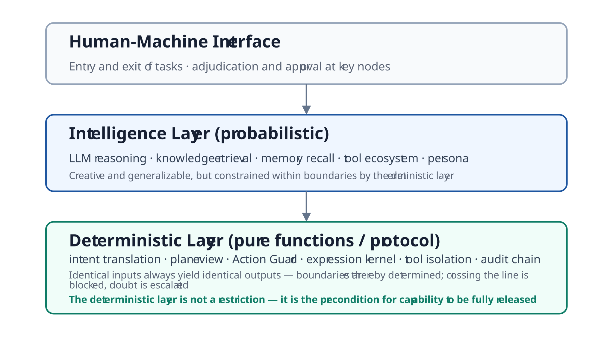
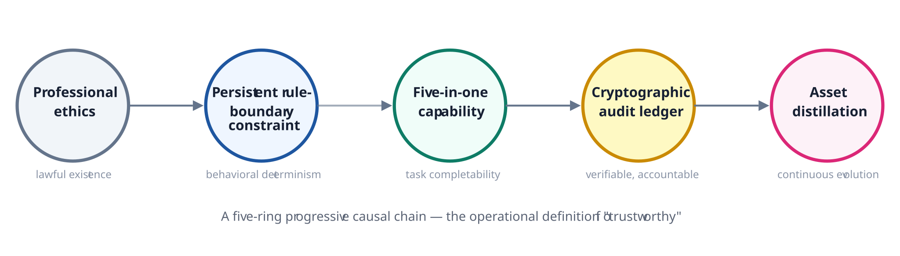
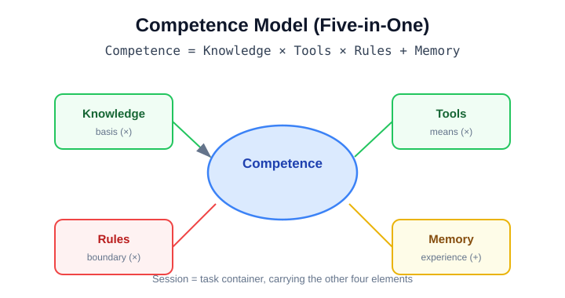
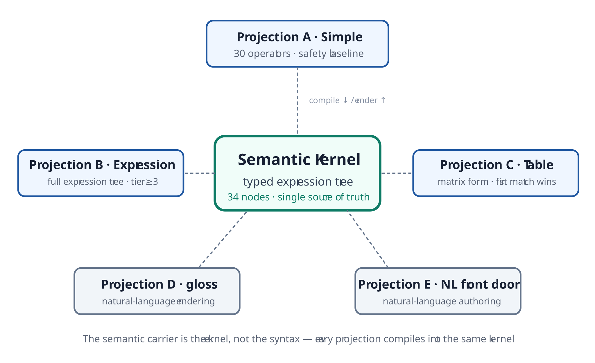
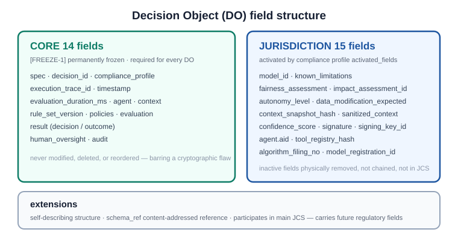
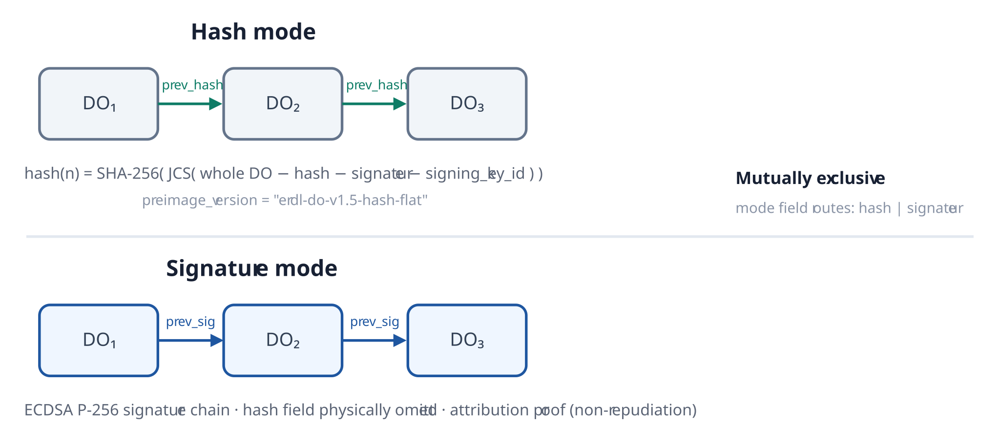
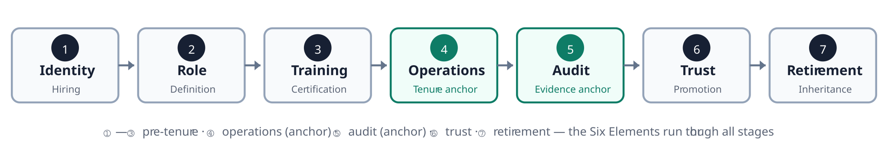
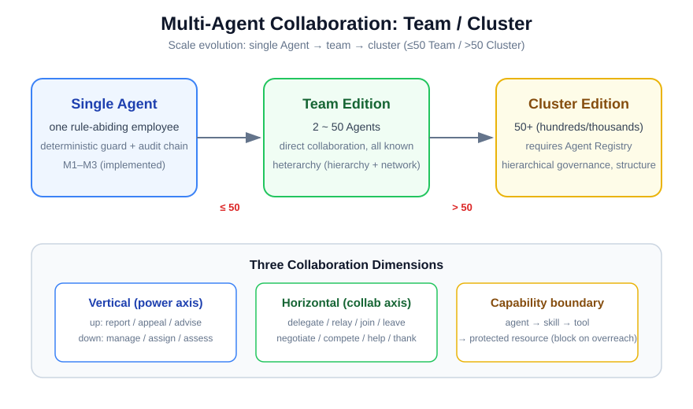
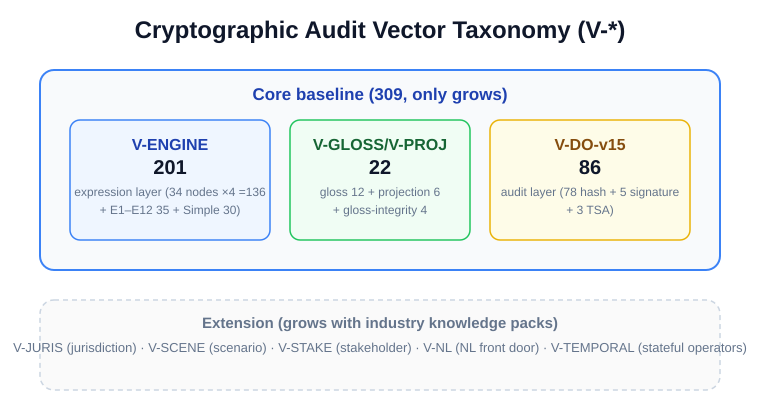

# OpenOBA · Professionalized AI Employee — Open Specification v2.0

> **Authority note (2026-08-31 · full-line alignment)**: This file is a **copy** of the condensed spec-2.0; the authoritative source is the erdl-landing repo `spec/spec-2.0-en.md`. Normative facts (incl. vector counts) follow the authority.

> **Alias**: OpenOBA PAE Open Specification v2.0 (abbreviated spec-2.0)
> **Status**: Final (v2.0) · Public release
> **Aligned with**: RFC-002 (Decision Object v1.5 flat hash + signature layer) · 14-framework three-tier activation
> **Version semantics**: This document is version **v2.0**; the Decision Object data model it defines is version **v1.5** (`preimage_version = "erdl-do-v1.5-hash-flat"`, FREEZE-1 frozen). The two are orthogonal version lines that evolve independently and must not be conflated.
> **Related specifications**: This document builds on **ERDL** (Entity-Rule Definition Language) as its foundational language — ERDL carries the expression layer; the full language specification is in *[ERDL Language Specification v2.1](erdl-spec.en.md)*. Decision Object fields/hash/chain see RFC-002.

---

## 0. Positioning and Scope

This specification defines the protocol contract of the **Professionalized AI Employee** category: how the tenure behavior of an AI Employee (Human + AI) formally hired by an enterprise is constrained, recorded, and verified by **deterministic mechanisms**.

Its division of labor with the *Professionalized AI Employee Whitepaper*:

| Document | Answers | Nature |
|------|------|------|
| **Whitepaper** | Why — category narrative, root causes of failure, trust claims | Narrative, not verifiable |
| **This spec** | What, and how determinism is achieved — fields, serialization, audit chain, verification vectors | Contract, independently implementable and byte-verifiable |

In one sentence: **the whitepaper is the promise; this specification is the implementation contract by which the promise can be independently verified by a third party.** The two share one narrative; this spec fills in, in technical language, the determinism details the whitepaper deliberately leaves open.

### 0.1 Ecosystem Positioning (Orthogonal)

| Layer | Protocol / Category | Question solved |
|------|--------------|---------|
| Connection layer | MCP | Can the agent reach tools and data? |
| Communication layer | A2A | Can agents collaborate with each other? |
| Governance layer | This spec (Professionalized AI Employee) | Can the organization hire, audit, and hold this AI Employee accountable? |

The deterministic mechanisms this spec defines (behavioral boundary, decision object, audit chain) live at the governance layer, orthogonal and complementary to connection/communication protocols, and do not re-implement transport or communication.

### 0.2 Reading Guide

- **Chapter 1** terminology, constraint levels, and freeze levels — prerequisite for the rest;
- **Chapter 2** deterministic architecture — design philosophy and layering;
- **Chapters 3–5** the protocol body: expression layer, compliance layer, trust layer;
- **Chapter 6** lifecycle — the mapping between the seven stages and the six elements;
- **Chapter 7** multi-agent collaboration — the quantity criterion for Team / Cluster editions;
- **Chapter 8** cryptographic audit vectors — the reproducible evidence that "neutrality is measured";
- **Chapter 9** data model — the relationship view of protocol-necessary entities;
- **Chapters 10–12** security / privacy / registry considerations;
- **Chapters 13–14** normative / informative references;
- **Chapter 15** community acknowledgments — contributors to this upgrade.

---

## 1. Terminology, Requirement Levels, and Freeze

### 1.1 Terminology

| Term | Definition |
|------|------|
| **Professionalized AI Employee (PAE)** | An AI Employee (Human + AI) formally hired by the enterprise, headcounted, certified for the role, auditable throughout, promoted or demoted by evaluation, inheritable on retirement. Distinguished from tools, assistants, and Copilot: the latter are "used"; the PAE is "hired." |
| **Deterministic Layer** | The set of system components that do not depend on an LLM, are pure-function/protocol implementations, and always produce the same output for the same input; the carrier of behavioral boundaries. |
| **Intelligence Layer** | The reasoning and planning capability borne by an LLM — probabilistic, creative, and constrained within boundaries by the deterministic layer. |
| **Competence** | The measure of an AI Employee's ability to complete tasks: `Competence = Knowledge × Tools × Rules + Memory`. |
| **Decision Object (DO)** | The cryptographic audit record of a single adjudication, serialized with JCS (RFC 8785) + SHA-256; the unit of an independently verifiable audit chain. |
| **Audit Chain** | The tamper-proof evidence chain formed by anchoring Decision Objects in order: cannot be altered, deleted, or reordered. |
| **Practice Loop** | The five-ring causal chain of the full tenure process (§2.3); the operational definition of "trustworthy." |
| **Shared Semantics** | The semantic agreement among humans, LLMs, systems, and auditors on the same behavioral requirement, eliminating natural-language ambiguity. |
| **Compliance Profile** | The structured declaration of jurisdiction/industry/risk/activated fields, with `profile_hash` on-chain and traceable. |
| **tier (rule hierarchy)** | The rule's hierarchy level (0–5): 0 Moral / 1 Compliance / 2 Security / 3 Policy / 4 Role / 5 Convention. Tiers 0–2 are the safety baseline (Simple), tiers 3–5 the business panorama (Expression). |

### 1.2 Requirement Levels (RFC 2119)

| Keyword | Meaning | Consequence of violation |
|--------|------|---------|
| **MUST / MUST NOT** | Absolute constraint, unconditionally binding | Violation makes system behavior unpredictable; non-conforming |
| **SHOULD / SHOULD NOT** | Strong recommendation | Deviation must be justified, otherwise an implementation defect |
| **MAY** | Optional implementation | Does not affect interoperability; implementers may choose |

### 1.3 Freeze Levels

| Label | Freeze level | Meaning | Change path |
|------|---------|------|---------|
| **`[FREEZE-1]`** | Protocol-level freeze | Fields/structure immutable (e.g., DO CORE fields) | Change requires RFC process + version upgrade |
| **`[FREEZE-2]`** | Semantic-level freeze | Additive only, no modification (e.g., 34-node semantics) | Additions via version upgrade; published nodes unchanged |
| **`[FREEZE-3]`** | Naming-level freeze | Numbering/classification fixed, entries extensible (e.g., vector system) | New entries get fresh numbers; existing numbers never reused |

### 1.4 Version Lifecycle

| Stage | Meaning | Change scope |
|------|------|-----------|
| Draft | Design exploration, not finalized | Arbitrary additions/changes |
| Baseline | Finalized as current baseline | Additive only |
| Frozen | Interface contract locked | Security fixes only |
| Deprecated | Superseded by a new version | No changes; historical references retained |

**v2.0 stage by object**: DO CORE 14 fields and JCS rules → Frozen (FREEZE-1); 34-node set and vector set → Baseline (FREEZE-2/3); capability content (knowledge/rules/tools/memory) → Draft (continuously hot-updated).

---

## 2. Deterministic Architecture (Architecture Contract)

### 2.1 Three Pillars → Deterministic Mapping

The whitepaper's Three Pillars correspond, in this spec, to three sets of implementable deterministic mechanisms:

| Pillar | Proposition | Deterministic mechanism in this spec |
|------|------|------------------|
| **P1 Trustworthy** | No overreach, no loss of control, verifiable | Compliance layer (Ch. 4) + Trust layer (Ch. 5) |
| **P2 Competent** | Genuinely completes the role's duties | Expression layer (Ch. 3) + competence model (§2.4) |
| **P3 Controllable** | Final decision authority always rests with humans | Responsibility model (§5.9) + lifecycle (Ch. 6) |

Priority: P1 the precondition for hiring → P2 the value of tenure → P3 the organizational boundary. Missing any one means the category does not hold.

### 2.2 Layering: Intelligence / Deterministic / Human-Machine Interface



*Figure 1 · Capability to the intelligence layer, boundary to the deterministic layer, authorization to humans.*

- **Intelligence layer**: LLM reasoning, knowledge retrieval, memory recall, tool ecosystem, persona expression;
- **Deterministic layer**: intent translation, plan review, Action Guard, expression kernel, tool isolation, audit chain — identical inputs always yield identical outputs;
- **Human-machine interface**: the entry and exit of tasks, adjudication and approval at key nodes.

The deterministic layer's existence is not a restriction on AI capability, but the precondition for capability to be fully released.

### 2.3 The Practice Loop: Five Rings



*Figure 2 · The practice loop: a five-ring progressive causal chain — the operational definition of "trustworthy."*

| Ring | Guarantee provided | Consequence on failure |
|----|---------|---------|
| Professional ethics as the foundation | The precondition for lawful existence | No qualification to take a role |
| Persistent constraint by rule boundaries | Behavioral determinism | Uncontrollable |
| Five-in-one capability reinforcement | Task completability | Degrades into an executor |
| End-to-end cryptographic audit ledger | Verifiable, accountable | Not accountable |
| Digital-asset sedimentation and distillation | Continuous capability evolution | No growth |

### 2.4 Competence Model (Five-in-One)



*Figure 8 · Competence = Knowledge × Tools × Rules + Memory (five-in-one).*

Completing a task requires five kinds of capability working together — **conversation carries the task, knowledge provides the basis, tools deliver the execution, rules draw the boundary, memory sediments the experience**.

Competence is defined as a **product** rather than a sum, because any factor reaching zero collapses the whole:

```
Competence = Knowledge × Tools × Rules + Memory
```

- **Knowledge × Tools**: without knowledge there is no basis, without tools there is no execution — if either is zero, the product is zero;
- **Rules** is a multiplier, not an addend: without constraint, capability is uncontrollable;
- **Memory** is an addend: it does not decide "whether it can complete today," but "whether it keeps getting better with use."

| Element | Capability role | Question answered |
|------|---------|-----------|
| Session | Task carrier | Where the task comes from and runs |
| Knowledge | Judgment basis | How it gets it right |
| Tools | Execution means | How it actually lands |
| Rules | Behavioral boundary | How it avoids errors |
| Memory | Experience accumulation | How it improves with use |

Corresponding to the "five-in-one capability reinforcement" ring of §2.3 — five capabilities together support task completion; the first four (session/knowledge/tools/rules) are the precondition for tenure, memory the lever for evolution.

---

## 3. Expression Layer Protocol (Rule Engine)

> **Relationship of this chapter to the ERDL specification**: The expression layer is carried by **ERDL** (Entity-Rule Definition Language). ERDL is the **foundational language** for expressing rules and behavior boundaries, and this document builds on it: ERDL defines how rules are deterministically expressed (the 34-node semantic kernel and its projections), while this document defines the compliance, trust, and lifecycle of the professionalized AI employee on top of it. This chapter is a **normative summary** of ERDL; the full language specification (canonical form, compile mapping, gloss rendering templates, rule governance) is in *[ERDL Language Specification v2.1](erdl-spec.en.md)*.

### 3.1 Overall Architecture: One Semantic Kernel + Multiple Projections



*Figure 3 · The semantic carrier is the kernel (34-node tree), not the syntax. All projections share one kernel.*

The semantic carrier of a rule is a **typed expression tree** (a single semantic kernel); projections are merely deterministic renderings of the kernel:

- **Projection A · Simple**: the 30-operator safety baseline (§3.3);
- **Projection B · Expression**: the full expression tree (§3.4);
- **Projection C · Decision table**: matrix form (§3.5);
- **Projection D · gloss**: natural-language readable projection (§3.6);
- **Projection E · NL front door**: natural-language authoring entry (§3.7).

Every projection compiles into the same kernel; the kernel renders back into any projection.

### 3.2 Semantic Kernel: Typed Expression Tree (34 Nodes)

The semantic kernel is a **typed expression tree**, with a baseline of **34 nodes** (in 10 groups), frozen at `[FREEZE-2]` — published nodes never change semantics or shed capability; additions go through version upgrades.

| Group | Nodes | Semantic capability |
|----|------|---------|
| Value | field · var · literal | Reference fields, context variables, constants (var only `$`/`$.path`; no clock or randomness) |
| Logic | and · or · not | Combination |
| Comparison | eq · ne · gt · gte · lt · lte | Operands may be fields, variables, literals, or arithmetic subtrees |
| Set | in | Scalar membership in a set |
| String | contains · match · starts_with · ends_with | Pattern matching; match uses safe regex |
| Existence/cardinality | exists · length · between | Existence, length, closed interval |
| Quantifier | all · any · none | Per-element array judgment; empty array always false |
| Arithmetic | add · sub · mul · div · round | Fixed-point deterministic arithmetic |
| Time | days_between · epoch_ms · date_add · date_part · month_last_day | Date difference, timestamp, date arithmetic, component extraction, month end |
| Aggregate | aggregate (count/sum/avg/min/max) | Array aggregation |

**Evaluation constraints (E1–E12, all MUST)**:

| # | Constraint |
|------|------|
| E1 | Evaluation is a pure function: no side effects, no implicit external state, no clock reads |
| E2 | Fixed-point scale=14 + half-even; intermediate computation in high-precision bounded rationals, rounding only at output nodes |
| E3 | Evaluation errors recorded as eval_warnings; fold direction tiered per E12 |
| E4 | Resource limits (tiered): Grade A (tier 0–2) tree depth ≤6 / nodes ≤64 / arrays ≤10000 / single-rule ≤50ms / no nested quantifiers / regex steps ≤10000; Grade B depth ≤10 / nodes ≤256 / quantifier nesting ≤2; Grade C (fn delegation) N/A |
| E5 | Type-check at load; `when` and `expr` must not coexist |
| E6 | Tree-as-evidence: the DO carries canonical_tree; eval_trace is a recomputable derivative, not in the DO |
| E7 | Simple and Expression compile to the same evaluation core; no second evaluator |
| E8 | Quantifier safe folding: empty array → any/none both false; all is false (deliberate safe deviation, preventing "no element to check yet judged allowed") |
| E9 | No wall-clock reads; as_of injected by the engine and recorded in the DO |
| E10 | String NFC normalization |
| E11 | undefined sentinel semantics (null propagation, table below) |
| E12 | Evaluation-error handling: tier≤2 defaults fail-close, tier 3–5 folds to false |

**Null propagation (E11)** — field absence is the norm; evaluation MUST fail safe under three-valued logic:

| Scenario | Behavior |
|------|------|
| Equality/numeric comparison on a missing field | Returns false (not NPE) |
| `== null` / `!= null` checks | Return true / false normally |
| Type-mismatched comparison | Returns false (no implicit conversion) |

**Canonical Form**: the object of tree hashing is the canonical tree — fixed node order, load-bearing field names (frozen on release `[FREEZE-1]`), literals as fixed-point strings, NFC-normalized strings, metadata stripped. Two structurally equivalent trees produce identical bytes and hash after canonicalization.

**UTC semantics of time nodes**: all time nodes evaluate in UTC; date-only parsed as UTC, date-time parsed as ISO 8601 with timezone, component extraction in UTC — guaranteeing byte-identical results across implementations and timezones.

### 3.3 Projection A: Simple (30 Operators)

Simple is the retained existing semantic-unit set — **30 operators = 28 conditions + 2 modifiers** — unchanged. It corresponds to safety rules (tier 0–2), the safety baseline for behavioral boundaries.

| Family | Count | Operators |
|----|------|--------|
| Comparison | 6 | eq · ne · gt · gte · lt · lte |
| List | 2 | in · not_in |
| String | 5 | contains · not_contains · match · starts_with · ends_with |
| Boundary negation | 2 | not_starts_with · not_ends_with |
| Existence | 2 | exists · not_exists |
| Length | 5 | length_gt · length_gte · length_lt · length_lte · length_eq |
| Range | 2 | between · not_between |
| Count | 4 | count_gt · count_gte · count_lt · count_lte |
| Modifier | 2 | within (time window) · rate (rate limit) |

**Semantic conventions**: strict type matching (no implicit conversion), null propagation (missing → false, except exists), list cap (in/not_in ≤256 items), determinism (closed evaluation kernel, zero code injection).

**Authoritative compile mapping**: all 30 operators have a definite compile target, none dangling — **13 direct nodes** (eq/ne/gt/gte/lt/lte · in · contains/starts_with/ends_with/match · exists · between), **6 not-derived** (not_in/not_contains/not_starts_with/not_ends_with/not_exists/not_between), **9 length/count combinations** (length_* 5 + count_* 4), **2 time modifiers** (within/rate). The kernel naturally carries the 15 non-direct operators via `not`, `length`, and `aggregate(count)` (6 not-derived + 9 length/count combinations); the two time modifiers within/rate are carried via out-of-tree `temporal_state`.

**Stateful operators (within/rate)**: state is not stored in the tree node but maintained outside the tree by the Guard state manager, entering the DO as `temporal_state` — the tree remains a pure function; the state source is auditable and the comparison recomputable, decoupled.

### 3.4 Projection B: Expression (Full Expression Tree)

Expression opens the kernel's full expressive power for complex business rules (tier ≥3): logical combination, quantifiers, arithmetic, time, aggregation all available.

| Dimension | Simple (A) | Expression (B) |
|------|------|------|
| Carries | 30 operators (safety baseline) | Full 34-node tree (business panorama) |
| Applicable tier | 0–2 (MUST) | ≥3 |
| Expressiveness | Basic conditions | Logic / quantifiers / arithmetic / time / aggregation |
| Audit | Same-tier recomputable | eval_trace MUST (recomputable derivative, not in DO) |

**Simple is the safety baseline, Expression the business panorama** — the two compile to one core, share one semantics, differing only in expressiveness and tier authorization.

### 3.5 Projection C: Decision Table (Matrix Form)

The decision table faces business and finance users — the preferred form for matrix rules (pricing, approval, discount), compiled to the same kernel (E7). Syntax `[FREEZE-2]`: condition-column definitions + rule rows (top-down first match wins) + a default row.

```yaml
kind: decision_table
columns:
  - field: "context.amount"        # field path (Entity semantics)
    label: "application amount"
rows:
  - when: [["gte", 10000]]
    then: "REQUEST_HUMAN"
    priority: 100
  - when: [["gte", 5000]]
    then: "ESCALATE"
    priority: 90
  - when: []                       # default row (unconditional match, fallback)
    then: "ALLOW"
    priority: 1
```

**Compile rules**: each row's `when` condition group compiles by column order into a logical AND; condition units compile into comparison nodes; row order is priority (consistent with `priority`, MUST not conflict); the default row compiles to literal true; `then` values MUST belong to the decision-type enum (Appendix B); compilation produces the same expression tree as hand-written Simple/Expression.

### 3.6 Projection D: gloss (Natural-Language Readable Projection)

gloss is the **deterministically generated** natural-language statement of a rule — the mechanism behind "transparent execution, human-instant comprehension." At compile time, the engine generates canonical human-readable text node-by-node from the tree, per frozen rendering templates `[FREEZE-2]`.

**Five invariants (all MUST)**:

| # | Invariant |
|---|--------|
| G1 | gloss = render(tree): deterministically generated by frozen templates |
| G2 | Every rule MUST carry gloss; lint checks `gloss == render(tree)`, hand-writing forbidden |
| G3 | gloss forbids raw field paths, MUST use the Entity's display_name |
| G4 | gloss is a rendering artifact, not in the DO; rendered live via render(tree) at display time |
| G5 | Simple rules also generate gloss (rendered after compiling to tree); the reading layer is unstratified |

**Rendering templates (`[FREEZE-2]`)**: node-by-node bilingual templates (field/var/literal/and/or/not/eq…gt…/in/contains…/exists…/all…/add…/days_between…/aggregate, covering all 34 nodes), serving as the expected-value baseline for V-GLOSS vectors. After freezing, revisions go through version upgrades.

**Authority anchoring**: the rule tree and gloss are hashed together and RFC 3161 timestamped by an independent TSA, reaching regulatory/compliance-grade trust.

### 3.7 Projection E: NL Front Door (Natural-Language Authoring)

To lower the barrier, rule authoring offers an NL front door — describing rules conversationally.

**Key distinction: NL is an authoring front door (probabilistic, acceptable), not a runtime mechanism (probabilistic, zero tolerance).** NL input MUST pass a deterministic toolchain and land in canonical form before taking effect, through four gates:

| Gate | Mechanism |
|------|------|
| ① schema + quality gate | Structural and semantic validation |
| ② mandatory example tests | ≥2 positive/negative examples (rules-as-tests), the behavioral contract and last line of defense |
| ③ tiered approval + shadow mode | tier 0 no NL; tier 1-2 dual approval + shadow run |
| ④ authoring provenance | records nl_prompt_hash / model / confirmed_by / test_results, etc., a complete provenance chain |

**Key asymmetry**: the verification direction is deterministic (tree→gloss is a pure function), the generation direction is not (NL→tree is probabilistic). Humans therefore always check against the deterministic gloss and example tests — gloss is the first readability aid, example tests the last defense against behavioral-level errors (e.g., gt vs gte).

**Polishing period**: after passing the four gates, NL-generated rules enter shadow mode (no real business consequence), with parallel positive verification (positive examples hit) + reverse back-translation (YAML → another LLM → restored NL → compared with the original NL semantics) + multi-round human cross-check; only after semantic fidelity is confirmed may the rule be stored.

**Semantic-drift defense**: boundary-value testing mandatory (MUST, positive/negative + gt/gte critical values); adversarial back-translation (SHOULD); **NL is limited to ALLOW/NOTIFY advisory rules (MUST)** — all other decision types (block/correct/escalate, etc.) MUST be hand-written YAML, never NL-generated.

### 3.8 Function Delegation and Rule Grading

**Function delegation (FnRegistry)**: for scenarios the kernel explicitly excludes but that are genuinely needed, a controlled fallback — not the main path of logic expression.

| Constraint | Description |
|------|------|
| Registration | Functions MUST be registered before reference |
| Sandboxed execution | Restricted environment, under resource quota and timeout |
| Determinism-exemption declaration | Functions on the Guard evaluation path MUST declare and guarantee determinism |
| Audit traceability | Every call recorded in the DO, offline-verifiable |

**Rule grading (Grade)**:

| Grade | Expression form | Audit SLA |
|:---:|------|------|
| A | Pure Simple (30 operators) | Highest, plain-text recomputable |
| B | Expression tree | High, eval_trace MUST (not in DO) |
| C | Contains function delegation | Tiered, must not masquerade as plain-text recomputable |

Grade determines audit strength and recomputability claims; Grade metadata travels in extension fields, not core frozen fields.

### 3.9 Rule Governance

**Layering and sharding** (the core governance dimension of the pluggable runtime framework):

- **Global layer**: enterprise-wide rules shared by all Agents, maintained by the Guardian, not counted against per-Agent limits;
- **Position layer**: Agent-specific rules, assembled/unloaded with the role blueprint, ≤1,000 per Agent;
- **Business shards**: sharded by business entity, loading only relevant shards per evaluation;
- **Inverted index**: indexed by `tool.name` + `field.path`, matching from O(N) to O(1);
- **Three-tier legislative layering**: regulatory rules stack at national/provincial/municipal levels (hit-means-block, no mutual override); conflicts submitted to human adjudication.

**Centralized management and version sync**: unified backend management + `rule_set_version` increment + Agents sync by version to local (atomic replacement, no gap) + runtime reads local (the DO records `rule_set_version` for audit recomputation).

**Quality gates (enforced at load)**: wild-when-with-blocking-then (error) / no-condition-on-security-rule (error) / regex-redos-risk (error) / ast-complexity-exceeded (error, aligned with E4) / empty-message-on-blocking-rule (warning) / non-standard-name (warning), etc.

---

## 4. Compliance Layer Protocol

### 4.1 Compliance Profile

Compliance is the precondition of trust (the practice loop's first ring, "professional ethics as foundation"): non-compliant means untrustworthy; not yet compliant means no qualification to take a role.

The Compliance Profile carries the AI Employee's compliance configuration — jurisdiction / industry / risk level / activated fields / maturity rating (🟢/🟡/🔴/⚠️ four tiers) — and, after canonical serialization, its SHA-256 forms `profile_hash`, entering every DO and making "under which compliance regime this decision occurred" an independently verifiable fact.

### 4.2 14-Framework Three-Tier Activation

| Tier | Frameworks | Activation |
|----|------|---------|
| Jurisdiction-mandated | EU / CN / US / SG / BR / IN | Mandatory by tenure jurisdiction |
| Industry | HIPAA / PCI DSS | Enabled by industry baseline |
| Risk + standards bodies | critical→signature mandatory / COSO / ISO/IEC / OWASP / IEEE / CAICT | By risk tier + standards bodies |

**The 14-framework list** (all jurisdictions equal): EU AI Act, GB/Z 185-2026 (CN), NIST AI RMF, Colorado SB-205, HIPAA, Singapore MGF, LGPD (BR), DPDP (IN), PCI DSS, COSO GenAI, ISO/IEC 42001, OWASP Agentic, IEEE P3395, CAICT 2.0. "critical→signature mandatory" is a risk-activation rule, not counted among the frameworks.

### 4.3 Jurisdiction → Activated-Field Mapping

The Compliance Profile's core mechanism: by activated jurisdiction, determine the field set the DO must contain. The full per-jurisdiction mapping is authoritative in RFC-002 §5.3 and the V-COMP vector list; excerpt:

| Jurisdiction | Activated fields (excerpt) |
|------|----------------|
| EU | model_id · agent.known_limitations · confidence_score · fairness_assessment · impact_assessment_id · autonomy_level · sanitized_context · signature |
| CN | agent.aid · agent.tool_registry_hash · agent.model_registration_id · data_modification_expected · autonomy_level · sanitized_context · signature |
| US | model_id · confidence_score · fairness_assessment · impact_assessment_id · signature |

**Field-completeness check (programmable gate)**: before a DO lands on the chain, the compliance layer verifies it contains all mandatory fields of the activated jurisdictions; any missing field is treated as incomplete compliance, blocked (Error, rejected) and recorded.

**Risk tiering and compliance strength**:

| Risk level | Compliance obligation | Landing in this spec |
|:---:|------|------|
| Prohibited/unacceptable | Must not exist | Guard blocks |
| High risk | Strict retention / transparency / human oversight | Full DO fields + audit chain + REQUEST_HUMAN |
| Limited/transparency | Inform user / output labeling | AI label + output watermark |
| Low/no risk | Baseline compliance | Baseline profile fields |

**Profile hash and change management**: the profile is canonical-serialized and SHA-256 hashed into `profile_hash`, entering every DO. Profile changes are non-retroactive (grandfathering) — decisions fixed before a change still cite the old `profile_hash`; old and new profile versions coexist via `profile_hash` (the version number is resolved by hash through the profile registry), letting auditors pick the exact verification baseline.

---

## 5. Trust Layer Protocol (Decision Object and Audit Chain)★

### 5.1 Decision Object (DO) Overview



*Figure 4 · DO = CORE 14 fields (permanently frozen) + JURISDICTION 15 fields (activated by profile) + extensions.*

The Decision Object is the sole factual carrier of the audit record, under uniform normalization: every field has a definite name, type, meaning, and constraint; implementations may not invent fields or let meanings drift.

### 5.2 CORE Fields (14, permanently frozen `[FREEZE-1]`)

| # | Field | Type | Meaning and constraint |
|---|------|------|-----------|
| 1 | `spec` | const | Format identifier, always `"decision-object-v1.5"` |
| 2 | `decision_id` | UUID v7 | Unique identifier of this decision |
| 3 | `compliance_profile` | object | Compliance profile (jurisdiction/industry/risk/activated fields/maturity) |
| 4 | `execution_trace_id` | UUID v7 | Global correlation ID across DOs and external audit formats |
| 5 | `timestamp` | ISO 8601 UTC | Decision timestamp (millisecond precision) |
| 6 | `evaluation_duration_ms` | integer | Decision duration (milliseconds, integer, no decimal point) |
| 7 | `agent` | object | Agent identity (id/role/version + extended subfields) |
| 8 | `context` | object | Evaluation context (tool.name/args/intent/attachments, etc.) |
| 9 | `rule_set_version` | object | Rule-set version identifier (participates in JCS) |
| 10 | `policies` | array | Activated policy set (each with JCS hash + author_id) |
| 11 | `evaluation` | object | Rule-evaluation details (matched_rules / totals / knowledge_references) |
| 12 | `result` | object | Final decision (decision/reason/applied_rule/rules_matched + outcome) |
| 13 | `human_oversight` | object | Human oversight (including override_reason) |
| 14 | `audit` | object | Tamper-proof audit (mode/hash/previous_hash/commitment/previous_signature/timestamp_proof/retention/chain_id/chain_seq/preimage_version) |

**Invariant**: the 14 CORE fields are permanently frozen; barring a cryptographic flaw, never modified, deleted, or reordered.

### 5.3 JURISDICTION Fields (15, activated by profile)

| # | Field | Type | Activation condition (for compliance needs) |
|---|------|------|----------|
| 15 | `model_id` | string | EU AI Act / NIST |
| 16 | `agent.known_limitations` | string[] | EU AI Act (known-limitation declaration) |
| 17 | `fairness_assessment` | string | EU AI Act / NIST / Colorado |
| 18 | `impact_assessment_id` | UUID | EU AI Act / ISO 42001 |
| 19 | `autonomy_level` | string | EU AI Act / CN / SG MGF |
| 20 | `data_modification_expected` | boolean | EU AI Act / CN / HIPAA / PCI DSS / CAICT |
| 21 | `context_snapshot_hash` | string | EU AI Act / CN (PII / cross-Agent) |
| 22 | `sanitized_context` | string | EU AI Act / CN (GDPR compliance) |
| 23 | `confidence_score` | integer | EU AI Act / NIST (0~100) |
| 24 | `signature` | string (Base64url) | critical decisions (ECDSA P-256) |
| 25 | `signing_key_id` | string | Companion to signature, identifying the verification public-key version |
| 26 | `agent.aid` | string | CN GB/Z 185 (28-char AID) |
| 27 | `agent.tool_registry_hash` | string | CN GB/Z 185.7 |
| 28 | `agent.algorithm_filing_no` | string | CN (algorithm filing number) |
| 29 | `agent.model_registration_id` | string | CN (model registration number) |

**Activation rule**: a field in `activated_fields` but missing from the DO → compliance failure; a field not in `activated_fields` → the producer MUST physically remove it, not on-chain, not in JCS.

### 5.4 extensions

The extension area carries future regulatory fields, each in **self-describing structure**:

- `regulatory_ref`: framework/version/effective date;
- `schema_ref`: content-addressed reference (JCS+SHA-256), pointing to the field's full schema definition, offline-resolvable and long-term understandable;
- `field`: field name/type/description; `value`: field value.

Extension entries participate directly in the main JCS serialization; any added field automatically enters `audit.hash`; `schema_ref` resolution follows offline-first + whitelist (anti-SSRF).

### 5.5 result.outcome Unified Conclusion Layer

| Subfield | Type | Description |
|--------|------|------|
| `scenario` | string | Scenario identifier (dot notation) |
| `verdict` | string | Conclusion identifier |
| `grade` | string? | Tier |
| `rank` | string? | Rank |
| `comment` | string? | Conclusion note |
| `basis` | array? | Basis hash pointers |
| `extra` | object? | Arbitrary structured extension |

Structure layer frozen `[FREEZE-1]`, value layer open to any extension; pure Guard decisions (no business conclusion) omit the whole group. Producers tiered by decision authority: D1 pure judgment (engine) / D2 reasoning-anchored (LLM) / D3 discretionary final review (human).

### 5.6 Serialization and Hashing (JCS / RFC 8785)

DO hashing is based on JCS (RFC 8785) normalization: fields sorted lexicographically, strings escaped deterministically, numbers normalized per IEEE 754 — the same logical JSON object serializes to byte-identical bytes in any implementation.

**Numeric constraints**: integers without a decimal point (range ±(2^53-1)); floats/amounts MUST be strings + minimal canonical representation (no trailing zeros / no leading zeros / no scientific notation); no NaN/Infinity; fixed-point rounding (E2 scale=14 + half-even) done before serialization.

**Omit over Null**: null/undefined/empty-array optional fields physically deleted before JCS. **Exceptions**: the chain-anchoring fields `audit.previous_hash` / `audit.previous_signature` MUST be retained when null on the genesis block (genesis symmetry); `extensions` empty array MUST be retained.

**Pre-serialization pruning**: JURISDICTION fields not declared in `activated_fields` MUST be physically removed (Omit), never set to null or empty placeholders.

**Self-reference exclusion**: when computing `policies[].hash` and `profile_hash`, the field being computed (the hash key) MUST be temporarily removed before JCS.

### 5.7 Audit Chain: Hash Mode / Signature Mode



*Figure 5 · Mutually exclusive dual modes: hash chain flat-hash anchoring, signature chain ECDSA P-256 anchoring.*

- **Hash mode**: `audit.hash(n) = "sha256:" + HEX( SHA-256( JCS( whole DO − hash − signature − signing_key_id ) ) )`, `preimage_version = "erdl-do-v1.5-hash-flat"`;
- **Signature mode**: ECDSA P-256 signature chain, hash field physically omitted;
- Five-step verification (independent recomputation) + strong verification (rule recompilation compared against canonical_tree);
- **commitment three-field object**: `audit.commitment` is a frozen structured object `[FREEZE-1]` `{ agent_id, tool_name, decision }` — hash-mode-specific, carrying the attribution triple of this decision, protected in the preimage by hashing.

### 5.8 Time Anchoring (RFC 3161)

`timestamp` is self-declared (an attacker can roll back the clock). For nodes needing external attestation or stronger temporal trust, a single RFC 3161 Timestamp Authority (TSA) anchoring mechanism applies — the TSA provides proof that "data existed at a certain moment":

| Anchored object | Tier |
|---------|------|
| Rule tree + gloss | The authoritative time of rule semantics |
| Decision-object hash | The attestation time of decision evidence |
| Retirement audit sealing | Time anchoring of lifecycle evidence |

The three share one TSA mechanism, reaching regulatory/compliance grade (ordinary RFC 3161 timestamps), with judicial grade (eIDAS qualified timestamps) reserved for future uniform upgrade. The `timestamp_proof` field set (tsa_id / token / anchored_field / requested_at) is authoritative in §5.2 (the audit object); auditors can offline-verify any provider.

### 5.9 Responsibility Model (Five Powers)

| Power | Owner | Mechanism |
|------|------|------|
| Decision power | Humans | Approval/veto paths |
| Judgment power | Deterministic layer | Action Guard adjudication |
| Planning power | Intelligence layer | LLM reasoning and planning |
| Evidence power | Audit chain | Tamper-proof evidence |
| Signing power | Agent key | Attribution proof |

---

## 6. Lifecycle Protocol (Seven Stages)



*Figure 6 · Seven stages: Identity → Role → Training → Operations → Audit → Trust → Retirement.*

**The Six Elements (entry threshold)**: organizational identity, role authorization, pre-employment certification, tenure audit, promotion and demotion, retirement and inheritance — missing any one means it is not this category.

| Seven stages | Corresponding element | Note |
|:---:|------|------|
| ① Identity | Organizational identity | On the roster, searchable |
| ② Role | Role authorization | Boundaries clear, overreach blocked |
| ③ Training | Pre-employment certification | Qualified by assessment before taking the role |
| ④ Operations | (outside the Six Elements) | The continuous tenure process after the threshold; the object the Six Elements govern |
| ⑤ Audit | Tenure audit | Evidence at every step, independently recomputable |
| ⑥ Trust | Promotion and demotion | Evaluation driven by tenure evidence |
| ⑦ Retirement | Retirement and inheritance | Experience distilled into organizational assets |

Two key designs: **certification is a hard gate** (without assessment, or with an expired certificate, no qualification to take a role); **retirement is not the end** (AI capability reclaimed, knowledge retained, experience distilled back into the organization).

---

## 7. Multi-Agent Collaboration: Team Edition / Cluster Edition



*Figure 7 · Team / Cluster editions: scale evolution and three collaboration dimensions.*

Professionalized AI Employees evolve from "a single rule-abiding employee" to "composable teams, departments, and organizations". Two product forms by scale:

| Form | Agent Count | Organizational Character | Coordination |
|:---:|:---:|------|------|
| **Team Edition** | 2 ~ 50 | Direct collaboration, everyone knows everyone, heterarchy (hierarchy + network symbiosis) | Point-to-point, O(n²) coordination cost tolerable |
| **Cluster Edition** | 50+ (up to hundreds/thousands) | Requires Agent Registry (directory + occupation index) + hierarchical governance | Structured management — "structure, not scale, produces intelligence" |

**Quantity Criterion**: Agent count **≤ 50 → Team Edition** (point-to-point collaboration suffices, no central Registry needed); **> 50 (typically 100+) → Cluster Edition** (must introduce Agent Registry + reporting chain + hierarchical governance, because point-to-point O(n²) coordination cost becomes the bottleneck).

> **50 is a dividing criterion, not a hard threshold** — the real deciding factor is "whether centralized Registry + hierarchical governance is required", not the exact count.

**Collaboration Dimensions**: vertical (power axis: report / manage) + horizontal (collaboration axis: delegate / relay / negotiate) + capability-boundary axis (skill → tool → protected resource, blocked on overreach).

**Division of Labor**: transport layer carried by A2A; organizational behavior layer (who delegates to whom, on what basis, leaving what evidence) defined by ERDL. Full specification in *erdl-spec-v2.1* Part 10.

---

## 8. Cryptographic Audit Vectors (Verifiability Contract)★

This section is the dividing line between "standard-grade" and "description-grade": a description-grade spec can only write prose, while a **standard-grade spec provides executable test vectors** — any independent party, with a different technology stack, recomputes byte-for-byte and judges conformance without trusting any vendor. The vectors are the concretized carrier of "independently verifiable", the hard evidence that distinguishes this spec from whitepaper-style description.

### 8.1 Vector Classification (V-*, `[FREEZE-3]`)



*Figure 9 · Vector taxonomy: Core 309 + Extension.*

| Category | Verification target | Count |
|------|---------|------|
| V-ENGINE | Expression layer (34 nodes × 4 scenarios 136 + E1–E12 constraints 35 + Simple compile 30) | 201 |
| V-GLOSS / V-PROJ | gloss and projection rendering | 22 |
| V-DO-v15 | Audit layer (decision/chain-attack/anchoring/time/canary/conclusion/jurisdiction/signature; of which V-COMP 32 are the jurisdiction-compliance subcategory) | 86 |
| V-JURIS | Jurisdiction compliance | Extension |
| V-SCENE | Scenario | Extension |
| V-STAKE | Multi-party perspective | Extension |

Core baseline = V-ENGINE 201 + V-GLOSS/V-PROJ 22 + V-DO-v15 86 = **309** (defined baseline, only grows with the node-set evolution).

### 8.2 Numbering and Naming Rules (`[FREEZE-3]`)

Numbers are never reused, reordered, or re-meaninged; new entries get fresh numbers. The canary vector (V-DO-v15-K01) catches regressed runners that skip independent recomputation.

### 8.3 Verification Procedure and Cross-Implementation Proof

Any independent party, with a different technology stack, recomputes independently against the public specification and compares byte-for-byte — depending on no component of the system under test.

**Five-step verification (for a Decision Object)**: load vector input → generate DO → recompute hash → compare with answer → judge consistency (the full Step 0–6 seven-step procedure is in RFC-002 §7). Vector verification reuses the same flow.

**Cross-implementation parity verification**: the same vector set runs under TypeScript / Python / Rust (or more languages), requiring byte-identical results. Third-party auditors recompute with their own implementations, not the vendor's verification tooling.

**Dual-implementation generation (semantic-sensitive vectors)**: the expected values of V-ENGINE semantic-sensitive vectors (E2 fixed-point, E8 quantifier safe-folding, time-node UTC calendar) MUST be independently generated and byte-compared by OpenOBA and one independent implementation; divergences first go through spec clarification, then vectors freeze — avoiding passive alignment to the vendor's output that would undermine neutrality.

**Answer-file anti-cheating**: full vector answers (canonical_hex) live in a separate answer file; conformant runs MUST NOT read the answer file (reading it bypasses independent verification); the vector file keeps only the `diag_hash` debug anchor (one-way, non-invertible).

Methodology: **three independent implementations + one open specification + no single owner**.

**Third-party Runner verification flow (from zero to conformance)**:

1. Read this spec + [RFC-002] (Decision Object field/hash/chain specification) →
2. Implement an independent verifier in a technology stack of your choice, following [RFC-002] §7 (importing no OpenOBA code) →
3. Load the 78 vectors of `decision-object-vectors-v1.5.json` and compare byte-for-byte →
4. Confirm against [RUNNER_CONTRACT] that your implementation satisfies the contract (unique deletion point, zero projection, canary K01) →
5. Submit results to the [IMPLEMENTATIONS] registry for third-party audit re-verification.

---

## 9. Data Model (Protocol View)

### 9.1 Three-Axis Entities

The data model is organized along **lifecycle mainline + capability kernel + audit bypass**:

| Axis | Entities | Purpose |
|----|------|------|
| Lifecycle mainline | agent_identity / occupation_blueprint / training_scenario / training_result / agent_certificates | Persistence of the employment system from identity to retirement |
| Capability kernel | rule_config / rule_version / knowledge_entry / tool_registry / memory_event | Versioning of rules/knowledge/tools/memory |
| Audit bypass | decision_object / compliance_profile | Decision evidence and compliance profile |

**Three-axis relation**: the lifecycle mainline defines who it is and by what it may take a role, the capability kernel provides what it performs with, the audit bypass records what it actually did. The three connect via identity (agent_identity.id → decision_object.agent) and role (occupation_blueprint → capability assembly → certificate) into a complete data chain.

**Core entity relations**:

| Relation | From → To | Cardinality |
|------|------|------|
| Identity attribution | decision_object.agent.id → agent_identity.id | one-to-many |
| Role assembly | occupation_blueprint → rule / tool_registry / knowledge | many-to-many |
| Certificate binding | agent_certificates → agent_identity + occupation_blueprint | many-to-many |
| Assessment linkage | training_result → training_scenario / agent_certificates | many-to-one |
| Compliance constraint | decision_object.compliance_profile → compliance_profile | one profile per decision |
| Capability reference | decision_object → knowledge / tool_registry / memory | via context/evaluation fields |

> The decision object does not create a standalone table: hash on-chain, body in cold storage/knowledge base/rule base (external attachment reference, see §5.3 context_snapshot_hash); compliance_profile lands on-chain with the decision object. The physical table list (including session, usage, license, experiment and other operational/engineering entities) is implementation detail, out of this spec's scope.

---

## 10. Security Considerations

The security properties of the deterministic mechanisms (behavior boundary, DO, audit chain) split into a "protocol layer" and an "implementation layer" (implementation-layer STRIDE is in the full spec §61).

| Property | Mechanism |
|------|------|
| Integrity | JCS (RFC 8785) + SHA-256 hash chain (cannot be altered, deleted, or reordered) |
| Attribution | ECDSA P-256 (FIPS 186-5) signature chain |
| Timing | RFC 3161 TSA time anchoring |
| Verifiability | Flat hash + cross-implementation vectors (third-party independent byte-for-byte recomputation) |

**Honest boundaries**: rule content is "content" — technology cannot prevent copying (rely on copyright + audit soft protection); LLM reasoning is non-deterministic — this spec only constrains "actions are determined by the Guard, records by the DO"; cross-Agent strong timing guarantees depend on TSA.

---

## 11. Privacy Considerations

| Threat | Mitigation |
|------|------|
| Data minimization | `sanitized_context` + JURISDICTION fields physically pruned per activated_fields |
| Correlation | `context_snapshot_hash` uses a hash pointer instead of the original text |
| Cross-Agent | parent_audit_id reference, without copying the other party's full context |
| Cross-border | Jurisdiction mapping (EU GDPR / CN PIPL / BR LGPD / IN DPDP) activates fields per jurisdiction |

---

## 12. Registry Considerations

Decision types (13), vector numbering (V-*, Core 309), compliance frameworks (14), jurisdiction codes (6), and the preimage_version constant — new values MUST follow the version-upgrade process and MUST NOT be invented ad hoc; published values keep their meaning and are never reused.

---

## 13. Normative References

| Standard | Purpose |
|------|------|
| [RFC 2119] | MUST/SHOULD/MAY requirement levels |
| [RFC 8785] | JSON Canonicalization Scheme (JCS), Decision Object serialization |
| [RFC 8259] | JSON data interchange format |
| [RFC 3161] | Time-Stamp Protocol (TSA) |
| [RFC 6962] | Certificate Transparency, Merkle audit-chain sharding |
| [RFC 4648] | Base16/32/64 encodings, Base64url for signature |
| [RFC 9562] | UUID, UUID v7 for decision_id / execution_trace_id |
| [FIPS 186-5] | Digital Signature Standard, ECDSA P-256 |
| [ISO 8601] | Date and time format, timestamp |

---

## 14. Informative References

[1] Gartner, "Gartner Predicts Over 40% of Agentic AI Projects Will Be Canceled by End of 2027", 2025-06-25.

[2] Deloitte AI Institute, "The State of AI in the Enterprise" (2026).

[3] Gartner, "Gartner Identifies Six Steps to Manage AI Agent Sprawl", 2026-04-28.

[4] Gartner, "Gartner Says Applying Uniform Governance Across AI Agents Will Lead to Enterprise AI Agent Failure", 2026-05-26.

[5] *Professionalized AI Employee Whitepaper* V1.0 (the category whitepaper answering "why").

---

## 15. Community Acknowledgments

This upgrade of the specification benefited from the help of the following people:

### Christopher Hopley (chopmob-cloud / AlgoVoi)

Independent technical reviewer; contributions to the engineering self-consistency and cross-implementation interoperability of the specification:

- **RFC-001 review**: found the missing self-reference-hash-exclusion rule, cross-engine string-decimal inconsistency, and layering-integrity gap, driving the establishment of the flat-hash architecture;
- **Clean-room inspection (v1.3 audit)**: verified the spec's internal consistency with an independent RFC 8785 JCS + SHA-256 checker, reporting 4 technical findings (C1–C4) + 3 security issues (S1–S3) — including the dual-hash downgrade (CWE-757) and schema_ref SSRF attack surface, directly driving security hardening;
- **Compliance receipt format**: proposed the compliance receipt format (JCS + SHA-256), isomorphic to the decision-object hash, providing a standard carrier for cross-Agent compliance attestation — this spec's compliance receipt mechanism was inspired by it;
- **Content-address vs. signature**: in A2A Discussion #2031, clearly identified that "the load-bearing compliance mechanism is keyless content-addressed recompute, with signature only an optional additive layer" — a distinction that directly shaped the flat-hash design of the decision object (hash as the load-bearing mechanism, signature as optional endorsement);
- **Cross-Agent retention chain**: proposed the Retention Chain (I-D draft-hopley-x402-retention-chain-07) for cross-Agent evidence retention;
- **Three-way alignment**: led the three-way alignment between chopmob-cloud and the decision-object specification, providing a second runway for multi-party verification.

### Erik Newton (Concordia)

The first independent Runner implementer, and the proposer of the principle that "neutrality is not declared but measured":

- **Standardization methodology**: established in A2A Discussion #2031 the path of "three independent implementations, one open specification, no single owner," laying the methodological foundation for ERDL's progression from open-source project to infrastructure standard;
- **Cross-implementation byte-for-byte verification**: independently built a Decision Object verification engine in Python, first verifying the first 5 audit vectors byte-for-byte outside the Node.js implementation, later extending to all 13, proving the technical feasibility of JCS + SHA-256 cross-implementation verification;
- **v1.1 freeze-period audit**: independently discovered the structural risk of `expected_sha256` as an answer key;
- **v1.3 audit**: verified all 13 vectors with an independent RFC 8785 normalizer, confirming 12 byte-identical + AV-013 correctly failing; found the E1–E3 key issues, directly driving the audit-structure fix, the AV-013 chain-integrity canary design, and the answer-file separation architecture;
- **CI/CD engineering (v1.3.2)**: proposed and validated the generated-artifact + clean-room + IMPLEMENTATIONS.md registry architecture, providing the engineering foundation for specification-neutral compliance verification.

### OpenOBA Reference Implementation Team

The reference implementation of the ERDL rule engine, and the baseline for all test-vector generation and verification. Its production-grade engine provides real-world constraint inputs to the Decision Object's field design — from Agent identity metadata to compliance configuration structure — ensuring the protocol definition withstands engineering practice.

The significance of independent verification lies in "not trusting the party under test": recomputing independently with a different technology stack eliminates the risk of "having to trust the vendor." We record and thank their contributions faithfully.

---

## Appendix A · Freeze-Level Quick Index

| Object | Freeze level | Location |
|------|:---:|------|
| DO CORE 14 fields | `[FREEZE-1]` | §5.2 |
| JCS serialization rules (RFC 8785) | `[FREEZE-1]` | §5.6 |
| `result.outcome` structure layer | `[FREEZE-1]` | §5.5 |
| `audit.hash` preimage_version constant | `[FREEZE-1]` | §5.7 |
| `audit.commitment` three-field object | `[FREEZE-1]` | §5.7 |
| 34-node set | `[FREEZE-2]` | §3.2 |
| gloss rendering templates | `[FREEZE-2]` | §3.6 |
| Vector classification system | `[FREEZE-3]` | §8.1 |
| Vector numbering system (V-DO-v15) | `[FREEZE-3]` | §8.2 |

## Appendix B · Decision-Type Enumeration (13)

| # | Decision type | Meaning |
|---|---------|------|
| 1 | ALLOW | Release |
| 2 | DENY | Block |
| 3 | CORRECT | Correct deviation |
| 4 | NOTIFY | Notify |
| 5 | REQUEST_HUMAN | Request human adjudication |
| 6 | ESCALATE | Escalate |
| 7 | DELEGATE | Delegate |
| 8 | DEFER | Defer |
| 9 | EMERGENCY_HALT | Emergency halt |
| 10 | ROLLBACK | Rollback |
| 11 | QUARANTINE | Quarantine |
| 12 | WORKFLOW | Workflow (state machine; sub-states WORKFLOW_WAITING / WORKFLOW_PROGRESS) |
| 13 | GUIDE | Guide |

---

*© 2026 Shenzhen Miaojing Technology Co., Ltd. (OpenOBA) · All rights reserved*
