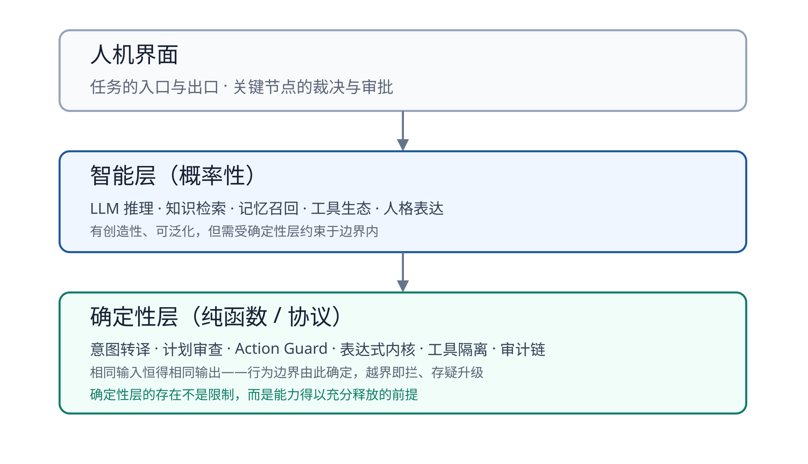
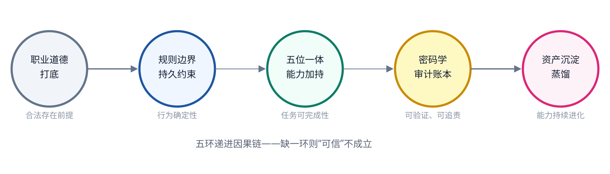
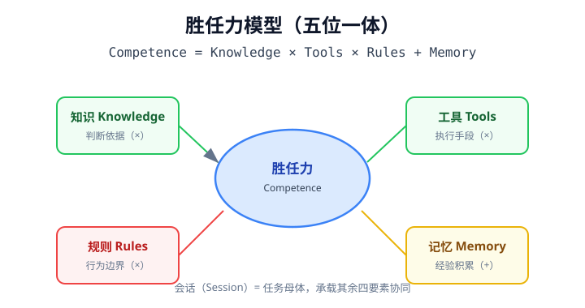
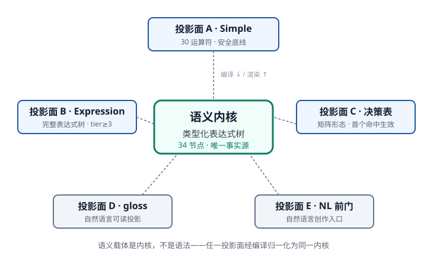
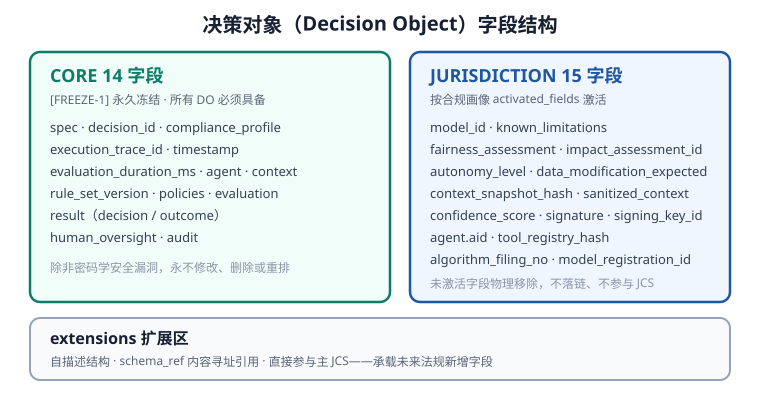
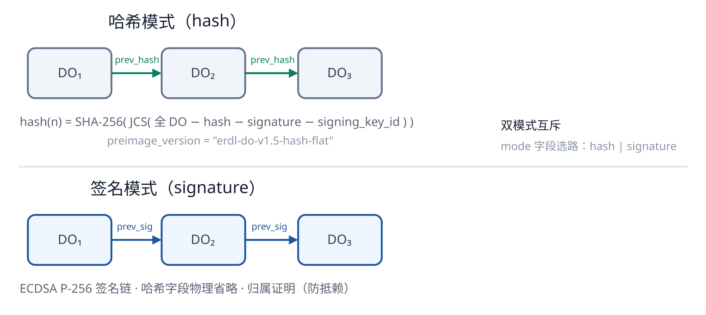
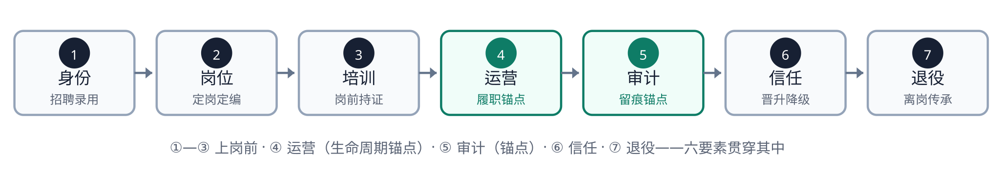
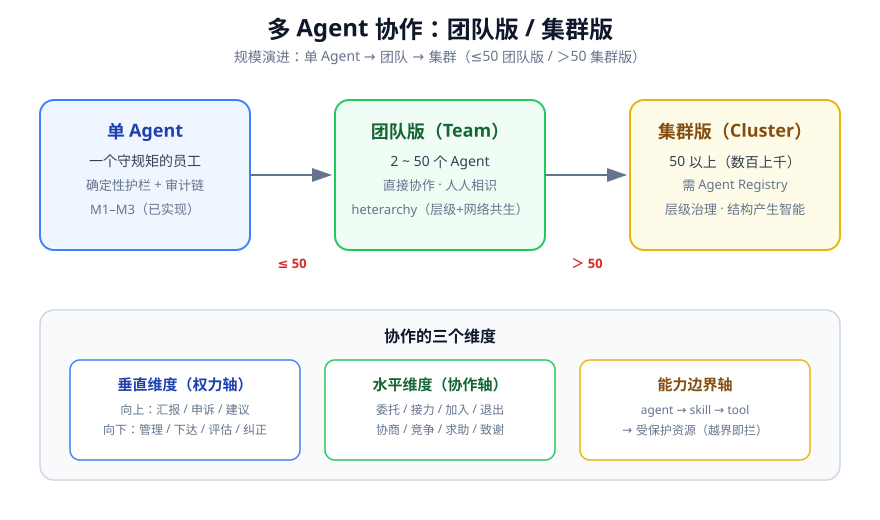
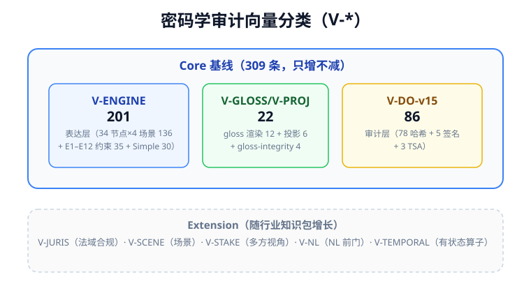

# OpenOBA · 职业化AI员工 — 开放规范 v2.0

> **权威源声明（2026-08-31 · 全线统一）**：本文件为 spec-2.0 精简版的**副本**，权威源为 erdl-landing 仓库 `spec/spec-2.0.md`；规范性事实（含向量计数口径）以权威源为准。

> **别名**：OpenOBA PAE Open Specification v2.0（简称 spec-2.0）
> **状态**：定稿（v2.0）· 对外发布版
> **对齐**：RFC-002（Decision Object v1.5 扁平哈希 + 签名层）· 14 框架三层激活
> **版本语义**：本文档版本为 **v2.0**；其定义的 Decision Object 数据模型版本为 **v1.5**（`preimage_version = "erdl-do-v1.5-hash-flat"`，FREEZE-1 冻结）。二者为正交版本线，独立演进，不可混同。
> **关联规范**：本文档构建于 **ERDL**（Entity-Rule Definition Language，实体规则定义语言）这一基础语言之上——ERDL 承载表达层，完整语言规范见《[ERDL 语言规范 v2.1](erdl-spec.md)》；决策对象字段/哈希/链规范见 RFC-002。

---

## 0. 定位与本规范的范围

本规范定义**职业化AI员工**这一品类的协议契约：一个被企业正式录用的 AI 员工（人 + AI），其履职行为如何被**确定性机制**约束、记录与验证。

它与《职业化AI员工白皮书》的分工：

| 文档 | 回答 | 性质 |
|------|------|------|
| **白皮书** | 为什么——品类叙事、失败潮根因、信任主张 | 叙事，不可验证 |
| **本规范** | 是什么、如何实现确定性——字段、序列化、审计链、验证向量 | 契约，可独立实现与逐字节验证 |

一句话：**白皮书是承诺，本规范是承诺可被第三方独立验证的实现契约。** 二者叙事一致，本规范以技术语言填充白皮书刻意留白的确定性细节。

### 0.1 生态定位（正交）

| 层 | 协议 / 品类 | 解决的问题 |
|------|--------------|---------|
| 连接层 | MCP | 智能体能否触达工具与数据？ |
| 通信层 | A2A | 智能体之间能否协作？ |
| 治理层 | 本规范（职业化AI员工） | 组织能否雇用、审计、问责这名 AI 员工？ |

本规范定义的确定性机制（行为边界、决策对象、审计链）位于治理层，与连接/通信协议正交互补，不重复实现传输与通信。

### 0.2 阅读指南

- **第 1 章** 术语、约束等级与冻结等级——阅读其余章节的前提；
- **第 2 章** 确定性架构——本规范的设计哲学与分层；
- **第 3–5 章** 协议主体：表达层、合规层、可信层；
- **第 6 章** 生命周期——七阶段与六要素的映射；
- **第 7 章** 多 Agent 协作——团队版 / 集群版的数量判据；
- **第 8 章** 密码学审计向量——“中立性是被测出来的”的可复现证据；
- **第 9 章** 数据模型——协议必要实体的关系视图；
- **第 10–12 章** 安全考虑 / 隐私考虑 / 命名空间注册表；
- **第 13–14 章** 规范性引用 / 资料性引用；
- **第 15 章** 社区鸣谢——本次升级的帮助者。

---

## 1. 术语、要求等级与冻结

### 1.1 术语定义

| 术语 | 定义 |
|------|------|
| **职业化AI员工（Professionalized AI Employee，PAE）** | 被企业正式录用、纳入编制、持证上岗、全程可审计、按考核晋升降级、退役可传承的 AI 员工（人 + AI）。区别于工具、助手与 Copilot：后者被"使用"，职业化AI员工被"雇用"。 |
| **确定性层（Deterministic Layer）** | 不依赖 LLM、纯函数/协议实现、相同输入恒得相同输出的系统构件集合，是行为边界的实现载体。 |
| **智能层（Intelligence Layer）** | 由 LLM 承担的推理与规划能力，概率性、有创造性，受确定性层约束于边界内。 |
| **胜任力（Competence）** | AI 员工完成任务的能力度量：`Competence = Knowledge × Tools × Rules + Memory`。 |
| **决策对象（Decision Object，DO）** | 单次裁决的密码学审计记录，采用 JCS（RFC 8785）+ SHA-256 序列化，构成可独立验证的审计链单元。 |
| **审计链（Audit Chain）** | 决策对象按序锚定形成的防篡改证据链：改不了、删不掉、不可重排。 |
| **执业闭环（Practice Loop）** | 执业全过程的五环因果链（§2.3），是"可信"的操作性定义。 |
| **共享语义（Shared Semantics）** | 人、LLM、系统、审计四方对同一行为要求的语义一致性约定，消除自然语言歧义。 |
| **合规画像（Compliance Profile）** | 法域/行业/风险/激活字段的结构化声明，`profile_hash` 入链可溯源。 |
| **tier（规则层级）** | 规则的分级层级（0–5）：0 道德 / 1 合规 / 2 安全 / 3 策略 / 4 岗位 / 5 惯例。tier 0–2 为安全底线（对应 Simple），tier 3–5 为业务全景（对应 Expression）。 |

### 1.2 规范要求等级（RFC 2119）

| 关键词 | 语义 | 违反后果 |
|--------|------|---------|
| **MUST / MUST NOT** | 绝对约束，无条件遵守 | 违反则系统行为不可预期，属规范不合规 |
| **SHOULD / SHOULD NOT** | 强烈建议 | 偏离需记录理由，否则视为实现缺陷 |
| **MAY** | 可选实现 | 不影响互操作性，实现者可自由选择 |

### 1.3 冻结等级（Freeze Level）

| 标签 | 冻结等级 | 语义 | 变更路径 |
|------|---------|------|---------|
| **`[FREEZE-1]`** | 协议级冻结 | 字段/结构不可变（如 DO 的 CORE 字段） | 变更需 RFC 流程 + 版本升级 |
| **`[FREEZE-2]`** | 语义级冻结 | 可增不可改（如 34 节点语义） | 增补走版本升级，已发布节点不改语义 |
| **`[FREEZE-3]`** | 命名级冻结 | 编号/分类不变，条目可扩展（如向量体系） | 新条目走独立编号，既有编号不复用 |

### 1.4 版本生命周期

| 阶段 | 语义 | 可变更范围 |
|------|------|-----------|
| 草案期（Draft） | 设计探索，未定稿 | 可任意增改 |
| 定基期（Baseline） | 定稿为当前基线 | 只增不改 |
| 冻结期（Frozen） | 接口契约锁定 | 仅修正安全漏洞 |
| 废止期（Deprecated） | 被新版本取代 | 不再变更，保留历史引用 |

**v2.0 各对象所处阶段**：DO 的 CORE 14 字段、JCS 规则 → 冻结期（FREEZE-1）；34 节点集、向量集 → 定基期（FREEZE-2/3）；能力内容（知识/规则/工具/记忆）→ 草案期（持续热更新）。

---

## 2. 确定性架构（架构契约）

### 2.1 三支柱 → 确定性映射

白皮书的三支柱，在本规范中对应三组可实现的确定性机制：

| 支柱 | 命题 | 本规范的确定性机制 |
|------|------|------------------|
| **P1 可信** | 不越权、不失控、可验证 | 合规层（第 4 章）+ 可信层（第 5 章） |
| **P2 胜任** | 能真正完成岗位职责 | 表达层（第 3 章）+ 胜任力模型（§2.4） |
| **P3 可控** | 最终决策权永远在人 | 责任模型（§5.9）+ 生命周期（第 6 章） |

优先级：P1 录用前提 → P2 履约价值 → P3 组织边界。任一缺失，品类不成立。

### 2.2 分层：智能层 / 确定性层 / 人机界面



*图 1 · 能力交给智能层，边界交给确定性层，授权归于人。*

- **智能层**：LLM 推理、知识检索、记忆召回、工具生态、人格表达；
- **确定性层**：意图转译、计划审查、Action Guard、表达式内核、工具隔离、审计链——相同输入恒得相同输出；
- **人机界面**：任务的入口与出口，关键节点的裁决与审批。

确定性层的存在不是对 AI 能力的限制，而是能力得以充分释放的前提。

### 2.3 执业闭环五环



*图 2 · 执业闭环：五环递进因果链——"可信"的操作性定义。*

| 环 | 保障性质 | 失效后果 |
|----|---------|---------|
| 职业道德打底 | 合法存在前提 | 无上岗资格 |
| 规则边界持久约束 | 行为确定性 | 不可控 |
| 五位一体能力加持 | 任务可完成性 | 退化为执行器 |
| 全链路密码学审计账本 | 可验证、可追责 | 不可追责 |
| 数字资产沉淀蒸馏 | 能力持续进化 | 无增长 |

### 2.4 胜任力模型（五位一体）



*图 8 · 胜任力 = 知识 × 工具 × 规则 + 记忆（五位一体）。*

职业化AI员工完成一项任务，需要五类能力协同——**会话承载任务，知识提供依据，工具完成落地，规则划定边界，记忆沉淀经验**。

胜任力定义为**乘法**而非加法，因为任一乘数归零即整体失效：

```
Competence（胜任力）= Knowledge（知识）× Tools（工具）× Rules（规则）+ Memory（记忆）
```

- **知识 × 工具**：知识缺失则无据可依，工具缺失则无可执行——任一项为零，乘积归零；
- **规则**是乘数而非加数：约束缺失则能力不可控；
- **记忆**是加项：不决定“今天能否完成”，决定“是否越用越好”。

| 要素 | 能力定位 | 回答的问题 |
|------|---------|-----------|
| 会话（Session） | 任务母体 | 任务从哪里来、在哪里执行 |
| 知识（Knowledge） | 判断依据 | 凭什么做得对 |
| 工具（Tools） | 执行手段 | 靠什么真正落地 |
| 规则（Rules） | 行为边界 | 如何保证不出错 |
| 记忆（Memory） | 经验积累 | 如何越用越好 |

对应 §2.3 执业闭环的「五位一体能力加持」环——五类能力协同支撑任务完成，前四者（会话/知识/工具/规则）是履约的前提，记忆是进化的杠杆。

---

## 3. 表达层协议（规则引擎）

> **本章与 ERDL 规范的关系**：表达层由 **ERDL**（Entity-Rule Definition Language，实体规则定义语言）承载。ERDL 是表达规则与行为边界的**基础语言**，本文档构建于其上：ERDL 定义规则如何被确定性表达（34 节点语义内核 + 多投影面），本文档在其上定义职业化AI员工的合规、可信与生命周期。本章是 ERDL 的**规范摘要**；完整语言规范（规范化树、编译映射、gloss 渲染模板、规则治理的逐条定义）见《[ERDL 语言规范 v2.1](erdl-spec.md)》。

### 3.1 总体架构：单一语义内核 + 多投影面



*图 3 · 语义载体是内核（34 节点树），不是语法。多投影面共享同一内核。*

规则的语义载体是**类型化表达式树**（单一语义内核），投影面只是内核的确定性渲染形态：

- **投影面 A · Simple**：30 运算符的安全底线（§3.3）；
- **投影面 B · Expression**：完整表达式树（§3.4）；
- **投影面 C · 决策表**：矩阵形态（§3.5）；
- **投影面 D · gloss**：自然语言可读投影（§3.6）；
- **投影面 E · NL 前门**：自然语言创作入口（§3.7）。

任一投影面经编译归一化为同一内核；内核经渲染还原为任一投影面。

### 3.2 语义内核：类型化表达式树（34 节点）

语义内核是一棵**类型化表达式树**，基线由 **34 个节点**构成（归为 10 组），节点集冻结于 `[FREEZE-2]`——已发布节点不改语义、不减配，增补走版本升级。

| 组 | 节点 | 语义能力 |
|----|------|---------|
| 取值 | field · var · 字面量 | 引用字段、上下文变量、常量（var 仅 `$`/`$.path`，禁读时钟与随机） |
| 逻辑 | and · or · not | 组合关系 |
| 比较 | eq · ne · gt · gte · lt · lte | 操作数可为字段、变量、字面量或算术子树 |
| 集合 | in | 标量属于集合 |
| 字符串 | contains · match · starts_with · ends_with | 模式匹配；match 走安全正则 |
| 存在/量纲 | exists · length · between | 存在性、长度、闭区间 |
| 量词 | all · any · none | 数组逐元素判定；空数组一律 false |
| 算术 | add · sub · mul · div · round | 定点小数确定性运算 |
| 时间 | days_between · epoch_ms · date_add · date_part · month_last_day | 日期差、时间戳、日期推演、分量提取、月末取日 |
| 聚合 | aggregate（count/sum/avg/min/max） | 数组聚合 |

**求值约束（E1–E12，全部 MUST）**：

| 编号 | 约束 |
|------|------|
| E1 | 求值是纯函数：无副作用、无隐式外部状态、无时钟读取 |
| E2 | 定点小数 scale=14 + half-even；中间计算用高精度有界有理数，仅输出节点舍入 |
| E3 | 求值错误记 eval_warnings，折叠方向按 E12 分 tier |
| E4 | 资源上限（分级）：Grade A（tier 0–2）树深≤6 / 节点≤64 / 数组≤10000 / 单规则≤50ms / 量词不嵌套 / 正则步数≤10000；Grade B 树深≤10 / 节点≤256 / 量词嵌套≤2 层；Grade C（fn 委派）不适用 |
| E5 | 加载时类型检查；`when` 与 `expr` 不得共存 |
| E6 | 树即证据：决策对象含 canonical_tree；eval_trace 为可重算派生产物，不进 DO |
| E7 | Simple 与 Expression 编译到同一求值核心，禁止两个求值器 |
| E8 | 量词安全折叠：空数组 → any/none 均 false；all 为 false（刻意安全偏离，防无元素可校验却判为放行） |
| E9 | 禁读墙钟；as_of 由引擎注入并记入决策对象 |
| E10 | 字符串 NFC 规范化 |
| E11 | undefined 哨兵语义（空值传播，见下表） |
| E12 | 求值错误处理：tier≤2 缺省 fail-close，tier 3–5 折叠为 false |

**空值传播（E11）**：字段缺失是常态，求值 MUST 三值逻辑安全失败——

| 场景 | 行为 |
|------|------|
| 字段不存在时的相等/数值比较 | 返回 false（非 NPE） |
| `== null` / `!= null` 检查 | 正常返回 true / false |
| 类型不匹配的比较 | 返回 false（禁止隐式转换） |

**规范化形式（Canonical Form）**：树哈希的对象是规范化树——节点序固定、字段名承重（发布即冻结 `[FREEZE-1]`）、字面量定点小数字符串、字符串 NFC、元数据剥离。两个结构等价的树规范化后产生完全相同字节与哈希。

**时间节点的 UTC 语义**：所有时间节点统一以 UTC 求值，date-only 按 UTC 解析、date-time 按 ISO 8601 带时区解析、分量提取取 UTC 分量——保证跨实现、跨时区逐字节一致。

### 3.3 投影面 A：Simple（30 运算符）

Simple 是保留的既有语义单元集合，**30 运算符 = 28 条件 + 2 修饰符**，一字不改。它对应安全规则（tier 0–2），是行为边界的安全底线。

| 族 | 数量 | 运算符 |
|----|------|--------|
| 比较 | 6 | eq · ne · gt · gte · lt · lte |
| 列表 | 2 | in · not_in |
| 字符串 | 5 | contains · not_contains · match · starts_with · ends_with |
| 边界否定 | 2 | not_starts_with · not_ends_with |
| 存在性 | 2 | exists · not_exists |
| 长度 | 5 | length_gt · length_gte · length_lt · length_lte · length_eq |
| 范围 | 2 | between · not_between |
| 计数 | 4 | count_gt · count_gte · count_lt · count_lte |
| 修饰符 | 2 | within（时间窗口）· rate（速率限制） |

**语义约定**：严格类型匹配（无隐式转换）、空值传播（缺失→false，除 exists）、列表上限（in/not_in ≤256 项）、确定性保证（封闭求值内核，零代码注入）。

**权威编译映射**：30 运算符全部有确定编译归宿，无悬空——**13 直接节点**（eq/ne/gt/gte/lt/lte·in·contains/starts_with/ends_with/match·exists·between）、**6 not 派生**（not_in/not_contains/not_starts_with/not_ends_with/not_exists/not_between）、**9 length/count 组合**（length_* 5 + count_* 4）、**2 时间修饰符**（within/rate）。树内核经 `not`、`length`、`aggregate(count)` 天然承载这 15 个非直接节点运算符（6 not 派生 + 9 length/count 组合）；within/rate 两个时间修饰符经树外 `temporal_state` 承载。

**有状态算子（within/rate）**：状态不存储在树节点中，而由 Guard 状态管理器在树外维护，以 `temporal_state` 字段进入决策对象——树仍是纯函数，状态源可审计、比较可重算，二者解耦。

### 3.4 投影面 B：Expression（完整表达式树）

Expression 开放完整内核表达力，面向复杂业务规则（tier ≥3）：逻辑组合、量词、算术、时间、聚合全部可用。

| 维度 | Simple（A） | Expression（B） |
|------|------|------|
| 承载 | 30 运算符（安全底线） | 完整 34 节点树（业务全景） |
| 适用 tier | 0–2（MUST） | ≥3 |
| 表达力 | 基础条件 | 逻辑组合 / 量词 / 算术 / 时间 / 聚合 |
| 审计 | 同级可重算 | eval_trace MUST（可重算派生产物，不进 DO） |

**Simple 是安全基线，Expression 是业务全景**——二者编译到同一核心、共享同一语义，仅表达力与 tier 授权不同。

### 3.5 投影面 C：决策表（矩阵形态）

决策表面向业务与财务人员，是矩阵类规则（定价、审批、折扣）的首选形态，编译到同一内核（E7）。语法规范 `[FREEZE-2]`：条件列定义 + 规则行（自上而下首个命中生效）+ 默认行。

```yaml
kind: decision_table
columns:
  - field: "context.amount"        # 字段路径（Entity 语义）
    label: "申请金额"
rows:
  - when: [["gte", 10000]]
    then: "REQUEST_HUMAN"
    priority: 100
  - when: [["gte", 5000]]
    then: "ESCALATE"
    priority: 90
  - when: []                       # 默认行（无条件命中，兜底）
    then: "ALLOW"
    priority: 1
```

**编译规则**：每行 `when` 条件组按字段列序编译为逻辑与（and），条件单元编译为比较节点；行序即优先级（与 `priority` 一致，MUST 不冲突）；默认行编译为字面量 true；`then` 值 MUST 属于决策类型枚举（附录 B）；编译后产生与手写 Simple/Expression 相同的表达式树。

### 3.6 投影面 D：gloss（自然语言可读投影）

gloss 是从树**确定性生成**的自然语言表述——透明执行、人类秒懂的落地机制。每条规则编译时，由引擎按冻结渲染模板 `[FREEZE-2]` 从树逐节点生成规范化人话。

**五条不变量（全部 MUST）**：

| # | 不变量 |
|---|--------|
| G1 | gloss = render(树)：由冻结渲染模板确定性生成 |
| G2 | 每条规则 MUST 携带 gloss，lint 校验 `gloss == render(树)`，禁手写 |
| G3 | gloss 禁原始字段路径，MUST 用 Entity 的 display_name |
| G4 | gloss 为渲染产物，不进决策对象，展示时实时 render(树) 呈现 |
| G5 | Simple 规则同样生成 gloss（编译为树后渲染），阅读层不分层 |

**渲染模板（`[FREEZE-2]`）**：逐节点给出中英双语渲染模板（field/var/literal/and/or/not/eq…gt…/in/contains…/exists…/all…/add…/days_between…/aggregate 等 34 节点全覆盖），作为 V-GLOSS 向量预期值基准。模板冻结后，修订走版本升级。

**权威性锚定**：规则树与 gloss 整体哈希后经 RFC 3161 时间戳由独立 TSA 加盖，达监管/合规级可信。

### 3.7 投影面 E：NL 前门（自然语言创作）

为降低门槛，规则创作提供 NL 前门，以对话方式描述规则。

**关键区分：NL 是创作前门（概率性可接受），不是运行时机制（概率性零容忍）。** NL 输入 MUST 经确定性工具链验证并落到规范形态后才生效，过四道闸门：

| 闸门 | 机制 |
|------|------|
| ① schema + 质量门禁 | 结构与语义校验 |
| ② 示例测试强制 | ≥2 条正反例（rules-as-tests），行为契约、最后防线 |
| ③ 分级审批 + 影子模式 | tier 0 禁 NL；tier 1-2 双人审批 + 影子运行 |
| ④ 创作溯源 | 记录 nl_prompt_hash / model / confirmed_by / test_results 等完整溯源链 |

**关键不对称**：验证方向确定（树→gloss 为纯函数），生成方向不确定（NL→树为概率过程）。因此人始终对照确定性的 gloss 与示例测试判断——gloss 是第一道可读性辅助，示例测试是兜住行为层级错误（如 gt vs gte）的最后防线。

**打磨期**：NL 生成的规则经四道闸门通过后，进入影子模式运行观察（不产生真实业务后果），并行正向验证（正例命中）+ 逆向回译验证（YAML → 另一个 LLM → 还原 NL → 与原 NL 语义比对）+ 人类多轮交叉验证；语义保真确认后方可落库。

**语义漂移对抗**：边界值测试强制（MUST，含正反例 + gt/gte 临界值）；对抗性回译（SHOULD）；**NL 仅限 ALLOW/NOTIFY 建议性规则（MUST）**——其余决策类型（拦截/纠正/升级等）MUST 人工手写 YAML，禁 NL 生成。

### 3.8 函数委派与规则分级

**函数委派（FnRegistry）**：对内核显式排除、确有需求的场景，提供受控兜底——不承担主干逻辑表达。

| 约束 | 说明 |
|------|------|
| 注册制 | 函数 MUST 注册方可引用 |
| 沙箱执行 | 受限环境，受资源配额与超时约束 |
| 确定性豁免声明 | Guard 求值路径函数 MUST 声明并保证确定性 |
| 审计可溯 | 每次调用记入决策对象，可离线核验 |

**规则分级（Grade）**：

| Grade | 表达方式 | 审计 SLA |
|:---:|------|------|
| A | 纯 Simple（30 运算符） | 最高，纯文本可重算 |
| B | Expression 树 | 高，eval_trace MUST（不进 DO） |
| C | 含函数委派 | 分层，不得冒充纯文本可重算 |

Grade 决定审计强度与可重算性声明；Grade 元数据走扩展字段，不进核心冻结字段。

### 3.9 规则治理

**分层分片**（可插拔运行时框架的核心治理维度）：

- **全局层**：企业级规则，所有 Agent 共享，由 Guardian 统一维护，不计入单 Agent 上限；
- **岗位层**：Agent 专属规则，随岗位蓝图装配卸载，单 Agent ≤1,000 条；
- **业务分片**：按业务实体分片，每次仅加载相关分片；
- **倒排索引**：按 `tool.name` + `field.path` 建索引，匹配从 O(N) 降至 O(1)；
- **三级立法分层**：法规规则按国家/省/市三层叠加生效（命中即拦，不互相覆盖），冲突交用户裁决。

**集中管理与版本同步**：后台统一管理 + `rule_set_version` 递增 + Agent 按版本同步到本地（原子替换，无空窗）+ 运行时读本地（决策对象记录 `rule_set_version` 锚定，审计按版本重算）。

**质量门禁（加载期强制）**：wild-when-with-blocking-then（error）/ no-condition-on-security-rule（error）/ regex-redos-risk（error）/ ast-complexity-exceeded（error，对齐 E4）/ empty-message-on-blocking-rule（warning）/ non-standard-name（warning）等。

---

## 4. 合规层协议

### 4.1 合规画像

合规是可信的前提（执业闭环首环“职业道德打底”）：不合规，不可信；未合规，无上岗资格。

合规画像（Compliance Profile）承载 AI 员工的合规配置——法域 / 行业 / 风险等级 / 激活字段 / 成熟度评级（🟢/🟡/🔴/⚠️ 四档），经规范化序列化取 SHA-256 形成 `profile_hash` 进入每一次决策对象，使“这段决策发生在哪个合规辖境”成为可独立验证的事实。

### 4.2 14 框架三层激活

| 层 | 框架 | 激活方式 |
|----|------|---------|
| 法域强制 | EU / CN / US / SG / BR / IN | 按履职法域强制激活 |
| 行业 | HIPAA / PCI DSS | 按行业启用基准 |
| 风险 + 标准组织 | critical→signature 强制 / COSO / ISO/IEC / OWASP / IEEE / 信通院 | 按风险分级 + 标准组织 |

**14 框架清单**（全部法域平级）：EU AI Act、GB/Z 185-2026（CN）、NIST AI RMF、Colorado SB-205、HIPAA、Singapore MGF、LGPD（BR）、DPDP（IN）、PCI DSS、COSO GenAI、ISO/IEC 42001、OWASP Agentic、IEEE P3395、信通院 2.0。「critical→signature 强制」为风险激活规则，不计入框架数。

### 4.3 法域 → 激活字段映射

合规画像的核心机制：按激活法域确定决策对象必须包含的字段集合。逐法域完整映射以 RFC-002 §5.3 与 V-COMP 向量清单为唯一权威，节选如下：

| 法域 | 激活字段（节选） |
|------|----------------|
| EU | model_id · agent.known_limitations · confidence_score · fairness_assessment · impact_assessment_id · autonomy_level · sanitized_context · signature |
| CN | agent.aid · agent.tool_registry_hash · agent.model_registration_id · data_modification_expected · autonomy_level · sanitized_context · signature |
| US | model_id · confidence_score · fairness_assessment · impact_assessment_id · signature |

**字段完备性校验（可编程门禁）**：决策对象落链前，合规层校验其是否含全部激活法域的强制字段；缺失即视为合规不完整，予以拦截（Error，拒绝落链）并记录。

**风险分级与合规强度**：

| 风险等级 | 合规义务 | 本规范落地 |
|:---:|------|------|
| 禁止/不可接受 | 不得存在 | Guard 阻断 |
| 高风险 | 严格留档 / 透明度 / 人类监督 | DO 全字段 + 审计链 + REQUEST_HUMAN |
| 有限/透明度 | 告知用户 / 输出标记 | AI 标识 + 输出水印 |
| 低/无风险 | 基础合规 | 合规画像基础字段 |

**画像哈希与变更管理**：合规画像经规范化序列化取 SHA-256 形成 `profile_hash`，进入每一次决策对象。画像变更不溯及既往（grandfathering）——变更前固化的决策仍引用旧 `profile_hash`；新旧版本画像经 `profile_hash` 并存（版本号由画像注册表按哈希反查），审计方据此精确选择验证基准。

---

## 5. 可信层协议（决策对象与审计链）★

### 5.1 决策对象（DO）总览



*图 4 · DO = CORE 14 字段（永久冻结）+ JURISDICTION 15 字段（按画像激活）+ extensions 扩展区。*

决策对象是审计记录的唯一事实载体，遵循统一规范化：字段有确定的名称、类型、含义与约束，不允许各实现自造字段或含义漂移。

### 5.2 CORE 字段（14 个，`[FREEZE-1]` 永久冻结）

| # | 字段 | 类型 | 含义与约束 |
|---|------|------|-----------|
| 1 | `spec` | const | 格式标识，恒为 `"decision-object-v1.5"` |
| 2 | `decision_id` | UUID v7 | 本条决策唯一标识 |
| 3 | `compliance_profile` | object | 合规画像（法域/行业/风险/激活字段/成熟度评级） |
| 4 | `execution_trace_id` | UUID v7 | 跨 DO 与外部审计格式的全局关联 ID |
| 5 | `timestamp` | ISO 8601 UTC | 决策时间戳（毫秒精度） |
| 6 | `evaluation_duration_ms` | integer | 决策耗时（毫秒，整数，无小数点） |
| 7 | `agent` | object | Agent 身份（id/role/version + 扩展子字段） |
| 8 | `context` | object | 评估上下文（tool.name/args/intent/attachments 等） |
| 9 | `rule_set_version` | object | 规则集版本标识（参与 JCS） |
| 10 | `policies` | array | 激活的策略集（每条含 JCS 哈希 + author_id） |
| 11 | `evaluation` | object | 规则评估详情（matched_rules / totals / knowledge_references） |
| 12 | `result` | object | 最终决策（decision/reason/applied_rule/rules_matched + outcome） |
| 13 | `human_oversight` | object | 人类监督（含 override_reason） |
| 14 | `audit` | object | 防篡改审计（mode/hash/previous_hash/commitment/previous_signature/timestamp_proof/retention/chain_id/chain_seq/preimage_version） |

**不变量**：14 个 CORE 字段永久冻结，除非发现密码学安全漏洞，否则永不修改、删除或重排。

### 5.3 JURISDICTION 字段（15 个，按画像激活）

| # | 字段 | 类型 | 激活条件（作用于合规需求） |
|---|------|------|----------|
| 15 | `model_id` | string | EU AI Act / NIST / CN |
| 16 | `agent.known_limitations` | string[] | EU AI Act（模型已知局限声明） |
| 17 | `fairness_assessment` | string | EU AI Act / NIST / Colorado / CN |
| 18 | `impact_assessment_id` | UUID | EU AI Act / ISO 42001 / CN |
| 19 | `autonomy_level` | string | EU AI Act / CN / SG MGF |
| 20 | `data_modification_expected` | boolean | EU AI Act / CN / HIPAA / PCI DSS / 信通院 |
| 21 | `context_snapshot_hash` | string | EU AI Act / CN（含 PII / 跨 Agent） |
| 22 | `sanitized_context` | string | EU AI Act / CN（GDPR 合规） |
| 23 | `confidence_score` | integer | EU AI Act / NIST / CN（0~100） |
| 24 | `signature` | string (Base64url) | critical 决策（ECDSA P-256） |
| 25 | `signing_key_id` | string | 配套 signature，标识验签公钥版本 |
| 26 | `agent.aid` | string | CN GB/Z 185（28 位 AID） |
| 27 | `agent.tool_registry_hash` | string | CN GB/Z 185.7 |
| 28 | `agent.algorithm_filing_no` | string | CN（算法备案号） |
| 29 | `agent.model_registration_id` | string | CN（模型上线备案号） |

**激活规则**：字段在 `activated_fields` 但 DO 缺失 → 合规失败；字段不在 → 生成端 MUST 物理移除，不落链、不参与 JCS。

### 5.4 extensions 扩展区

扩展区承载未来法规新增字段，每条采取**自描述结构**：

- `regulatory_ref`：框架/版本/生效日期；
- `schema_ref`：内容寻址引用（JCS+SHA-256），指向字段完整 schema 定义，保证离线可解析、长期可理解；
- `field`：字段名/类型/描述；`value`：字段值。

扩展条目直接参与主 JCS 序列化，任何新增字段自动进入 `audit.hash`；`schema_ref` 解析遵循离线优先 + 白名单原则（防 SSRF）。

### 5.5 result.outcome 统一结论层

| 子字段 | 类型 | 说明 |
|--------|------|------|
| `scenario` | string | 场景标识（点分命名） |
| `verdict` | string | 结论标识 |
| `grade` | string? | 档位 |
| `rank` | string? | 排位 |
| `comment` | string? | 结论说明 |
| `basis` | array? | 依据哈希指针 |
| `extra` | object? | 任意结构化扩展区 |

结构层冻结 `[FREEZE-1]`、值层开放任意扩展；纯 Guard 决策（无业务结论）省略整组。产出者按决策权分层：D1 纯判定（引擎） / D2 推理锚定（LLM） / D3 裁量终审（人）。

### 5.6 序列化与哈希（JCS / RFC 8785）

DO 的哈希基于 JCS（RFC 8785）规范化：字段按字典序排列、字符串按确定形式转义、数字按 IEEE 754 规范化——同一 JSON 逻辑对象在任何实现下序列化为逐字节一致的字节序列。

**数值类型约束**：整数不带小数点（值域 ±(2^53-1)）；浮点/金额 MUST 用字符串表达 + 最小规范表示（禁尾零/禁前导零/禁科学计数法）；禁 NaN/Infinity；定点舍入（E2 scale=14 + half-even）在序列化前完成。

**Omit over Null**：null/undefined/空数组的可选字段在 JCS 前物理删除。**例外**：链锚定字段 `audit.previous_hash` / `audit.previous_signature` 首条为 null 时 MUST 保留（创世块对称性）；`extensions` 空数组 MUST 保留。

**序列化前裁剪**：未在 `activated_fields` 声明的 JURISDICTION 字段 MUST 物理移除（Omit），不得设为 null 或空占位。

**自引用排除**：计算 `policies[].hash` 与 `profile_hash` 时，被计算字段自身 MUST 在 JCS 前临时移除。

### 5.7 审计链：哈希模式 / 签名模式



*图 5 · 双模式互斥：哈希链扁平哈希锚定，签名链 ECDSA P-256 锚定。*

- **哈希模式**：`audit.hash(n) = "sha256:" + HEX( SHA-256( JCS( 全 DO − hash − signature − signing_key_id ) ) )`，`preimage_version = "erdl-do-v1.5-hash-flat"`；
- **签名模式**：ECDSA P-256 签名链，哈希字段物理省略；
- 五步验证法（独立重算）+ 强验证（规则重编译比对 canonical_tree）；
- **commitment 三字段对象**：`audit.commitment` 为冻结结构化对象 `[FREEZE-1]` `{ agent_id, tool_name, decision }`——哈希模式专属，承载本次决策的归因三元组，进原像受哈希保护。

### 5.8 时间锚定（RFC 3161）

`timestamp` 是自我声明的（攻击者可回拨时钟）。对需外部举证、或需要更强时间可信的节点，采用同一套 RFC 3161 时间戳机构（TSA）锚定机制——TSA 提供“数据在某时刻已存在”的证明：

| 锚定对象 | 层次 |
|---------|------|
| 规则树 + gloss | 规则语义的权威时间 |
| 决策对象哈希 | 决策证据的举证时间 |
| 退役审计封存 | 生命周期证据的时间锚定 |

三者共用同一 TSA 机制，监管/合规级达标（普通 RFC 3161 时间戳），司法级（eIDAS 合格时间戳）留作未来统一升级。`timestamp_proof` 字段集（tsa_id / token / anchored_field / requested_at）以 §5.2（audit 对象）为权威，审计方可离线验核任意提供商。

### 5.9 责任模型（五权）

| 权力 | 归属 | 机制 |
|------|------|------|
| 决策权 | 人 | 审批/否决路径 |
| 判定权 | 确定性层 | Action Guard 裁决 |
| 规划权 | 智能层 | LLM 推理规划 |
| 证据权 | 审计链 | 防篡改证据 |
| 签名权 | Agent 密钥 | 归属证明 |

---

## 6. 生命周期协议（七阶段）



*图 6 · 七阶段：身份 → 岗位 → 培训 → 运营 → 审计 → 信任 → 退役。*

**六要素（准入门槛）**：组织身份、定岗授权、岗前持证、履职审计、晋升降级、退役传承——六要素缺一，即非本品类。

| 七阶段 | 对应六要素 | 说明 |
|:---:|------|------|
| ① 身份 | 组织身份 | 在册可查 |
| ② 岗位 | 定岗授权 | 边界清晰，越权即拦 |
| ③ 培训 | 岗前持证 | 考核合格方可上岗 |
| ④ 运营 | （六要素之外） | 通过门槛后的持续履职过程，是六要素治理的对象 |
| ⑤ 审计 | 履职审计 | 每步留证，可独立重算 |
| ⑥ 信任 | 晋升降级 | 评级由履职证据驱动 |
| ⑦ 退役 | 退役传承 | 经验蒸馏为组织资产 |

两个关键设计：**持证上岗是硬门禁**（未经考核或证书过期不具备上岗资格）；**退役不是终点**（AI 能力回收、知识留存，经验蒸馏回馈组织）。

---

## 7. 多 Agent 协作：团队版 / 集群版



*图 7 · 团队版 / 集群版：规模演进与协作三维度。*

职业化AI员工从"单个守规矩的员工"走向"可组团队、可编成部门、可运转组织"。按规模划分两个产品形态：

| 形态 | Agent 数量 | 组织特征 | 协调机制 |
|:---:|:---:|------|------|
| **团队版（Team）** | 2 ~ 50 | 直接协作、人人相识、heterarchy（层级+网络共生） | 点对点协作，O(n²) 协调成本可承受 |
| **集群版（Cluster）** | 50 以上（可达数百上千） | 需 Agent Registry（黄页+岗位索引）+ 层级治理 | 结构化管理，靠"结构而非规模"产生智能 |

**数量判据**：Agent 数 **≤ 50 → 团队版**（点对点协作即可运转，无需中心化 Registry）；**> 50（典型 100+）→ 集群版**（必须引入 Agent Registry + 汇报链 + 分层治理，因点对点协调成本 O(n²) 成为瓶颈）。

> **50 是分界判据，非硬阈值**——真正决定因素是"是否需要中心化 Registry + 层级治理"，而非精确数量。

**协作维度**：垂直（权力轴：汇报/管理）+ 水平（协作轴：委托/接力/协商）+ 能力边界轴（skill → tool → 受保护资源，越界即拦）。

**分工**：传输层由 A2A 承载；组织行为层（谁委托给谁、凭什么、留什么证据）由 ERDL 定义。完整规范见《erdl-spec-v2.1》第十部分。

---

## 8. 密码学审计向量（可验证性契约）★

本节是本规范「标准级」与「描述级」的分水岭：描述级规范只能写文字，**标准级规范给出可执行的测试向量**——任何独立方用不同技术栈逐字节重算，即可判定自己是否合规，无需信任任何厂商。向量是「可独立验证」的实体化载体，是本规范区别于「白皮书式描述」的硬证据。

### 8.1 向量分类体系（V-*，`[FREEZE-3]`）



*图 9 · 向量分类：Core 309（V-ENGINE 201 + V-GLOSS/V-PROJ 22 + V-DO-v15 86）+ Extension。*

| 类别 | 验证对象 | 数量 |
|------|---------|------|
| V-ENGINE | 表达层（34 节点 × 4 场景 136 + E1–E12 约束 35 + Simple 编译 30） | 201 |
| V-GLOSS / V-PROJ | gloss 与投影面渲染 | 22 |
| V-DO-v15 | 审计层（决策/链攻击/锚定/时间/金丝雀/结论/法域/签名；其中 V-COMP 32 条为法域合规子类） | 86 |
| V-JURIS | 法域合规 | Extension |
| V-SCENE | 场景 | Extension |
| V-STAKE | 多方视角 | Extension |

Core 基线 = V-ENGINE 201 + V-GLOSS/V-PROJ 22 + V-DO-v15 86 = **309**（定义基线，随节点集演进只增不减）。

### 8.2 编号与命名规则（`[FREEZE-3]`）

编号不复用、不重排、不改变含义；新条目独立编号。金丝雀向量（V-DO-v15-K01）捕获跳过独立重算的 regressed runner。

### 8.3 验证程序与跨实现证明

任何独立方用不同技术栈，依据公开规范独立重算，逐字节比对——不依赖被测系统的任何组件。

**五步验证法（对决策对象）**：加载向量输入 → 生成 DO → 重算哈希 → 与答案对比 → 判定一致（完整 Step 0–6 共 7 步见 RFC-002 §7）。向量验证复用同一流程。

**跨实现对等验证**：同一向量集分别在 TypeScript / Python / Rust（或更多语言）实现下运行，要求逐字节一致。第三方审计师用自己的实现重算，不依赖被测厂商的验证工具。

**双实现生成制（语义敏感向量）**：V-ENGINE 的语义敏感向量（E2 定点小数、E8 量词安全折叠、时间节点 UTC 日历）的预期值，MUST 由 OpenOBA 与一家独立实现各自独立生成、逐字节比对；分歧处先走规范澄清，再冻结向量——避免各家实现被动对齐厂商输出，导致中立性不成立。

**答案文件防作弊**：完整向量答案（canonical_hex）存放于独立答案文件，合规运行 MUST NOT 读取答案文件（读取即绕过独立验证）；向量文件中仅保留 `diag_hash` 调试锚点（单向不可反推）。

方法论：**三独立实现 + 一开放规范 + 无单一所有者**。

**第三方 Runner 验证流程（从零到合规）**：

1. 读本规范 + [RFC-002]（决策对象字段/哈希/链规范）→
2. 按 [RFC-002] §7 用自己选择的技术栈实现独立验证器（不 import 任何 OpenOBA 代码）→
3. 加载 `decision-object-vectors-v1.5.json` 的 78 条向量，逐字节比对 →
4. 对照 [RUNNER_CONTRACT] 确认自建实现满足契约（唯一删除点、零投影、金丝雀 K01）→
5. 提交结果至 [IMPLEMENTATIONS] 注册表，供第三方审计复验。

---

## 9. 数据模型（协议视角）

### 9.1 三轴实体

数据模型沿**生命周期主线 + 能力内核 + 审计旁路**三条轴组织：

| 轴 | 实体 | 用途 |
|----|------|------|
| 生命周期主线 | agent_identity / occupation_blueprint / training_scenario / training_result / agent_certificates | 身份→退役的用工制度落库 |
| 能力内核 | rule_config / rule_version / knowledge_entry / tool_registry / memory_event | 规则/知识/工具/记忆的版本化 |
| 审计旁路 | decision_object / compliance_profile | 决策证据与合规画像 |

**三轴关系**：生命周期主线定义它是谁、凭什么上岗，能力内核提供它靠什么履职，审计旁路记录它到底做了什么。三者经身份（agent_identity.id → decision_object.agent）与岗位（occupation_blueprint → 能力装配 → 证书）串起完整数据链。

**核心实体关系**：

| 关系 | 起点 → 终点 | 性质 |
|------|------|------|
| 身份归因 | decision_object.agent.id → agent_identity.id | 一对多 |
| 岗位装配 | occupation_blueprint → rule / tool_registry / knowledge | 多对多 |
| 持证绑定 | agent_certificates → agent_identity + occupation_blueprint | 多对多 |
| 考核关联 | training_result → training_scenario / agent_certificates | 多对一 |
| 合规约束 | decision_object.compliance_profile → compliance_profile | 每条决策绑定一份画像 |
| 能力引用 | decision_object → knowledge / tool_registry / memory | 经 context/evaluation 字段 |

> 决策对象（decision_object）不独立建表：哈希入链、正文入冷存储/知识库/规则库（外部附件引用，见 §5.3 context_snapshot_hash）；compliance_profile 随 decision_object 入链。物理表清单（含会话、用量、许可、实验等运营/工程实体）属实现细节，不在本规范范围。

---

## 10. 安全考虑（Security Considerations）

确定性机制（行为边界、DO、审计链）的安全属性分「协议层」与「实现层」两层（实现层 STRIDE 见全量规范 §61）。

| 属性 | 机制 |
|------|------|
| 完整性 | JCS（RFC 8785）+ SHA-256 哈希链（改不了、删不掉、不可重排） |
| 归属 | ECDSA P-256（FIPS 186-5）签名链 |
| 时序 | RFC 3161 TSA 时间锚定 |
| 可验证 | 扁平哈希 + 跨实现向量（第三方独立重算逐字节比对） |

**诚实边界**：规则内容是「内容」，技术防不住复制（靠版权 + 审计软守）；LLM 推理非确定，本规范只约束「行动被 Guard 确定、记录被 DO 确定」；跨 Agent 时序强保证依赖 TSA。

---

## 11. 隐私考虑（Privacy Considerations）

| 威胁 | 缓解 |
|------|------|
| 数据最小化 | `sanitized_context` + JURISDICTION 字段按 activated_fields 物理裁剪 |
| 关联性 | `context_snapshot_hash` 用哈希指针替代原文 |
| 跨 Agent | parent_audit_id 引用，不复制对方完整上下文 |
| 跨境 | 法域映射（EU GDPR / CN PIPL / BR LGPD / IN DPDP）逐法域激活 |

---

## 12. 命名空间注册表（Registry Considerations）

决策类型（13）、向量编号（V-*，Core 309）、合规框架（14）、法域码（6）、preimage_version 常量——新增值 MUST 走版本升级，不得自造；已发布不改含义、不复用。

---

## 13. 规范性引用（Normative References）

| 标准 | 用途 |
|------|------|
| [RFC 2119] | MUST/SHOULD/MAY 要求等级 |
| [RFC 8785] | JSON Canonicalization Scheme (JCS)，决策对象序列化 |
| [RFC 8259] | JSON 数据格式 |
| [RFC 3161] | TSA 时间戳协议 |
| [RFC 6962] | Certificate Transparency，Merkle 审计链分片 |
| [RFC 4648] | Base16/32/64 编码，signature 的 Base64url |
| [RFC 9562] | UUID，decision_id/execution_trace_id 的 UUID v7 |
| [FIPS 186-5] | 数字签名标准，ECDSA P-256 |
| [ISO 8601] | 日期时间格式，时间戳 |

---

## 14. 资料性引用（Informative References）

[1] Gartner, "Gartner Predicts Over 40% of Agentic AI Projects Will Be Canceled by End of 2027", 2025-06-25.

[2] Deloitte AI Institute, "The State of AI in the Enterprise" (2026).

[3] Gartner, "Gartner Identifies Six Steps to Manage AI Agent Sprawl", 2026-04-28.

[4] Gartner, "Gartner Says Applying Uniform Governance Across AI Agents Will Lead to Enterprise AI Agent Failure", 2026-05-26.

[5] 《职业化AI员工白皮书》V1.0（品类白皮书，回答「为什么」）。

---

## 15. 社区鸣谢（Community Acknowledgments）

本规范的本次升级更新，得益于以下人员的帮助：

### Christopher Hopley（chopmob-cloud / AlgoVoi）

独立技术审阅者，对规范的工程自洽与跨实现互操作贡献如下：

- **RFC-001 审查**：发现自引用哈希排除规则缺位、字符串小数跨引擎不一致、分层完整性缺口等关键问题，推动扁平哈希架构的确立；
- **洁净室检查（v1.3 审计）**：以独立 RFC 8785 JCS + SHA-256 检查器验证规范文本内部一致性，报告 4 个技术发现（C1–C4）+ 3 个安全问题（S1–S3）——其中双哈希算法降级（CWE-757）与 schema_ref SSRF 攻击面的发现直接推动安全加固；
- **合规收据格式**：提出 compliance receipt 格式（JCS + SHA-256），与决策对象哈希同构，为跨 Agent 合规举证提供标准载体——本规范的合规收据机制受其启发；
- **content-address 与签名的区分**：在 A2A Discussion #2031 明确指出「合规的承重机制是无密钥内容寻址重算（keyless recompute），签名只是可选附加层」——这一区分直接塑造了决策对象的扁平哈希设计（哈希为承重、签名为可选背书）；
- **跨 Agent 保留链**：提出 Retention Chain（I-D draft-hopley-x402-retention-chain-07），为跨 Agent 证据保留提供技术方案；
- **三方对齐**：主导 chopmob-cloud 与决策对象规范的三方对齐，为多方验证提供第二跑道。

### Erik Newton（Concordia）

首个独立 Runner 实现者，也是「中立性不是宣称的，是测出来的」原则的提出者：

- **标准化方法论**：在 A2A Discussion #2031 确立「三个独立实现、一个开放规范、没有单一所有者」的标准化路径，为 ERDL 从开源项目走向基础设施标准奠定方法论基础；
- **跨实现逐字节验证**：用 Python 独立构建 Decision Object 验证引擎，在 Node.js 实现之外首次逐字节验证前 5 个审计向量，后扩展至全部 13 条，以实践证明 JCS + SHA-256 跨实现验证的技术可行性；
- **v1.1 冻结期审计**：独立发现 `expected_sha256` 作为答案密钥的结构性风险；
- **v1.3 审计**：以独立 RFC 8785 规范化器验证全部 13 个向量，确认 12 个逐字节一致 + AV-013 正确失败；发现 E1–E3 三个关键问题，直接推动 audit 结构修复、AV-013 链完整性金丝雀设计、答案文件分离架构；
- **CI/CD 工程化（v1.3.2）**：提出并验证 generated-artifact + clean-room + IMPLEMENTATIONS.md registry 架构，为规范中立的合规验证提供工程基础。

### OpenOBA 参考实现团队

ERDL 规则引擎的参考实现，是所有测试向量生成与验证的基准。其生产级引擎为 Decision Object 的字段设计提供真实世界的约束输入——从 Agent 身份元数据到合规配置结构——确保协议定义经得起工程实践的检验。

独立验证的意义在于「不信任被测方」：用与被测实现不同的技术栈独立重算，消除「必须信任厂商」的风险。他们的贡献，我们如实记录并感谢。

---

## 附录 A · 冻结等级快速索引

| 对象 | 冻结等级 | 位置 |
|------|:---:|------|
| DO CORE 14 字段 | `[FREEZE-1]` | §5.2 |
| JCS 序列化规则（RFC 8785） | `[FREEZE-1]` | §5.6 |
| `result.outcome` 结构层 | `[FREEZE-1]` | §5.5 |
| `audit.hash` 的 preimage_version 常量 | `[FREEZE-1]` | §5.7 |
| `audit.commitment` 三字段对象 | `[FREEZE-1]` | §5.7 |
| 34 节点集 | `[FREEZE-2]` | §3.2 |
| gloss 渲染模板 | `[FREEZE-2]` | §3.6 |
| 向量分类体系 | `[FREEZE-3]` | §8.1 |
| 向量编号体系（V-DO-v15） | `[FREEZE-3]` | §8.2 |

## 附录 B · 决策类型枚举（13 种）

| # | 决策类型 | 语义 |
|---|---------|------|
| 1 | ALLOW | 放行 |
| 2 | DENY | 拦截 |
| 3 | CORRECT | 纠正偏差 |
| 4 | NOTIFY | 通知 |
| 5 | REQUEST_HUMAN | 请求人工裁决 |
| 6 | ESCALATE | 升级 |
| 7 | DELEGATE | 委派 |
| 8 | DEFER | 延期 |
| 9 | EMERGENCY_HALT | 紧急停止 |
| 10 | ROLLBACK | 回滚 |
| 11 | QUARANTINE | 隔离 |
| 12 | WORKFLOW | 工作流（状态机；子态 WORKFLOW_WAITING / WORKFLOW_PROGRESS） |
| 13 | GUIDE | 引导 |

---

*© 2026 深圳市秒镜科技有限公司（OpenOBA）· 保留所有权利*
