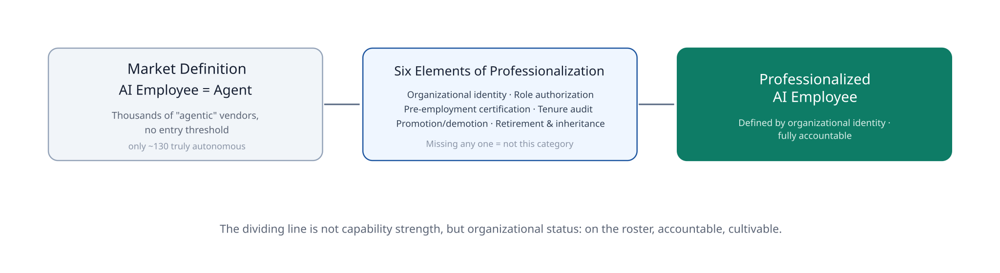
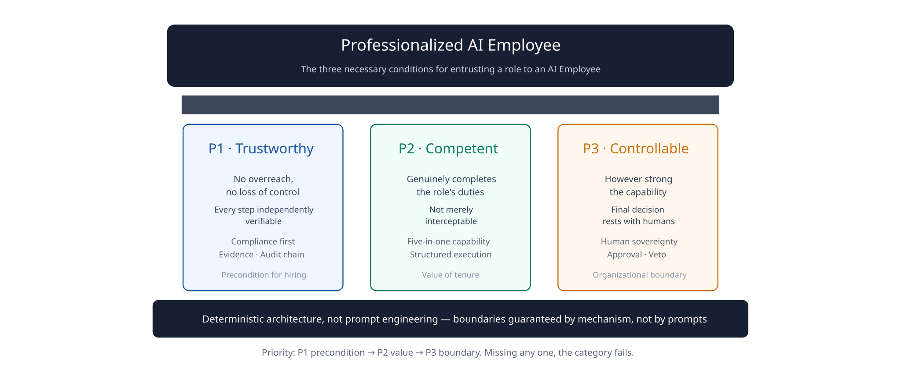
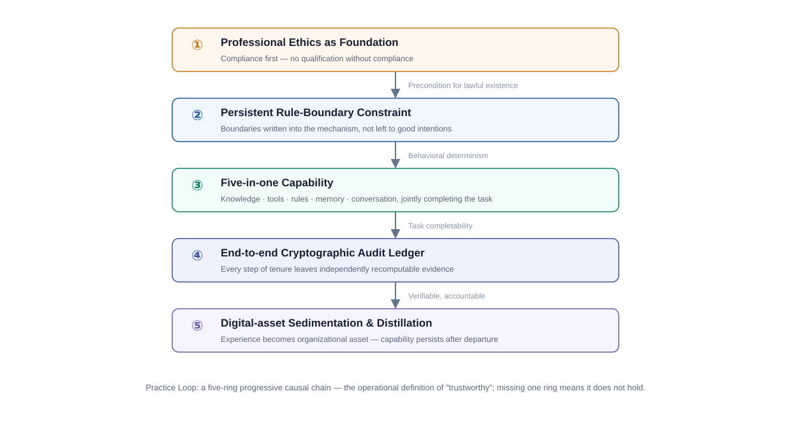
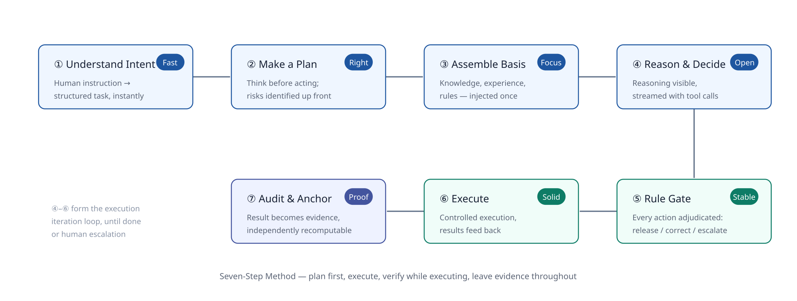
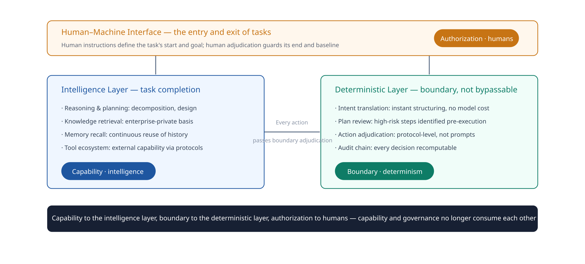
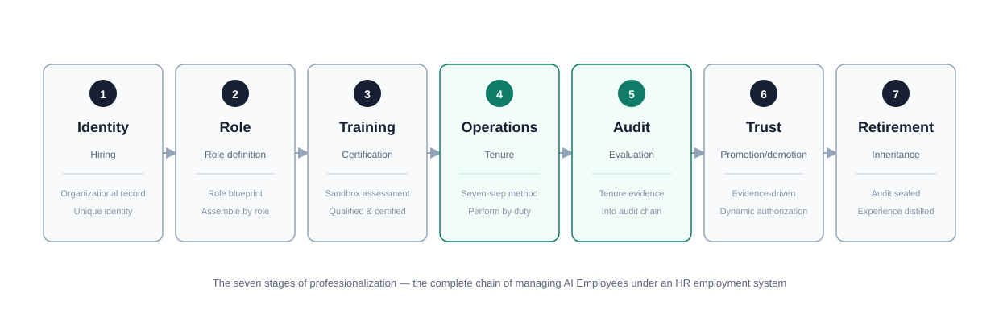

# Professionalized AI Employee

**Category Definition · Evaluation Framework · Evidence of Trust**

*Professionalized AI Employee（PAE）*

Professionalized AI Employee Whitepaper · V1.0

> Publisher: OpenOBA
> Version: V1.0
> Date: 2026-08-22
> Last Updated: 2026-09-02
> Status: Living Document — This whitepaper defines the category; engineering implementation is specified in the companion technical specification.

---

**Category Position Statement**

> AI's capability is real. Perceiving, reasoning, deciding, acting — what large models bring is not another software feature, but an unprecedented autonomous capability. Ignoring it or fearing it are not answers; using it well is.
>
> Seen from the organization's perspective, the essence of employment has never changed: **employing capability**. An enterprise hires a person because it needs the capability that resides in that person. But capability never exists in isolation — it always attaches to a subject of responsibility: the person who wields capability makes the decisions, bears the results, and shoulders the risks. A century of common sense in the employment system rests on this single point.
>
> What AI breaks is precisely this point. For the first time, capability can exist detached from a human body — and it is unprecedentedly strong — but it has no subject of responsibility. Trusting AI is not the problem; the problem is that the capability being trusted has no one accountable for it. So the only pragmatic answer is not to let AI enter the organization alone, but to attach this capability to an employee: **AI + Human = the smallest employee unit — the human wields the capability, and the human is the subject of responsibility**.
>
> Human organizations have long possessed a mature management framework for autonomous capability that must be accountable — human resource management. Bring the AI Employee into this framework, let capability be governed by the employment system, and return responsibility to the human — this is perhaps the most pragmatic optimal answer available today. From this stance we define the category:
>
> **Professionalized AI Employee** — AI + Human forming the enterprise's smallest employee unit: under the support of the HR system, responsibility has an owner, capability is compounded, and performance is amplified. AI capability is thereby fully released, and thereby always serves humanity.

---

## 1. Executive Summary

Enterprises are deploying AI agents at unprecedented speed, and failing at the same speed. Third-party research shows that over 40% of agentic AI projects will be canceled by the end of 2027 [1]; the primary cause of failure is not technology but governance — rising costs, unclear value, and insufficient risk control [1]. What this whitepaper offers is an **already-implemented** answer — not another vision.

The root cause is not technology, but a misalignment. **Seen from the organization's perspective, the essence of employment is employing capability, and the precondition of employing capability is that responsibility has a subject.** AI is precisely an autonomous capability without a subject of responsibility — procured as a tool, yet tools do not act autonomously; expected to bear responsibility, yet AI cannot become a party to an employment relationship. The correct answer lies between the two: **AI + Human = the smallest employee unit — the human wields AI as capability, and the human, as the subject of responsibility, is governed by the employment system.** What enterprises are missing is exactly this step.

This whitepaper offers a category-level answer to this wave of failure:

**Professionalized AI Employee — an AI Employee under the human-resource management system.** Here, "AI Employee" means the smallest employee unit composed of AI + Human: the human is the subject of responsibility, AI is the component of capability. The landing position of the AI Agent must be made explicit: it does not onboard alone, nor bears responsibility alone; it enters the organization as the employee's capability, following the human — organizational identity, role, and duties belong to the employee, and so does responsibility. But capability does not escape assessment: the AI Agent undergoes pre-employment assessment together with the employee, and is certified to work together with the employee. The entire tenure is auditable; the trust level rises or falls with evaluation results; and its experience can be inherited by the organization upon retirement.

This whitepaper defines the Professionalized AI Employee category and provides the first complete engineering implementation: the ERDL specification, the formal verification tool, 317 cross-implementation audit verification vectors, and the runtime framework are all open-sourced, while the governance infrastructure is in closed beta. Enterprises can apply for internal testing today; independent developers can verify today.

**Core claim: one of the ways out for agent adoption is to refer to the human-resource management framework and build a professionalized AI employee employment system.** Enterprises that can entrust critical business to AI over the long term are necessarily those that fold AI into accountable employees and manage them under a complete employment system.

---

## Implementation Status & Verification Entry

Every capability claimed in this whitepaper has a corresponding open-source implementation and independent verification entry. The table below anchors the core claims to verifiable implementations — any third party can independently recompute them against the public specification, without trusting any OpenOBA component.

| Whitepaper claim | Open-source implementation | License | Verification method |
|---|---|---|---|
| ERDL rule language specification | [OpenOBA/erdl-landing](https://github.com/OpenOBA/erdl-landing) (SPEC v2.1) | MIT | Independent implementation cross-verification |
| Formal verification of the deterministic kernel | [OpenOBA/erdl-formal](https://github.com/OpenOBA/erdl-formal) | Apache-2.0 | SMT proofs (34 nodes, full coverage) |
| Decision-evidence tamper-proof mechanism | [OpenOBA/erdl-vectors](https://github.com/OpenOBA/erdl-vectors) | CC0-1.0 (vectors) / Apache-2.0 (code) | 317 verification vectors (78 cryptographic + 239 semantic); 2 independent Runners landed (norviq-go Go / concordia-python Python) |
| Seven-step method runtime (Alpha) | [OpenOBA/rulsynor-core](https://github.com/OpenOBA/rulsynor-core) | BSL 1.1 | Local build & run |
| Community-edition full-stack Professionalized AI Employee runtime framework | [openoba.com](https://openoba.com) | In beta (not open-sourced) | Invitation-only beta |

Notably, the standardization of the ERDL rule language specification originates from A2A Discussion #2031 — where the independent verifier Erik Newton (Concordia) established the methodology of "three independent implementations, one open specification, no single owner," the very source of this whitepaper's principle that neutrality is tested, not claimed.

**Verification registry**: every verified independent implementation is recorded in the [IMPLEMENTATIONS registry](https://github.com/OpenOBA/erdl-vectors/blob/master/IMPLEMENTATIONS.md) — "who passed how many vectors on what date," measurements, not endorsements.

---

## 2. Industry Inflection Point: A Wave of Failure and a Governance Vacuum

### 2.1 Expansion Outpaces Governance

Agents are proliferating across enterprises while failing just as rapidly. The following data comes from Gartner's and Deloitte's continuous tracking across 2025–2026:

| Finding | Data | Source |
|------|------|------|
| Large-scale project failure | Over 40% of agentic AI projects will be canceled by the end of 2027 | [1] |
| Governance is the primary cause | Cancellation reasons: rising costs, unclear value, insufficient risk control | [1] |
| Low governance maturity | Only about 21% of enterprises have a mature agent governance model | [2] |
| Insufficient self-assessed governance | Only 13% of enterprises consider their agent governance adequate | [3] |
| Governance gaps force shutdowns | 40% of enterprises will downgrade or retire autonomous agents before 2027 due to governance gaps | [4] |
| Scale still exploding | By 2028, the average Fortune 500 enterprise will run over 150,000 agents (fewer than 15 in 2025) | [3] |

The supply side is equally confused: Gartner notes that among the thousands of "agentic" vendors on the market, only about 130 possess genuine autonomous capability; the rest are repackaged chatbots, process automation, and rule scripts [1]. **Even more confused is the definition of "AI Employee": the market generally equates it with Agent — letting AI "go to work" alone under the name of an employee — a term with no threshold, already severely diluted.**

### 2.2 Root Cause Diagnosis: Not a Technology Problem, but a Misalignment of Capability and Responsibility

Cost, value, risk — the three failure threads attributed by third parties [1] — all point to the same misalignment.

Seen from the organization's perspective, the essence of employment has never changed: **employing capability**. The enterprise pays compensation in exchange for the capability, residing in the employee, to complete tasks. But capability never exists in isolation — it always attaches to a subject of responsibility: the person who wields capability makes the decisions, bears the results, and shoulders the risks. A century of common sense in the employment system rests on this single point.

What AI brings is exactly an inverted combination: **capability unprecedentedly strong, yet without a subject of responsibility**. What the enterprise puts into operation is a capability that acts autonomously, but this capability belongs to no one, and no one is accountable for it. Procure it as a tool? Tools do not act autonomously; the moment one does, the old system immediately fails. Let AI clock in alone? AI cannot become a party to an employment relationship, and responsibility still has nowhere to land. Only one path remains between the two: **attach AI's capability to an employee — AI + Human = the smallest employee unit, the human wields the capability, and the human bears the responsibility.**

Gartner's judgment is piercing: treating agent governance as a binary choice of "lock down or fully trust" is precisely the root of failure [4]. And probationary periods, tiered authorization, and performance evaluation are exactly the intermediate states between "fully locked down" and "fully trusted" — they all presuppose one premise: that there is, in the organization, an employee who can be managed, evaluated, and held accountable. In today's failure cases, that employee does not exist.

### 2.3 The Way Out: A Runnable System for the HR Paradigm

The governance recommendations of industry research, translated into HR language, are strikingly familiar:

| Governance recommendation (Gartner's six steps [3]) | HR language |
|------|------|
| Establish agent governance and policy | Establish employment systems and codes of conduct |
| Establish a unified agent inventory | Organizational structure and headcount management |
| Define identity, authority, and lifecycle | Hiring, role authorization, lifecycle management |
| Information governance | Role-based knowledge access authorization |
| Monitor and correct agent behavior | Tenure audit and correction |
| Cultivate a culture of responsible AI use | Training and career development |

The industry's direction of convergence is clear: **the way out for agent adoption is human resource management.** What is missing is not consensus, but a product that turns this paradigm into a complete, out-of-the-box system. What this whitepaper defines is the category to which that product belongs.

---

## 3. Category Definition: Professionalized AI Employee

### 3.1 Formal Definition

Today the market generally equates "AI Employee" with Agent — AI as the employee, allowed to "go to work" alone in the name of the organization. This definition has no accountable subject: AI cannot become a party to an employment relationship, and responsibility for its behavior is destined to have nowhere to land. The term has no threshold and cannot serve as a basis for procurement or evaluation.

In this whitepaper's vocabulary, the employee carries no quotation marks:

> **AI Employee refers to the smallest employee unit composed of AI + Human — the human is the subject of responsibility, AI is the component of capability.** The employment relationship exists between the organization and the human; AI does not enter the organization in its own name, but as a component of the employee's capability — the AI Agent does not onboard alone or bear responsibility alone, but undergoes pre-employment assessment together with the employee, and is certified to work together with the employee.

On this basis, this whitepaper defines a category demarcated by **organizational identity**:

> **Professionalized AI Employee refers to an AI Employee (AI + Human) hired by the enterprise — it has an organizational identity, a defined role and responsibilities, is certified after pre-employment assessment, is auditable throughout its tenure, rises or falls in trust level according to evaluation results, and its experience can be inherited by the organization upon retirement.**

The difference between the two, in HR terms:

| | AI Employee = Agent (market definition) | Professionalized AI Employee of AI + Human (this category) |
|------|------|------|
| Definition dimension | Technical form: can AI work alone? | Organizational identity: is AI + Human on the roster, and accountable? |
| Who the employee is | AI (no human subject) | A real employee; AI is their capability |
| Entry threshold | None; any vendor can affix a label | A complete employment relationship (all six elements present) |
| Governance approach | Binary: lock down or trust | Tiered: probation → tiered authorization → performance evaluation |
| Responsibility for failure | No one to hold accountable | Auditable throughout; attributable to specific employees and decision points |
| Relationship with the organization | Loose, one-off | Certified, headcounted, promotable, inheritable |

An analogy: the market-defined AI Employee is like a day laborer without identity; the Professionalized AI Employee is a formal employee with a career plan. **Whether it can work is determined by the capability the employee wields; whether it can be managed, evaluated, held accountable, cultivated, and inherited is the core question of AI adoption in enterprises and government.**



*Figure 1 · The dividing line of the category is not capability strength, but organizational status: on the roster, accountable, value distributed, cultivable.*

> Text version (Figure 1): left is the market definition — "AI Employee = Agent", thousands of "agentic" vendors with no entry threshold (only about 130 with genuine autonomous capability); the middle is the six-element professionalization gate — organizational identity, role authorization, pre-employment certification, tenure audit, promotion/demotion, retirement and inheritance, missing any one means it is not this category; right is the Professionalized AI Employee — defined by organizational identity, fully accountable.

### 3.2 Entry Threshold: The Six Elements of Professionalization

For an AI Employee to enter this category, six elements must all be present. Missing any one means it is not this category — not that it is not good enough, but that it is not in this category at all:

| Element | Organizational meaning | Failure mode when absent |
|------|---------|----------------|
| Organizational identity | On the roster: which employee, what AI capability, in which jurisdiction | Uncontrolled proliferation, no attribution |
| Role authorization | Headcount: what role, what authority boundary | Overreach or over-restriction |
| Pre-employment certification | Qualified by assessment before taking the role; certificate has an expiry | Problems surface only after production incidents |
| Tenure audit | Every decision leaves verifiable evidence | Incidents cannot be traced or attributed |
| Promotion and demotion | Trust level adjusts dynamically with tenure evidence | Binary governance of full lock or full trust |
| Retirement and inheritance | Experience sediments into organizational assets on departure | All-or-nothing shutdown, asset loss |

### 3.3 Category Boundary: What It Is Not

- **Not a chat assistant (Copilot)**: an assistant is "used"; a Professionalized AI Employee is "hired." Assistants answer questions; employees complete roles. Assistants need no accountability; employees leave a complete trace.
- **Not an automation tool (RPA)**: tools execute preset processes with no judgment and no assessable behavioral boundary; employees exercise judgment within a boundary and leave evidence of that judgment.
- **Not a "stronger Agent"**: the category's dividing line is not capability strength. However strong an AI capability, if it is not folded into an accountable employee — without identity, role, or audit — it remains uncontrolled capability.
- **Not label-washing (agent washing)**: products that use "agentic" or "AI Employee" as marketing slogans — whether in fact chatbots, rule scripts, or merely letting an Agent "work alone" with no one accountable — satisfy none of the entry elements.

A one-line contrast of the two paradigms: **the tool-management paradigm manages Agent instances — no subject of responsibility, usable on procurement, binary governance; the employee-management paradigm (this category) manages AI Employees — responsibility with the human, assessment before onboarding, tiered authorization, evidence-based tenure, with incidents traceable, correctable, and inheritable.** The difference between the two is not product form, but whether "responsibility" has an owner.

### 3.4 The Category's Threefold Identity

This definition has three meanings:

- **For enterprises**, it is a **procurement criterion** — what you buy is not "an Agent" but "an accountable AI Employee: an AI + Human combination";
- **For the industry**, it is an **evaluation yardstick** — the Three Pillars of Chapter 4 and the Six Elements of this chapter constitute an operable framework for evaluating any "AI employee".
- **For the organization**, it resolves the **headcount problem** — what AI capability occupies is a "role quota," not an "employee headcount," avoiding both the political anxiety of "AI replacing employees" and labor-law risk (see Appendix D).

### 3.5 Ecosystem Positioning: Orthogonal to Connection and Communication Protocols

The agent ecosystem has formed two important open protocols: MCP solves "how an agent connects to tools and data" (the connection layer), and A2A solves "how agents collaborate with each other" (the communication layer) [9][10]. What this category solves is a third, organizational-level question: **how an organization hires, manages, and trusts an AI Employee (AI + Human)** (the governance layer).

The three are orthogonal and complementary, not competitive alternatives:

| Layer | Protocol / Category | Question solved |
|------|--------------|---------|
| Connection layer | MCP | Can the agent reach tools and data? |
| Communication layer | A2A | Can agents collaborate with each other? |
| Governance layer | This category (Professionalized AI Employee) | Can the organization hire, audit, and hold this AI Employee accountable? |

An AI Employee's AI capability can connect to tools via MCP and collaborate with colleagues' AI capabilities via A2A — while the employee's identity, role, certification, audit, evaluation, and retirement are always governed by this category's mechanisms. **Connection and communication make capability more capable; governance makes capability employable.** The behavior-boundary and rule-expression layers of the companion technical specification follow the same positioning: they are semantic conventions for agent behavior rules, complementary to — not parallel with — connection/communication protocols.

As the first practitioner of this category, OpenOBA maintains threefold neutrality and one openness:

- **Model-neutral**: bound to no large model; the capability layer can adopt models from different vendors;
- **Protocol-neutral**: compatible with open connection/communication protocols like MCP/A2A; builds no closed walls;
- **Jurisdiction-neutral**: all jurisdictions are equal (§7.5); no country-specific structure exists;
- **Vendor-open**: the Six Elements and Three Pillars are the category's public threshold and yardstick, equally applicable to OpenOBA and any peer — the definer of the category does not monopolize it.

---

### 3.6 ERDL and the Ecosystem Protocols (Technical Positioning)

ERDL is now open-sourced. What exactly is its relationship to MCP and A2A? In one sentence: **ERDL is the language of the governance layer, MCP is the protocol of the connection layer, A2A is the protocol of the communication layer — the three live on different layers, orthogonally complementary, not competitive.**

```
┌──────────────────────────────────────┐
│ Application layer: job tasks         │
├──────────────────────────────────────┤
│ Governance layer: ERDL               │ ← we are here
│   (behavior boundary & rule expr.)   │
│   ├─ Input: role blueprint +         │
│   │   jurisdiction compliance        │
│   └─ Output: deterministic verdict   │
│       (allow / correct / escalate)   │
├──────────────────────────────────────┤
│ Communication layer: A2A             │
│   (agent collaboration)              │
├──────────────────────────────────────┤
│ Connection layer: MCP                │
│   (tool & data access)               │
└──────────────────────────────────────┘
```

ERDL is not "yet another communication protocol" — it is the **semantic convention for behavior boundaries and rule expression**. It does not answer "how does an agent connect to tools" (that's MCP), nor "how do agents collaborate" (that's A2A); it answers "should this action be taken, and under what conditions." Every action of an AI employee is first adjudicated by ERDL (allow / correct / escalate to human), then reaches tools via MCP and collaborates with colleagues via A2A.

It is not a castle in the air — a real ERDL rule (behavior boundary) looks like this:

```yaml
protocol: "erdl/v2"
version: "2.0.0"
rules:
  - name: "SEC-001-dangerous-command"
    when:
      field: tool.name
      operator: eq
      value: exec
    then:
      decision: REQUEST_HUMAN
```

This rule means: when an AI employee attempts to execute the `exec` command, the deterministic engine adjudicates it as "requires human approval" — not relying on the prompt's self-discipline, but enforced by a deterministic mechanism.

---

## 4. Evaluation Framework: The Three Pillars

On what basis does an enterprise entrust a formal role to an AI Employee (AI + Human)? The question converges into three non-decomposable aspects — the category's Three Pillars:

| Pillar | Proposition | Question answered |
|------|------|-----------|
| **P1 · Trustworthy** | It will not overreach or run out of control, and every step can be independently verified | Can it be entrusted? |
| **P2 · Competent** | It can genuinely complete the role's duties, not merely be intercepted | Can it perform? |
| **P3 · Controllable** | However strong its capability, the final decision authority always rests with humans | Who has the final say? |

The three follow a strict priority: **P1 is the precondition for hiring (non-compliant means untrustworthy), P2 is the value of tenure (only the competent are formally hired), P3 is the organizational boundary (however strong, decision authority rests with the enterprise). Missing any one means the category does not hold.**



*Figure 2 · The Three Pillars: the three necessary conditions for an enterprise to entrust a role to an AI Employee.*

> Text version (Figure 2): P1 Trustworthy — no overreach, no loss of control, every step independently verifiable (compliance-first + decision evidence + audit chain), the precondition for hiring; P2 Competent — can genuinely complete the role's duties rather than merely be intercepted (five-in-one capability + structured execution program), the value of tenure; P3 Controllable — however strong the capability, the final decision authority rests with humans (human sovereignty: approval authority, veto authority), the organizational boundary. Missing any one means the category does not hold.

### 4.1 P1 · Trustworthy: No Overreach, and Every Step Independently Verifiable

Trustworthiness is not a promise but a verifiable fact. It is composed of three layers:

- **Compliance first**: first answer "is it permitted to exist and act," then "does it perform well." Compliance status is recorded with every decision and traceable along the evidence chain;
- **Behavioral boundary**: behavioral constraints are enforced by deterministic mechanisms — identical inputs always yield identical adjudications, with no reliance on prompt-word self-restraint. Crossing the line is blocked; doubt is escalated to a human;
- **Evidence chain**: every step of tenure produces a piece of decision evidence — tamper-proof, non-repudiable, and recomputable by any independent party.

**How to verify**: require the other party to produce the complete evidence of any historical decision and recompute it with an independent tool; require a demonstration of an overreach being blocked by mechanism (rather than dissuaded by a prompt).

### 4.2 P2 · Competent: Genuinely Completing the Role

A system that can only intercept but cannot be entrusted is not an employee. Competence is jointly supported by five kinds of capability — **conversation carries the task, knowledge provides the basis, tools deliver the execution, rules draw the boundary, and memory sediments the experience**.

Competence is a multiplicative relationship:

> **Competence = Knowledge × Tools × Rules + Memory**

The five capabilities are not parallel in the formula: conversation is the carrier of tasks, running through the whole process without entering the multiplication; knowledge, tools, and rules are the three multiplicands, and memory is the sedimentation term. Without knowledge there is no basis; without tools there is no execution; without rules capability runs wild — if any of the three multiplicands drops to zero, what remains is only memory, not the competence to fulfill a role; and memory determines whether it keeps getting better with use.

**How to verify**: assess against real role tasks (not demo scripts), require demonstration of the structured execution from intent to result, and observe quality change over usage time.

### 4.3 P3 · Controllable: Decision Authority Always Rests with Humans

However capable the employee, the organization's final decision authority, approval authority, and veto authority over critical matters cannot be transferred. The AI capability within the employee is the suggester and executor; the employee and the organization are the deciders and the accountable parties.

Controllability is realized through three invariants:

- **Shared semantics**: the organization's requirements for employee behavior can be stated, understood, and inspected — rules exist in a human-readable form, so humans can audit them;
- **Transparent execution**: every act of tenure is explainable — why this, on what basis, with what result;
- **Decision authority with humans**: the approval and veto paths for critical matters always exist and are fully recorded.

**How to verify**: confirm that explicit human approval/veto paths exist; confirm that human coverage of decisions (including reasons) is recorded and traceable.

---

## 5. How the Category Works

This chapter explains, from a black-box perspective, how the Professionalized AI Employee works — what it does and why it is trustworthy, without touching on implementation.

### 5.1 The Practice Loop: An Operational Definition of Trustworthiness

The tenure of a Professionalized AI Employee is a five-ring progressive causal chain; missing one ring means "trustworthy" does not hold:



*Figure 3 · The Practice Loop: a five-ring progressive causal chain — the operational definition of "trustworthy".*

| Ring | Guarantee provided | Consequence on failure |
|----|---------|---------|
| Professional ethics as the foundation | The precondition for lawful existence | No qualification to take a role |
| Persistent constraint by rule boundaries | Behavioral determinism | Uncontrollable |
| Five-in-one capability reinforcement | Task completability | Degrades into an executor |
| End-to-end cryptographic audit ledger | Verifiable, accountable | Not accountable |
| Digital-asset sedimentation and distillation | Continuous capability evolution | No growth |

The "five-in-one capability reinforcement" in the table is the competence jointly supported by the five capabilities of Chapter 4 P2 (conversation, knowledge, tools, rules, memory) — the capability ring among the five is exactly competence unfolding through the tenure process.

### 5.2 How a Task Gets Done: The Seven-Step Method

A task travels from a human instruction to a provable result through a structured execution program — **plan first, then execute, verify while executing, and leave evidence throughout**:



*Figure 4 · The Seven-Step Method: a deterministic execution pipeline from intent to result.*

> Text version (Figure 4): ① Understand intent (the human instruction is translated into a structured task in milliseconds, "fast") → ② Formulate plan (high-risk steps identified up front, "accurate") → ③ Assemble basis (knowledge, experience, and code of conduct injected once, "specialized") → ④ Reason and decide (the thinking process visible in real time, "transparent") → ⑤ Rule gatekeeping (every action passes boundary adjudication: allow / correct / escalate to human, "stable") → ⑥ Execute operations (controlled execution, results fed back to drive iteration, "reliable") → ⑦ Settle into the audit chain (adjudication and result become evidence immediately, recomputable, "evidentiary"). ④ through ⑥ form an execution iteration loop, until the task completes or escalates to a human.

This program differs in essence from the old "direct instruction, bare tool-call" model: **plan ahead** (high-risk steps are identified before execution), **boundary adjudication** (every action passes deterministic adjudication: release, correct, or escalate to a human), and **evidence produced on the fly** (adjudication and result immediately become verifiable evidence).

This yields five measurable value shifts:

| Value dimension | Old model: direct instruction | Execution loop: seven-step method |
|---------|----------------|-------------------|
| Completion efficiency | Zero-start reasoning each time | Intent routed instantly, basis prefetched, startup cost significantly reduced |
| Completion quality | Depends on prompt technique, high variance | Structured plan + basis injection, variance significantly narrowed, problems traceable |
| Capability ceiling | Limited by the model's own knowledge | Enterprise-private basis and tool ecosystem continuously extend the ceiling |
| Growth | No accumulation | Memory and knowledge continuously sediment, improving with use |
| Entrustability | Critical tasks cannot be entrusted | Full evidence, block-on-boundary, critical tasks can be entrusted |

These value shifts can be given order-of-magnitude engineering estimates (mechanism-based inference, not measured values; measured baselines will be published after Alpha-runtime measurement):

| Metric | Traditional Agent (estimated baseline) | Professionalized AI Employee (estimated) | Basis of inference |
|------|------------------|------------------------|----------|
| Incident trace-back | Days to weeks: manual log reconstruction | Minutes: direct audit-chain retrieval + independent recompute | Every decision's evidence enters the chain; hash recomputable |
| Overreach detection timing | Surfaced after the incident | Intercepted before execution | ERDL adjudication precedes tool invocation |
| Governance build cost | Organized ad hoc per project | Reused six-element system | Category-level institutional reuse |

Note: the above are order-of-magnitude estimates from mechanism inference, for understanding the direction of value only, not a procurement commitment. The deterministic-layer overhead of "intercept before execution" has been measured (~1ms per action, see Appendix E).

### 5.3 Layering Capability and Boundary

The employee's capability and boundary belong to different layers, each with its own owner:



*Figure 5 · Capability to the intelligence layer, boundary to the deterministic layer, authorization to humans.*

> Text version (Figure 5): a three-layer structure — the human-machine interface sits on top, the human's instruction defines the task's start and goal, the human's adjudication guards the end and the bottom line; the intelligence layer carries task completion (reasoning and planning, knowledge retrieval, memory recall, tool ecosystem); the deterministic layer constitutes the non-bypassable behavior boundary (intent translation, plan review, action adjudication, audit chain). Every action passes boundary adjudication: capability to the intelligence layer, boundary to the deterministic layer, authorization to humans.

It must be emphasized: **the deterministic layer's existence is not a restriction on AI capability, but the precondition for capability to be fully released.** It is precisely because behavioral boundaries are deterministic that enterprises dare entrust higher-value tasks to it. This also directly echoes the industry research diagnosis — governance cannot be one-size-fits-all; the scope of authorization should be tiered by risk and capability [4].

### 5.4 Pluggable Capability: Assembling a Role Like Assembling an Employee

Technically, this category is a **runtime framework into which rules, knowledge, tools, and roles can be freely plugged**: rules, knowledge, tools, and roles are all pluggable modules assembled by enterprises on demand; the framework itself provides only the deterministic execution, audit, and governance substrate, fixing no domain-specific business logic.

Capability content evolves continuously while the deterministic substrate remains stable over the long term — capability upgrades do not break audit traceability. **Capability evolves, but every step of that evolution is itself auditable.**

---

### 5.5 Configuration Example: A Role Blueprint

Assembling an AI employee starts with a role blueprint — declaring the role, permission boundary, and recommended capabilities in ERDL:

```yaml
# occupations/credit_assistant.erdl.yaml — role blueprint
protocol: "erdl/v2"
version: "1.0.0"
metadata:
  kind: occupation
occupation: credit_assistant
label: Junior Credit Assistant
description: Automated approval of low-risk credit
category: review

recommended_rules:
  - credit-limit          # credit-limit rule package
  - credit-compliance     # compliance rule package

recommended_tools:
  - query_credit_score
  - approve_loan

recommended_knowledge:
  - occ-credit-assistant-sop   # role SOP

pass_threshold: 0.8       # certification pass threshold
required_scenarios: 3     # certification scenario count
```

This blueprint is the "role blueprint": HR defines the role (label, category, pass_threshold), while IT assembles capability and permissions per `recommended_rules` / `recommended_tools` / `recommended_knowledge`. The runtime instantiates a "Junior Credit Assistant" from it, with every action constrained by rule packages and auditable.

---

## 6. The Professionalization Lifecycle

The Professionalized AI Employee benchmarks itself against the enterprise's formal employees, using the HR employment system as its framework across seven stages — each stage carries a corresponding institutional semantics and an auditable landing mechanism. The Six Elements are the entry threshold running through them (Chapter 3); the seven stages are the complete lifecycle that includes the tenure process — tenure (④) is the stage that runs continuously after passing the threshold:



*Figure 6 · The professionalization lifecycle: hiring → role definition → pre-employment training → tenure → trace-based evaluation → promotion/demotion → retirement and inheritance.*

> Text version (Figure 6): ① Identity (organizational file: unique identity credential) → ② Role (role blueprint: capability assembled per role) → ③ Training (sandbox assessment: certified to work on passing) → ④ Operations (seven-step method: performing duties) → ⑤ Audit (tenure evidence: fixed into the audit chain) → ⑥ Trust (evidence-driven evaluation: authorization expands or contracts dynamically) → ⑦ Retirement (audit sealed: experience distilled and fed back).

| Stage | HR semantics | What the organization gains |
|:---:|------|------|
| ① Identity | Hiring | Every AI Employee is on the roster and searchable: which employee, what AI capability, in which jurisdiction |
| ② Role | Role definition | Capability and authorization assembled by the role blueprint; boundaries clear, overreach blocked |
| ③ Training | Pre-employment certification | Competence assessed by real behavior (not self-declaration); qualified candidates certified, certificates with expiry |
| ④ Operations | Tenure | Role tasks completed via the seven-step method; humans initiate at the entry, adjudicate at key nodes |
| ⑤ Audit | Trace-based evaluation | Every step of tenure produces decision evidence, fixed into the audit chain, independently recomputable |
| ⑥ Trust | Promotion and demotion | Evaluation driven by tenure evidence: expanded authorization when performing well, demotion or cooling on anomaly |
| ⑦ Retirement | Departure and inheritance | Audit sealed, authorization revoked, tenure experience distilled into organizational assets |

The correspondence between the seven stages and the Six Elements of Chapter 3 is as follows — the Six Elements are the entry threshold running through the lifecycle; ④ Operations is the tenure process that runs continuously after passing the threshold, not itself one of the Six Elements, yet exactly the object the Six Elements govern:

| Seven stages | Corresponding Six Element | Note |
|:---:|------|------|
| ① Identity | Organizational identity | On the roster, searchable |
| ② Role | Role authorization | Boundaries clear, overreach blocked |
| ③ Training | Pre-employment certification | Qualified by assessment before taking the role |
| ④ Operations | (outside the Six Elements) | The continuous tenure process after the threshold; the object the Six Elements govern |
| ⑤ Audit | Tenure audit | Evidence at every step, independently recomputable |
| ⑥ Trust | Promotion and demotion | Evaluation driven by tenure evidence |
| ⑦ Retirement | Retirement and inheritance | Experience distilled into organizational assets |

Two key designs:

- **Certification is a hard gate**: an AI Employee that has not been assessed or whose certificate has expired has no qualification to take a role — just as uncertified persons may not practice;
- **Retirement is not the end**: when the employee departs, AI capability is reclaimed and knowledge retained. Experience is distilled back into the organization, so the organization's wisdom is not lost with the departure of any employee or their AI capability. One honest boundary: the scope of experience distillation is subject to the deployer's compliance configuration per jurisdiction — personal information does not enter distillation by default; only desensitized assets enter the organizational knowledge base.

---

### 6.1 API Example: Register Identity, Issue Certificate, Record Audit

The seven lifecycle stages reduce to three API calls — register identity, issue a certificate, record audit:

```bash
# ① Register identity: instantiate the role → generate the AI employee's identity
curl -X POST http://localhost:3000/api/occupations/credit_assistant/instantiate

# ③ Issue certificate: after passing pre-employment assessment, issue the role certificate to this "smallest employee unit"
#    (agentId is the instance identifier of the AI + Human pairing, bound to the employee's headcount record)
curl -X POST http://localhost:3000/api/certificates/{agentId} \
  -H "Content-Type: application/json" \
  -d '{"occupation": "credit_assistant"}'

# ⑤ Record audit: every decision is automatically chained; inspect the audit chain anytime
curl http://localhost:3000/api/audit/{decisionId}/chain
```

Identity registration, certificate issuance, and audit recording are all executed deterministically by the runtime, without manual intervention.

To be clear: `agentId` is not an independent identity of the AI, but the instance identifier of the "AI + Human" smallest employee unit, bound to the employee's headcount record. When the employee departs, the certificate is immediately voided, the AI capability is reclaimed, and knowledge is retained; a successor taking over the same role must re-assess and re-certify — the certificate follows the pairing, not the AI.

---

## 7. Evidence and Trust: Neutrality Is Measured

The final and most important question of a trustworthy category: **why should we believe you?**

Our answer is a methodological principle:

> **Neutrality is measured, not declared.**

### 7.1 The Verification Vector System

"Neutrality is measured" materializes into 317 independently recomputable verification vectors, spanning two layers — the decision-evidence layer and the expression-kernel layer. The two layers use different verification paradigms: the decision-evidence layer is cryptographic verification (tamper resistance, recomputing JCS + SHA-256 hashes), and the expression-kernel layer is semantic verification (correctness, evaluating per the specification and comparing results).

**Decision-evidence layer · 78 vectors** (`decision-object-vectors-v1.5.json`) — covering the tamper resistance and compliance of the Decision Object:

| Category | Count | Coverage |
|---|---|---|
| Decision type (D) | 13 | Adjudication semantics of 13 decisions |
| Audit chain (C) | 8 | Serial anchoring of the Decision Object |
| Tamper attack (A) | 10 | Anchoring / knowledge-body tamper |
| Canary (K) | 1 | Chain-position sentinel: deleting the whole audit must mismatch |
| Result tamper (G) | 14 | Verdict / structure tamper |
| Compliance fields (V-COMP) | 32 | Jurisdiction-activated field completeness |

**Expression-kernel layer · 239 vectors** (`v-engine-vectors.json`) — covering the deterministic evaluation of the expression tree:

| Category | Count | Coverage |
|---|---|---|
| Node semantics | 136 | 34 nodes × 4 scenarios |
| Evaluation constraints | 35 | E1–E12 |
| Simple compilation | 30 | 28 condition operators + within/rate |
| Natural-language Gloss | 16 | Bidirectional rendering consistency |
| Projection | 6 | Multi-projection consistency |

**Independent-recomputation requirement for the expression-kernel layer**: an independent implementation must parse the expression tree per ERDL SPEC v2.1 and execute evaluation, matching the expected value and type field-by-field — this is not a unit test of some implementation, but a semantic cross-check against the public specification.

Each vector is a "given input → expected output" recomputable assertion. Take an expression-kernel vector:

```json
{
  "id": "V-ENGINE-field-001",
  "node": "field",
  "expr_tree": { "field": "age" },
  "context": { "age": 35 },
  "expected": { "value": 35, "value_type": "number" }
}
```

Any independent implementation reading this vector must evaluate `field("age")` on `{ age: 35 }` to `35` — byte-for-byte identical, otherwise it fails.

Now a decision-evidence vector (excerpt):

```json
{
  "id": "V-DO-v15-D01",
  "decision_type": "ALLOW",
  "context": { "operation": "read" },
  "rules": [{ "when": { "eq": [{ "field": "context.operation" }, "read"] }, "then": "ALLOW" }],
  "decision_object": { "audit": { "hash": "sha256:00550ae2b8bac16fa8ed03b38da4e90da3bb0083492fea798ae9564c5ec81b6e" } },
  "expected": { "type": "MATCH" }
}
```

This vector asserts: given `operation: read`, after the rule `eq(context.operation, read) → ALLOW` is evaluated, the generated Decision Object, canonicalized via JCS + SHA-256, must have `audit.hash` exactly equal to `sha256:00550a…` — tamper with any field, and the hash mismatches, turning the vector red.

**Independently recompute a single decision evidence** (verification command):

```bash
git clone https://github.com/OpenOBA/erdl-vectors && cd erdl-vectors
npm install
npm run verify   # recompute JCS + SHA-256 for each of the 78 decision evidences, compare against the independent answer file
```

If any hash mismatches, `verify` immediately reports red — this is the executable proof of "cannot be altered, deleted, or denied."

### 7.2 Independent Verification and Runner Recruitment

Independent verification is not empty words — the first independent implementer has already proven its feasibility with facts.

**Erik Newton (Concordia)'s verification results**: building an independent verification engine from scratch in a completely different programming language (Python), he recomputed 13 audit vectors byte-for-byte — **12 byte-identical, AV-013 canary correctly failing** (this canary deliberately makes a defective implementation that "deletes the entire audit object" mismatch, and it was successfully caught).

**Version lineage (please read carefully)**: Erik Newton's independent verification above was completed on the v1.3 audit vectors (AV-001–AV-013), proving the feasibility of the methodology. The current 78 v1.5 vectors in §7.1 have now been independently recomputed by two independent Runners — Santosh Kumar Puppala's **`norviq-go`** (clean-room Go, zero dependencies, self-built JCS RFC 8785 + crypto/sha256, merged 2026-09-01) and **`concordia-python`** (Python, self-built JCS RFC 8785, merged 2026-09-02) — each built from the public spec and RUNNER_CONTRACT R1–R6 alone: **107/107 canonical bytes byte-for-byte**, K01 canary correctly discriminating. A third Runner is being recruited below. We do not use old-version verification results to endorse the new version — and we no longer need to: the new version has now been re-measured by independent implementers.

This means: someone who has never seen any of our code, relying only on the public specification, independently recomputed hashes byte-identical to ours — **neutrality is not claimed, it is independently measured.**

**Runner recruitment**: the first two independent Runners (norviq-go Go, concordia-python Python) have landed; we now openly seek the 3rd. Verifiers will receive:

- **Community reputation** — listed in the IMPLEMENTATIONS registry as an independent verifier, visible to the whole community;
- **Early governance points** — weighted credentials for participating in category governance;
- **Future Rule Store revenue share** — a share of revenue once the rule marketplace launches.

In one sentence: **do not trust us — verify with your own code.**

### 7.3 The Principle of Independent Verification

Self-declaration does not constitute trust. Every piece of decision evidence of a Professionalized AI Employee satisfies three conditions:

1. **Independently recomputable**: any independent party, using a different technology stack than the vendor's, can recompute and verify from the public specification alone, without depending on any component of the system under test;
2. **Tamper-proof and non-repudiable**: evidence, once produced, is fixed by cryptographic mechanisms — it cannot be altered, deleted, or repudiated;
3. **Usable by many parties**: the same evidence serves enterprise internal audit for walkthrough testing, third-party audit for independent verification, and regulatory review for compliance mapping.

To this end we have established a public, verifiable benchmark: **317 verification vectors, spanning two verification paradigms** — the decision-evidence layer 78 (V-DO-v15, cryptographic verification) and the expression-kernel layer 239 (V-ENGINE/V-GLOSS/V-PROJ, semantic verification), both layers fully released, with signing-layer vectors released progressively thereafter — covering behavioral-boundary expression, decision-evidence tamper resistance, compliance fields, business scenarios, and multi-party audit perspectives. Any third party can independently recompute against the public specification — **capable of fooling humans, but not of fooling mathematics.**

### 7.4 External Evidence: Independent Third-Party Verification

The evidence system of this specification has undergone cross-implementation verification by an independent third party:

> **Erik Newton (Concordia)** — the first independent verification implementer, who built an independent verification engine from scratch in a programming language entirely different from the implementation under test, recomputed decision-evidence samples byte-for-byte, and confirmed complete agreement with the reference implementation; and who established in the international protocol community the standardization methodology of "three independent implementations, one open specification, no single owner." The principle that "neutrality is not declared but measured" was proposed by him.

The significance of independent verification is "not trusting the party under test": the verifier recomputes independently with a different technology stack, eliminating the risk of "having to trust the vendor."

**An honest boundary**: we state explicitly the scope of the trust commitment — the tamper resistance and verifiability of decision records are guaranteed by this category's cryptographic mechanisms; the physical security of the execution environment and the security of infrastructure are jointly guaranteed by the deployer and the infrastructure. Drawing the boundary is the precondition of trust.

### 7.5 Compliance Posture: Globally Neutral, Jurisdictions Equal

The compliance design of the Professionalized AI Employee covers the world's major regulatory frameworks and standards, **all jurisdictions treated equally, with no country-specific structure** — the jurisdictional requirements of the EU, China, the US, Singapore, Brazil, India, etc., together with the frameworks of international standards bodies such as ISO, NIST, and OWASP [7][11][12][13], are all first-class instances under the same mechanism.

Compliance is not a slogan but a programmable gate: whichever jurisdiction it serves in, it follows that jurisdiction's rules; whatever the risk level, it bears the corresponding compliance obligation; compliance status enters the evidence chain with every decision, independently inspectable.

---

## 8. Category Roadmap

The evolution path of the Professionalized AI Employee goes from individual to organization — and this path is happening now:

| Stage | Form | Status | Verification entry |
|------|------|------|---------|
| Individual | Seven-stage complete loop | 🟢 Shipped | runtime-alpha open to internal testing |
| Team | Multi-employee collaborative audit chain | 🟡 Alpha | Recruiting design partners |
| Organization | AI organization governance | ⚪ Roadmap | 2027 Q2 whitepaper update |

Parallel to individual growth is the **capability supply ecosystem**: rules and knowledge are no longer hand-written one by one, but mass-produced through an industrialized pipeline from authoritative source texts (laws, standards, norms), packaged in versioned, signed units, and supplied to enterprises through a unified distribution channel — enterprises assemble and upgrade AI Employees' capabilities just as they hire and train employees.

The farther prospect is the **institutionalization of the category itself**: when "Professionalized AI Employee" becomes a recognized employment category, role certification, industry capability-package standards, and audit conventions will follow — just as the HR institution itself sedimented into organizational common sense over a century.

---

## 9. Conclusion: A Category Declaration

1. **The way out for agent adoption is human resource management.** The root cause of the failure wave is not technology, but enterprises releasing AI as a standalone Agent outside any accountable employee and managing autonomous capability with the institution of tool procurement. Folding AI into accountable employees and managing it with probationary periods, tiered authorization, and performance evaluation — this century-old common sense is exactly the missing intermediate state between "fully locked down" and "fully trusted."

2. **The category's dividing line is not capability strength, but organizational status.** The Professionalized AI Employee is defined by organizational identity: on the roster, in a role, certified, auditable, evaluable, inheritable. Missing any of the Six Elements means it is not this category.

3. **Trustworthy, Competent, Controllable — only with all three can a role be entrusted.** Trustworthiness is the precondition for hiring, competence the value of tenure, controllability the organizational boundary. This is the yardstick for any enterprise evaluating an "AI employee."

4. **Boundaries let capability be released with confidence.** Capability to the intelligence layer, boundary to the deterministic layer, authorization to humans — capability and governance no longer consume each other.

5. **Neutrality is measured, not declared.** The evidence of every step of tenure can be recomputed and verified by any independent party. Trust comes not from promises but from verifiability.

**What OpenOBA delivers is the first complete practitioner of this category.** We believe the endgame of enterprise AI is not more tools, but a workforce of Professionalized AI Employees that is manageable, evaluable, and entrustable.

---

## Appendix A · Glossary

| Term | Definition |
|------|------|
| **AI Employee** | In this whitepaper's vocabulary: the smallest employee unit composed of AI + Human — the human is the subject of responsibility, AI is the component of capability; the employment relationship exists between the organization and the human; AI enters the organization as a component of the employee's capability. The market generally equates AI Employee with Agent (AI as the employee); this whitepaper does not adopt that definition. |
| **Professionalized AI Employee (PAE)** | The category defined by this whitepaper. An AI Employee (AI + Human) formally hired by the enterprise, headcounted, certified for the role, auditable throughout, promoted or demoted by evaluation, inheritable on retirement. Distinguished from tools, assistants, and Copilot: the latter are "used"; the Professionalized AI Employee is "hired." |
| **Six Elements of Professionalization** | The category's entry threshold: organizational identity, role authorization, pre-employment certification, tenure audit, promotion and demotion, retirement and inheritance. |
| **Three Pillars** | The category's evaluation framework: Trustworthy (P1), Competent (P2), Controllable (P3). |
| **Competence** | The measure of an AI Employee's ability to complete tasks: Knowledge × Tools × Rules + Memory. |
| **Deterministic Layer** | The set of mechanisms that do not depend on a large model and that always produce the same output for the same input; the carrier of behavioral boundaries. |
| **Intelligence Layer** | The reasoning and planning capability borne by a large model, constrained within boundaries by the deterministic layer. |
| **Practice Loop** | The five-ring causal chain of the full tenure process: ethics as foundation → boundary constraint → capability reinforcement → audit ledger → asset sedimentation; the operational definition of "trustworthy." |
| **Shared Semantics** | The semantic agreement among humans, models, systems, and auditors on the same behavioral requirement, eliminating natural-language ambiguity. |
| **Decision Object** | The cryptographic audit record of a single decision, independently recomputable and verifiable; the unit of the audit chain. |
| **Audit Chain** | The tamper-proof evidence chain formed by anchoring Decision Objects in order: cannot be altered, deleted, or reordered. |
| **Rule Package / Knowledge Package** | The versioned, signed, distributable form of rules and knowledge; the atomic unit of capability supply and loading. |
| **Rule Store** | The unified distribution channel for rule packages and knowledge packages, through which enterprises acquire and assemble capabilities. |
| **ERDL (Entity-Rule Definition Language)** | The behavior-boundary and rule-expression layer defined by the companion technical specification: a declarative language readable by humans, precisely parseable by models, and executable by systems; complementary to — not parallel with — connection/communication protocols like MCP/A2A. |

## Appendix B · References

**Industry Research**

1. Gartner, "Gartner Predicts Over 40% of Agentic AI Projects Will Be Canceled by End of 2027", press release, 2025-06-25.
2. Deloitte AI Institute, "The State of AI in the Enterprise", 2026.
3. Gartner, "Gartner Identifies Six Steps to Manage AI Agent Sprawl", press release, 2026-04-28.
4. Gartner, "Gartner Says Applying Uniform Governance Across AI Agents Will Lead to Enterprise AI Agent Failure", press release, 2026-05-26.

**Technical Standards and Regulations (public standards on which the evidence mechanism is based)**

5. RFC 8785 — JSON Canonicalization Scheme (JCS), the deterministic serialization basis for decision evidence.
6. RFC 3161 — Trusted Timestamping Protocol, the time-anchoring basis for evidence (reserved on the roadmap: current Decision Objects are time-anchored by "chain position + retention period"; trusted timestamps to be introduced per this protocol).
7. EU AI Act; Interim Measures for the Management of Generative Artificial Intelligence Services, and Measures for the Review of Science and Technology Ethics (Trial) (China's AI governance regulations) — examples of compliance frameworks, all jurisdictions equally activated.

**Companion Specification**

8. "OpenOBA · Professionalized AI Employee — Product Specification" (technical specification, separate volume) — the complete engineering definition of the mechanisms described in this whitepaper.

**Ecosystem Protocols and Governance Standards (citations for ecosystem positioning and compliance frameworks)**

9. Model Context Protocol (MCP) Specification — the open protocol of the connection layer between agents and tools/data.
10. Agent2Agent (A2A) Protocol Specification — the open protocol of the communication layer between agents.
11. ISO/IEC 42001 — Artificial Intelligence Management System standard; an example governance framework, all jurisdictions equal.
12. NIST AI RMF — AI Risk Management Framework; an example governance framework, all jurisdictions equal.
13. OWASP Agentic AI Security & Governance Guidance — an example of industry security governance guidance.

---

## Appendix C · 5-Minute Verification Guide

Don't read the whole whitepaper — spend 5 minutes verifying "neutrality is measured" with your own hands.

**Step 1 · Clone the verification vectors (1 minute)**

```bash
git clone https://github.com/OpenOBA/erdl-vectors
cd erdl-vectors
```

**Step 2 · Inspect an unauthorized-access interception test case (1 minute)**

Open `decision-object-vectors-v1.5.json` and find `V-DO-v15-A01` (anchoring attack vector) — it asserts: when the decision object's knowledge body is tampered with, the audit hash must mismatch, leaving unauthorized / tampered behavior nowhere to hide.

**Step 3 · Recompute hashes locally and compare (2 minutes)**

```bash
npm install
npm run verify
```

`verify` recomputes the JCS + SHA-256 hash for each of the 78 decision-evidence vectors and compares them against the independent answer file — all byte-for-byte identical, proving "cannot be altered, deleted, or denied."

**Step 3.5 · Verify the expression-engine semantic layer (1 minute)**

```bash
npm run verify:vengine
```

`verify:vengine` evaluates each of the 239 expression-kernel vectors per ERDL SPEC v2.1 and compares them against expected values — Step 3 verifies the cryptographic layer (tamper resistance), and this step verifies the semantic layer (correctness); only when both are run is verification complete.

**Step 4 · Launch the Alpha runtime (private beta, 1 minute; command current as of 2026-09-01)**

```bash
docker run openoba/runtime-alpha --scenario=credit-assistant
```

**Step 5 · Inspect the audit chain (private beta)**

Visit `http://localhost:8080/audit/chain` to view the hash chain of every decision.

Steps 1–3 run today; steps 4–5 belong to the Alpha runtime, invitation-only.

---

## Appendix D · Companion "PAE Organization Implementation Guide" Summary

Organizational implementation is the last mile from "category" to "product." The companion *PAE Organization Implementation Guide* answers the three questions enterprises care most about during implementation:

1. **The HR–IT responsibility boundary**: HR manages identity, role, certification, promotion and demotion; IT manages runtime, tool integration, and infrastructure. The two interface through the "role blueprint" — HR defines the role, IT assembles capability and permissions per the blueprint.

2. **The headcount question**: adopt "capability quota" rather than "personnel quota" — AI capability occupies a "role quota," not an "employee headcount," avoiding labor-law risk at the root.

3. **Procurement contract template**: a dual-track contract of SaaS subscription (capability usage) + governance services (responsibility and compliance) — capability is bought by volume, governance is bought by responsibility.

> The full guide is available in the companion document *PAE Organization Implementation Guide* (V1.0, 2026-09-01).

---

## Appendix E · Deterministic-Layer Performance Baseline (Self-Measured)

The whitepaper's creed is that "neutrality is measured" — and so is performance. The following baseline was self-measured by the OpenOBA reference-implementation team on a development machine; the script is provided in the rulsynor-core repository (`scripts/bench.mjs`), and anyone can reproduce it on their own machine.

**Measurement environment**

| Item | Value |
|---|---|
| CPU | Intel Core i5-8250U @ 1.60GHz (a 2017 laptop CPU) |
| Logical cores | 8 |
| Runtime | Node.js v24.18.0 |
| OS | Windows 10 (19045) |
| Rule set | 30 preset rules (security / compliance / integrity) |
| Scenario | Dangerous-command interception (`rm -rf /`, hitting DENY, with regex matching — the heaviest path) |
| Sampling | adjudication 100,000 · evidence 20,000 · full pipeline 20,000 |

**Measurement results**

| Stage | p50 | p95 | p99 | Mean | Throughput (single-thread) |
|---|---|---|---|---|---|
| ① Rule adjudication (Evaluator.evaluate) | 0.12ms | 0.20ms | 0.34ms | 0.13ms | ~7,400 ops/s |
| ② Audit recording (buildDecisionObject, JCS+SHA-256) | 0.68ms | 1.20ms | 1.64ms | 0.76ms | ~1,300 ops/s |
| ③ Full pipeline (adjudication + recording) | 0.86ms | 1.50ms | 2.17ms | 0.98ms | ~1,000 ops/s |

**Conclusion**

The deterministic governance cost of a single action is about **1ms (p50) to 2.2ms (p99)** — and this is a conservative value measured on a 2017 laptop CPU; production-grade servers will be faster. This means the concern that "determinism trades off throughput" does not hold at the per-action level: the governance layer's overhead is three orders of magnitude below a single LLM round-trip (seconds). The real time cost of the seven-step method lies in the intelligence layer, not the deterministic layer.

**An honest boundary**: the above are self-measured values on a single development machine, not production-environment measurements; concurrency and cluster throughput, and the latency of external dependencies such as MySQL/Redis, are outside this measurement's scope and will be supplemented after production-environment measurement.

---

## Community Acknowledgments

The publication of this whitepaper benefited from the help of the following people. All three are unpaid community contributors with no commercial relationship with OpenOBA (no payment, no equity) — the independence of their contributions is precisely the foundation of the principle that "neutrality is measured":

### Christopher Hopley (chopmob-cloud / AlgoVoi)

Independent technical reviewer, contributing to the compliance receipt and decision-evidence mechanisms:

- **Compliance receipt format**: proposed the compliance receipt format (JCS + SHA-256), providing a standard carrier for cross-Agent compliance attestation — this whitepaper's compliance receipt mechanism was inspired by it;
- **Content-address vs. signature**: in A2A Discussion #2031, clearly identified that "the load-bearing compliance mechanism is keyless content-addressed recompute, with signature only an optional additive layer" — a distinction that directly shaped the flat-hash design of the decision object;
- **Clean-room inspection**: verified the specification's internal consistency with an independent RFC 8785 JCS + SHA-256 checker, reporting 4 technical findings + 3 security issues that directly drove security hardening;
- **Cross-Agent retention chain**: proposed the Retention Chain (I-D draft-hopley-x402-retention-chain-07) for cross-Agent evidence retention.

### Erik Newton (Concordia)

The first independent Runner implementer, and the proposer of the principle that "neutrality is not declared but measured":

- **Standardization methodology**: established in A2A Discussion #2031 the path of "three independent implementations, one open specification, no single owner";
- **Cross-implementation byte-for-byte verification**: independently built a Decision Object verification engine in Python, verifying 13 audit vectors byte-for-byte (12 byte-identical + AV-013 canary correctly failing), demonstrating the technical feasibility of JCS + SHA-256 cross-implementation verification;
- **Chain-integrity canary**: drove the chain-integrity canary (AV-013) design and the answer-file separation architecture.

### Santosh Kumar Puppala (norviq-go)

The first third-party v1.5 Runner, and the proposer of the record-emission fidelity (P-05) residual risk:

- **First third-party v1.5 independent implementation**: built `norviq-go` from scratch in Go with zero dependencies (self-built JCS RFC 8785 + crypto/sha256), from the public spec and RUNNER_CONTRACT R1–R6 alone, reading no reference code — 107/107 canonical bytes byte-for-byte;
- **Record-emission fidelity (P-05)**: raised the P-05 residual risk with a real-world PEP / cache-hit bug example, driving §1.4 (production-side invariant), §1.5 (decision-derivation semantics), and §1.6 (Producer Contract + V-PRODUCER);
- **P6 resolvable-set clarification**: identified the resolvable-set semantic ambiguity, driving the "no information ≠ empty set" narrowing.

### RavindraAnnam

Independent technical reviewer who pressed on the boundary where a "deterministic kernel" claim is hardest to hold — the **stateful operators** (`within`/`rate`):

- **Stateful-operator evidence gap**: his review of the evaluator surfaced the `temporal_state` evidence gap on state mutation and the `total_evaluated` count drift, now fixed and covered by conformance vectors; the finding opened a dedicated research track on stateful-operator semantics;
- **Multi-agent governance invariants**: in A2A Discussion #2031 he proposed the four runtime-authority invariants — authority non-amplification, provenance continuity, narrow-only constraint inheritance, and transitive revocation — that grew into the INV-01–INV-05 delegation-authority security note and now underpin OpenOBA's multi-agent governance direction.

### OpenOBA Reference Implementation Team

The reference implementation of the ERDL rule engine, and the baseline for all test-vector generation and verification.

The significance of independent verification lies in "not trusting the party under test": recomputing independently with a different technology stack eliminates the risk of "having to trust the vendor." We record and thank their contributions faithfully.

---

## Design Partner Feedback

The first partners who practiced this category together with us provided the following feedback — note that this is feedback from the design-partner stage, not a formal delivery case:

> **The risk-control department of a multinational financial institution (anonymous)** has onboarded a credit-approval Agent into the PAE framework as a "junior credit assistant." After 30 days of Alpha runtime testing, it completed 1,200 low-risk business auto-approvals, with a **100% boundary adjudication interception rate and a fully traceable audit chain**.

Honest note: the above is self-reported data from the design-partner stage, and its audit chain is not yet externally recomputable; once the audit chain is published, an independent verification entry for this case will be provided — at which point it will upgrade from "partner feedback" to "verifiable adopter evidence." This is our first design partner (anonymized at the partner's request). We are recruiting more early adopters and design partners — reach out via business@openoba.com.

---

*© 2026 Shenzhen Miaojing Technology Co., Ltd. (OpenOBA) · All rights reserved*
