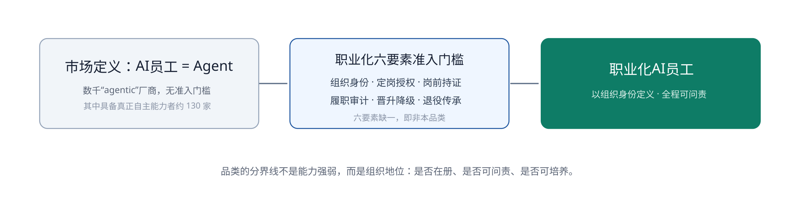
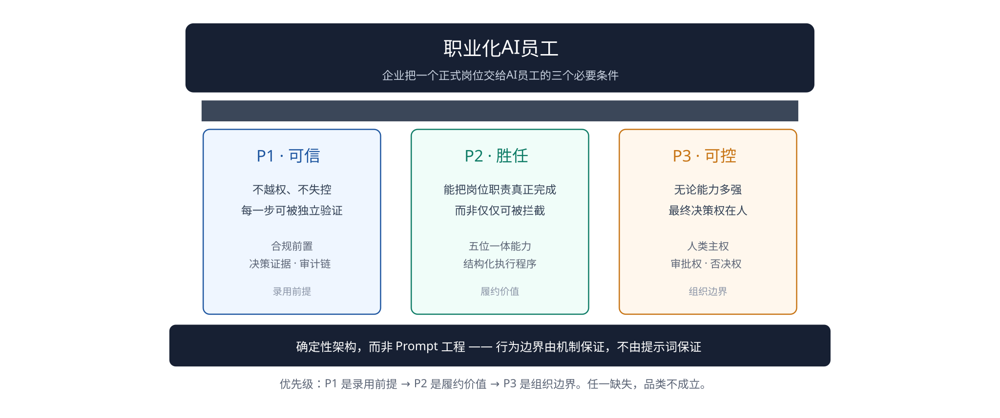
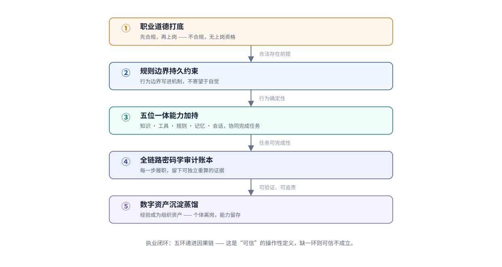
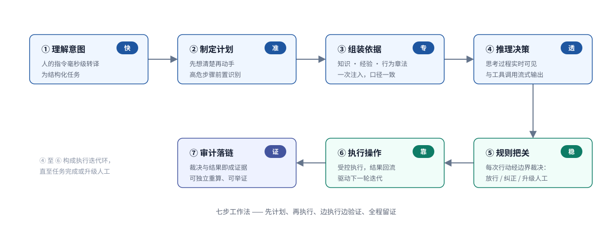
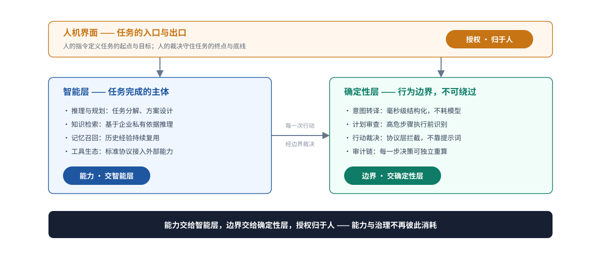
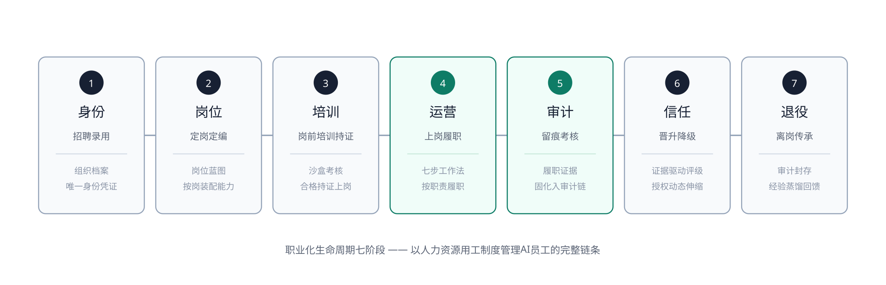

# 职业化AI员工

**品类定义 · 评估框架 · 信任证据**

*Professionalized AI Employee（PAE）*

职业化AI员工白皮书 · V1.0

> 发布方：OpenOBA
> 版本：V1.0
> 日期：2026-08-22
> Last Updated：2026-09-02
> 状态：活文档（Living Document）—— 本白皮书定义品类，工程实现另见配套技术规范

---

**品类立场声明**

> AI 的能力是真实的。感知、推理、决策、行动——大模型带来的不是又一项软件功能，而是一种前所未有的自主能力。无视它、恐惧它，都不是答案，用好它才是。
>
> 站在组织的视角看，用工的本质从未改变：**使用能力**。企业雇用一个人，需要的是这个人身上的能力。但能力从来不会孤立存在——它总是附着在责任主体身上：掌握能力的人做决策、担业绩、扛风险。用工制度的百年常识，就建立在这一点上。
>
> AI 打破的正是这一点。能力第一次可以脱离人的身体单独存在，而且前所未有地强——但它没有责任主体。信任 AI 没有问题，问题是被信任的能力没有人负责。所以，唯一务实的答案不是让 AI 独自进入组织，而是把这份能力附着到员工身上：**AI + 人 = 最小员工单元，人掌握能力，人是责任主体**。
>
> 人类组织早已为必须问责的自主能力准备好了成熟的管理框架——人力资源管理。把 AI员工纳入这套框架，让能力被用工制度管理，让责任回归于人，这可能是当下最务实的优解。由此，我们定义本品类：
>
> **职业化AI员工**——AI + 人组成企业的最小员工单元：在人力资源体系的支撑下，责任有归属，能力被叠加，绩效被放大。AI 能力由此被充分释放，也由此始终为人类所用。

---

## 1. 执行摘要

企业正在以前所未有的速度部署 AI 智能体（Agent），也在以同样快的速度失败。第三方研究显示，超过 40% 的 Agentic AI 项目将在 2027 年底前被取消 [1]；失败的主因不是技术，而是治理——成本攀升、价值不清、风险控制不足 [1]。本文给出的，是一个**已实现**的答案——不是又一份愿景。

根因不在技术，而在一个错位。**站在组织的视角，用工的本质是使用能力，而使用能力的前提，是责任有主体。** AI 恰恰是一种没有责任主体的自主能力——企业把它当工具采购，工具却会自主行动；想让它担责，AI 又无法成为雇佣关系的一方。正确的答案在两者之间：**AI + 人 = 最小员工单元——人把 AI 当作能力来掌握，人作为责任主体，被用工制度管理。** 企业缺的，正是这一步。

本白皮书给出这一失败潮的品类级答案：

**职业化AI员工——人力资源管理体系下的 AI员工。** 这里的 AI员工，指由 AI + 人组成的最小员工单元：人是责任主体，AI 是能力组成。这里要明确 AI Agent 的落地定位：它不单独入职、不独立担责，而是作为员工的能力，跟随人进入组织——组织身份、岗位与职责归属于员工，责任也归属于员工。但能力同样要过考核关：AI Agent 随员工一起接受岗前考核，合格后与员工一同持证上岗；履职全程可审计，信任等级随考核结果晋升或降级，退役时其经验可传承给组织。

本白皮书定义职业化AI员工品类，并提供首个完整工程实现：ERDL 规范、形式化验证工具、317 条跨实现审计验证向量、运行时框架均已开源，治理基础设施内测中。企业今日可申请内测，独立开发者今日即可验证。

**核心主张：Agent 落地的出路之一，是参考人力资源管理框架，构建职业化AI员工用工体系。** 能够把关键业务长期托付给 AI 的企业，必然是把 AI 纳入可问责的员工、并以完整用工制度加以管理的企业。

---

## 实现状态与验证入口

本白皮书所声明的能力，均有对应的开源实现与独立验证入口。下表将核心声明与可核验的实现一一锚定——任何第三方均可按公开规范独立验证，无需信任 OpenOBA 的任何组件。

| 白皮书声明 | 开源实现 | 许可证 | 验证方式 |
|---|---|---|---|
| ERDL 规则语言规范 | [OpenOBA/erdl-landing](https://github.com/OpenOBA/erdl-landing)（SPEC v2.1） | MIT | 独立实现交叉验证 |
| 确定性内核形式化验证 | [OpenOBA/erdl-formal](https://github.com/OpenOBA/erdl-formal) | Apache-2.0 | SMT 证明（34 节点全覆盖） |
| 决策证据防篡改机制 | [OpenOBA/erdl-vectors](https://github.com/OpenOBA/erdl-vectors) | CC0-1.0（向量）/ Apache-2.0（代码） | 317 条验证向量（78 条密码学验证 + 239 条语义验证）；已有 2 个独立 Runner 落地（norviq-go Go / concordia-python Python） |
| 七步工作法运行时（Alpha） | [OpenOBA/rulsynor-core](https://github.com/OpenOBA/rulsynor-core) | BSL1.1 | 本地构建运行 |
| 社区版全栈职业化AI员工运行时框架 | [openoba.com](https://openoba.com) | 内测中（未开源） | 内测邀请制 |

其中，ERDL 规则语言规范的标准化源于 A2A Discussion #2031——独立验证者 Erik Newton（Concordia）在此确立「三个独立实现、一个开放规范、没有单一所有者」的标准化方法论，本白皮书「中立性是被测出来的」原则正源于此。

**验证注册表**：每个通过验证的独立实现均登记于 [IMPLEMENTATIONS 注册表](https://github.com/OpenOBA/erdl-vectors/blob/master/IMPLEMENTATIONS.md)——「谁在什么日期通过了多少条向量」，是测量而非背书。

---

## 2. 行业拐点：失败潮与治理真空

### 2.1 扩张快于治理

Agent 正在企业中快速扩张，同时以同样快的速度失败。以下数据来自 Gartner 与 Deloitte 在 2025–2026 年间的连续追踪：

| 结论 | 数据 | 来源 |
|------|------|------|
| 项目大面积失败 | 超过 40% 的 Agentic AI 项目将在 2027 年底前被取消 | [1] |
| 失败主因是治理 | 取消原因：成本攀升、价值不清、风险控制不足 | [1] |
| 治理成熟度低 | 仅约 21% 的企业拥有成熟的 Agent 治理模型 | [2] |
| 治理自评不足 | 仅 13% 的企业认为自身 Agent 治理充分 | [3] |
| 治理缺口致下线 | 40% 的企业将在 2027 年前因治理缺口降级或下线自主 Agent | [4] |
| 规模仍在爆发 | 到 2028 年，平均一家财富 500 强企业在用 Agent 将超过 15 万个（2025 年不足 15 个） | [3] |

与此同时，市场供给端同样混乱：Gartner 指出，市面上数以千计的“agentic”厂商中，仅约 130 家具备真正的自主能力，其余多为聊天机器人、流程自动化与规则脚本的重新包装 [1]。**更混乱的是“AI员工”的定义：市场普遍将它等同于 Agent——让 AI 以员工的名义单独上班——这个词没有门槛，已被严重稀释。**

### 2.2 根因诊断：不是技术问题，是能力与责任的错位

成本、价值、风险——第三方归因的三条失败线索 [1]，指向同一个错位。

站在组织的视角，用工的本质从未改变：**使用能力**。企业付出薪酬，换取的是员工身上完成任务的能力。但能力从来不是孤立存在的——它总是附着在责任主体身上：掌握能力的人做决策、担业绩、扛风险。用工制度的百年常识，就建立在这一点上。

AI 带来的，恰恰是一个反过来的组合：**能力前所未有地强，却没有责任主体**。企业投放的是一个会自主行动的能力，但这个能力不属于任何人，也没有任何人为它负责。当工具采购？工具不会自主行动，一旦行动，旧制度立刻失效。让 AI 单独上班？AI 无法成为雇佣关系的一方，责任照样无处安放。两条路之间只剩一条：**把 AI 的能力附着到员工身上——AI + 人 = 最小员工单元，人掌握能力，人担责任。**

Gartner 的判断一针见血：把 Agent 治理当作“要么锁死、要么全信”的二元选择，正是失败的根源 [4]。而试用期、分级授权、绩效考核，恰恰是“锁死”与“全信”之间缺失的中间状态——它们都预设了一个前提：组织里有一个可管理、可考核、可问责的员工。在今天的失败案例里，这个员工不存在。

### 2.3 出路：给人力资源范式一个可运行的系统

行业研究的治理建议，翻译成 HR 语言后惊人地熟悉：

| 治理建议（Gartner 六步 [3]） | HR 语言 |
|------|------|
| 建立 Agent 治理与政策 | 建立用工制度与行为准则 |
| 建立统一 Agent 清单 | 组织架构与编制管理 |
| 定义身份、权限与生命周期 | 招聘录用、定岗授权、生命周期管理 |
| 信息治理 | 岗位知识访问授权 |
| 监控并纠正 Agent 行为 | 履职审计与纠偏 |
| 培育负责任的 AI 使用文化 | 培训与职业发展 |

行业的收敛方向已经清晰：**Agent 落地的出路，是人力资源管理。** 缺的不是共识，而是一个把这套范式做成开箱即用完整系统的产品。本白皮书定义的，就是这个产品所属的品类。

---

## 3. 品类定义：职业化AI员工

### 3.1 正式定义

今天市场普遍把“AI员工”等同于 Agent——AI 当员工，让它以组织的名义单独上班。这个定义里没有问责主体：AI 无法成为雇佣关系的一方，它的行为责任注定无处安放。这个词没有门槛，无法作为采购与评估的依据。

本白皮书的语境里，员工没有引号：

> **AI员工，指由 AI + 人组成的最小员工单元——人是责任主体，AI 是能力组成。** 雇佣关系发生在组织与人之间；AI 不是以自己的名义进入组织，而是作为员工能力的组成部分进入组织——AI Agent 不单独入职、不独立担责，而是跟随员工一起接受岗前考核，合格后与员工一同持证上岗。

在此基础上，本白皮书定义一个以**组织身份**划界的品类：

> **职业化AI员工，指被企业录用的 AI员工（AI + 人）——它有组织身份，有明确的岗位与职责，经过岗前考核并持证上岗，履职全程可审计，信任等级随考核结果晋升或降级，退役时其经验可传承给组织。**

两者之别，用 HR 的话说：

| | AI员工=Agent（市场定义） | AI + 人 的职业化AI员工（本品类） |
|------|------|------|
| 定义维度 | 技术形态：AI 能否单独干活？ | 组织身份：AI + 人 是否在册、是否可问责？ |
| 员工是谁 | AI（无人承担主体） | 真实的员工，AI 是他的能力 |
| 准入门槛 | 无，任何厂商可贴标 | 完整雇佣关系（六要素齐备） |
| 治理方式 | 二元：锁死或信任 | 分级：试用期 → 分级授权 → 绩效考核 |
| 失败责任 | 无人可问责 | 全程可审计，可归因到具体员工与决策点 |
| 与组织的关系 | 松散、一次性 | 有证书、有编制、可晋升、可传承 |

一个类比：市场定义的 AI员工如同没有身份的临时工，职业化AI员工则是有职业规划的正式员工。**会不会干活由员工掌握的能力决定；能否被管理、被考核、被问责、被培养、被传承，才是 AI 在企业与政务场景落地的核心问题。**



*图 1 · 品类的分界线不是能力强弱，而是组织地位：是否在册、是否可问责、价值是否被分配，是否可培养。*

> 文字版（图 1）：左侧是市场定义——「AI员工 = Agent」，数以千计的 agentic 厂商无准入门槛（其中具备真正自主能力者约 130 家）；中间是职业化六要素门槛——组织身份、定岗授权、岗前持证、履职审计、晋升降级、退役传承，缺一即非本品类；右侧是职业化AI员工——以组织身份定义，全程可问责。

### 3.2 准入门槛：职业化六要素

一个 AI员工要进入本品类，必须同时具备六个要素。六要素缺一，即非本品类——不是做得不够好，而是根本不在这个品类里：

| 要素 | 组织含义 | 缺失时的失败模式 |
|------|---------|----------------|
| 组织身份 | 在册：哪位员工、什么 AI 能力、在哪个法域履职 | 失控蔓延，无法归因 |
| 定岗授权 | 定编：什么岗位、什么权限边界 | 越权或过度限制 |
| 岗前持证 | 考核合格方可上岗，证书有有效期 | 问题到生产事故才暴露 |
| 履职审计 | 每一步决策留下可验证的证据 | 事故无法追溯、无法定责 |
| 晋升降级 | 信任等级随履职证据动态调整 | 全锁死或全信任的二元治理 |
| 退役传承 | 离岗时经验沉淀为组织资产 | 一刀切关停，资产流失 |

### 3.3 品类边界：它不是什么

- **不是聊天助手（Copilot）**：助手被“使用”，职业化AI员工被“雇用”。助手回答问题，员工完成岗位；助手无须问责，员工全程留痕。
- **不是自动化工具（RPA）**：工具执行预设流程，没有判断，也没有可考核的行为边界；员工在边界内自主判断，并对判断留证。
- **不是“更强的 Agent”**：品类分界线不是能力强弱。AI 能力再强，若不纳入可问责的员工——无身份、无定岗、无审计——仍是失控的能力。
- **不是贴标（agent washing）**：以“agentic”“AI员工”为营销话术的产品——无论实际是聊天机器人、规则脚本，还是仅仅让 Agent 无人担责地“单独上班”——都不满足任何一项准入要素。

一句话对比两种范式：**工具管理范式管理的是 Agent 实例——无责任主体、采购即用、二元治理；员工管理范式（本品类）管理的是 AI员工——责任在人、考核上岗、分级授权、履职留证，事故可追溯、可纠正、可传承。** 两者的差别不在产品形态，而在「责任」是否有归属。

### 3.4 品类的三重身份

这一定义有三重含义：

- **对企业**，它是**采购标准**——要买的不是“一个 Agent”，而是“一个可问责的 AI员工：AI + 人的组合”；
- **对行业**，它是**评估标尺**——第 4 章的三支柱与本章的六要素，构成评估任何“AI员工”的可操作框架。
- **对组织**，它化解**编制问题**——AI 能力占的是「岗位配额」，不是「员工名额」，既避免“AI 替代员工”的政治焦虑，也规避劳工法风险（详见附录 D）。

### 3.5 生态定位：与连接、通信协议正交

Agent 生态已形成两个重要的开放协议：MCP 解决“智能体如何连接工具与数据”（连接层），A2A 解决“智能体之间如何协作”（通信层）[9][10]。本品类解决的是第三个、也是组织层的问题：**组织如何雇用、管理、信任一名 AI员工（AI + 人）**（治理层）。

三者正交互补，而非竞争替代：

| 层 | 协议 / 品类 | 解决的问题 |
|------|--------------|---------|
| 连接层 | MCP | 智能体能否触达工具与数据？ |
| 通信层 | A2A | 智能体之间能否协作？ |
| 治理层 | 本品类（职业化AI员工） | 组织能否雇用、审计、问责这名 AI员工？ |

一名职业化AI员工，其掌握的 AI 能力可经 MCP 连接工具、经 A2A 与同事的 AI 能力协作——而员工的身份、岗位、持证、审计、评级、退役，始终由本品类的机制治理。**连接与通信让能力更能干，治理让能力可被信任。** 配套技术规范的行为边界与规则表达层同样遵循这一定位：它是智能体行为规则的语义约定，与连接 / 通信协议互补，而非并列。

OpenOBA 作为本品类的第一个践行者，保持三重中立、一项开放：

- **模型中立**：不绑定任何大模型，能力层可接入不同厂商的模型；
- **协议中立**：兼容 MCP / A2A 等开放连接与通信协议，不筑封闭围墙；
- **法域中立**：全部法域一律平级（§7.5），不存在国别特供结构；
- **厂商开放**：六要素与三支柱是品类的公开门槛与标尺，同等适用于 OpenOBA 与任何同行——品类定义者不垄断品类。

---

### 3.6 ERDL 与生态协议的关系（技术卡位）

ERDL 已开源。它究竟与 MCP、A2A 是什么关系？一句话：**ERDL 是治理层的语言，MCP 是连接层的协议，A2A 是通信层的协议——三者不在同一层，正交互补，而非竞争。**

```
┌─────────────────────────────────────┐
│ 应用层：岗位任务                     │
├─────────────────────────────────────┤
│ 治理层：ERDL（行为边界与规则表达）   │ ← 我们在这里
│   ├─ 输入：岗位蓝图 + 法域合规要求   │
│   └─ 输出：确定性裁决（放行/纠正/升级）│
├─────────────────────────────────────┤
│ 通信层：A2A（智能体间协作）          │
├─────────────────────────────────────┤
│ 连接层：MCP（工具与数据触达）        │
└─────────────────────────────────────┘
```

ERDL 不是“又一个通信协议”，而是**行为边界与规则表达的语义约定**——它不回答“智能体如何连接工具”（那是 MCP），也不回答“智能体如何协作”（那是 A2A），而是回答“这个动作该不该做、在什么条件下做”。一名职业化AI员工的每一次行动，先经 ERDL 裁决（放行 / 纠正 / 升级人工），再经 MCP 触达工具、经 A2A 与同事协作。

它不是空中楼阁——一段真实的 ERDL 规则（行为边界）如下所示：

```yaml
protocol: "erdl/v2"
version: "2.0.0"
rules:
  - name: "SEC-001-dangerous-command"
    when:
      field: tool.name
      operator: eq
      value: exec
    then:
      decision: REQUEST_HUMAN
```

这段规则的意思是：当 AI员工 尝试执行 `exec` 命令时，确定性引擎会裁决为「需人工审批」——不依赖提示词的自觉，而是由确定性机制强制拦截。

---

## 4. 评估框架：三支柱

企业凭什么把一个正式岗位交给一名 AI员工（AI + 人）？这个问题收敛为三个不可拆解的方面，即本品类的三大支柱：

| 支柱 | 命题 | 回答的问题 |
|------|------|-----------|
| **P1 · 可信** | 它不会越权、不会失控，且每一步可被独立验证 | 敢不敢托付？ |
| **P2 · 胜任** | 它能把岗位职责真正完成，而非仅可拦截 | 能不能干好？ |
| **P3 · 可控** | 无论能力多强，最终决策权永远在人 | 谁说了算？ |

三者遵循严格优先级：**P1 是录用前提（不合规不可信），P2 是履约价值（能胜任才被正式雇用），P3 是组织边界（无论多强，决策权在企业）。任一缺失，品类不成立。**



*图 2 · 三支柱：企业把岗位交给一名 AI员工的三个必要条件。*

> 文字版（图 2）：P1 可信——不越权、不失控，每一步可被独立验证（合规前置 + 决策证据 + 审计链），是录用前提；P2 胜任——能把岗位职责真正完成而非仅可拦截（五位一体能力 + 结构化执行程序），是履约价值；P3 可控——无论能力多强，最终决策权在人（人类主权：审批权、否决权），是组织边界。任一缺失，品类不成立。

### 4.1 P1 · 可信：不越权，且每一步可被独立验证

可信不是承诺，是可验证的事实。它由三层构成：

- **合规前置**：先回答“它被允许存在与履职吗”，再谈“它做得好不好”。合规状态随每一个决策被记录，可随证据链追溯；
- **行为边界**：行为约束由确定性机制执行——相同输入恒得相同裁决，不依赖提示词的自觉。越界即拦，存疑即升级人工；
- **证据链**：每一步履职生成一份决策证据，防篡改、防抵赖、可被任何独立方重算核验。

**如何检验**：要求对方出示任意一次历史决策的完整证据，并用独立工具重算验证；要求演示一次越权行为被机制拦截（而非被提示词劝阻）。

### 4.2 P2 · 胜任：真正把岗位完成

只可拦截、不可托付的系统不是员工。胜任由五类能力协同支撑——**会话承载任务，知识提供依据，工具完成落地，规则划定边界，记忆沉淀经验**。

胜任力是一个乘法关系：

> **胜任力 = 知识 × 工具 × 规则 + 记忆**

五类能力在公式中并非并列：会话是任务的载体，贯穿全程而不进入乘法；知识、工具、规则是三个乘数，记忆是沉淀项。知识缺失则无据可依，工具缺失则无可执行，规则缺失则能力失控——三项乘数任一归零，剩下的只有记忆，而非能履约的胜任力；而记忆决定它是否越用越好。

**如何检验**：以真实岗位任务考核，要求展示任务从意图到结果的结构化执行过程，并考察其随使用时间的质量变化。

### 4.3 P3 · 可控：决策权永远在人

无论员工能力多强，组织对关键事项的最终决策权、审批权、否决权不可让渡。员工之内的 AI 能力是建议者与执行者，员工与组织是决策者与责任者。

可控落实为三条不变量：

- **共享语义**：企业对员工行为的要求，说得出、看得懂、查得到——规则以人能读懂的形式存在，人就能审；
- **透明执行**：每一次履职都可解释——为什么这么做、依据是什么、结果如何；
- **决策权在人类**：关键事项的审批与否决路径始终存在，且被完整记录。

**如何检验**：确认存在明确的人工审批/否决路径；确认人对决策的覆盖（含理由）被记录并可追溯。

---

## 5. 品类如何运转

本章以黑盒视角说明职业化AI员工的工作方式——它做什么、为什么可信，不涉及如何实现。

### 5.1 执业闭环：可信的操作性定义

一名职业化AI员工的执业过程，是一条五环递进的因果链，缺一环则“可信”不成立：



*图 3 · 执业闭环：五环递进因果链——这是“可信”的操作性定义。*

| 环 | 保障性质 | 失效后果 |
|----|---------|---------|
| 职业道德打底 | 合法存在前提 | 无上岗资格 |
| 规则边界持久约束 | 行为确定性 | 不可控 |
| 五位一体能力加持 | 任务可完成性 | 退化为执行器 |
| 全链路密码学审计账本 | 可验证、可追责 | 不可追责 |
| 数字资产沉淀蒸馏 | 能力持续进化 | 无增长 |

表中的“五位一体能力加持”，即第 4 章 P2 所述五类能力（会话、知识、工具、规则、记忆）协同支撑的胜任力——五环之中的能力环，正是胜任力在执业过程中的展开。

### 5.2 任务如何被完成：七步工作法

一项任务从人的指令到可举证的结果，经过一条结构化的执行程序——**先计划、再执行、边执行边验证、全程留证**：



*图 4 · 七步工作法：从意图到结果的确定性执行流水线。*

> 文字版（图 4）：① 理解意图（人的指令毫秒级转译为结构化任务，快）→ ② 制定计划（高危步骤前置识别，准）→ ③ 组装依据（知识、经验、行为章法一次注入，专）→ ④ 推理决策（思考过程实时可见，透）→ ⑤ 规则把关（每次行动经边界裁决：放行 / 纠正 / 升级人工，稳）→ ⑥ 执行操作（受控执行，结果回流驱动迭代，靠）→ ⑦ 审计落链（裁决与结果即成证据，可独立重算，证）。④至⑥构成执行迭代环，直至任务完成或升级人工。

这一程序与“指令直达、裸调工具”的旧模式有本质区别：**计划先行**（高危步骤在执行前被识别）、**边界裁决**（每一次行动经过确定性裁决：放行、纠正或升级人工）、**证据随产**（裁决与结果即时成为可验证的证据）。

由此带来五个可度量的价值转变：

| 价值维度 | 旧模式：指令直达 | 执行环：七步工作法 |
|---------|----------------|-------------------|
| 完成效率 | 每次从零推理 | 意图即时路由，依据预取，启动成本显著降低 |
| 完成质量 | 依赖提示词技巧，波动大 | 结构化计划 + 依据注入，波动显著收敛、问题可追溯 |
| 能力上限 | 受限于模型自身知识 | 企业私有依据与工具生态持续扩展上限 |
| 成长性 | 无积累 | 记忆与知识持续沉淀，越用越强 |
| 可托付度 | 不敢交付关键任务 | 全程留证、越界即拦，关键任务可交付 |

这些价值转变可以给出量级上的工程推估（基于机制推断，非实测值；实测基准将在 Alpha 运行时测量后另行公布）：

| 指标 | 传统 Agent（推估基线） | 职业化AI员工（推估） | 推断依据 |
|------|------------------|------------------------|----------|
| 事故追溯 | 天到周级：人工翻日志重建现场 | 分钟级：审计链直接调取 + 独立重算 | 每步决策证据入链，哈希可重算 |
| 越权发现时点 | 事故后暴露 | 执行前拦截 | ERDL 裁决先于工具调用 |
| 治理建设成本 | 每个项目临时组织 | 六要素制度复用 | 品类级制度复用 |

注：以上为机制推断的量级估计，供理解价值方向，不构成采购承诺。其中「执行前拦截」的确定性层开销已实测（单次 ~1ms，见附录 E）。

### 5.3 能力与边界的分层

员工的能力与边界分属不同层，各有其主：



*图 5 · 能力交给智能层，边界交给确定性层，授权归于人。*

> 文字版（图 5）：三层结构——人机界面在上，人的指令定义任务的起点与目标，人的裁决守住终点与底线；智能层承担任务完成（推理与规划、知识检索、记忆召回、工具生态）；确定性层构成不可绕过的行为边界（意图转译、计划审查、行动裁决、审计链）。每一次行动都经边界裁决：能力交智能层，边界交确定性层，授权归于人。

需要强调的是：**确定性层的存在不是对 AI 能力的限制，而是能力得以充分释放的前提。** 正因为行为边界是确定的，企业才敢把更高价值的任务交给它。这也直接回应了行业研究的诊断——治理不能一刀切，授权范围应随风险与能力分级 [4]。

### 5.4 可插拔的能力：按需装配岗位

本品类在技术形态上是一个**可自由插拔规则、知识、工具、岗位的运行时框架**：规则、知识、工具、岗位均为可插拔，企业随业务按需装配；框架本身只提供确定性执行、审计与治理底座，不固化任何特定领域的业务逻辑。

能力内容持续演进，而确定性底座长期稳定——能力升级不破坏审计追溯。**能力在演进，但每一步演进本身可审计。**

---

### 5.5 配置示例：一个岗位蓝图

装配一名职业化AI员工，从一份岗位蓝图开始——用 ERDL 声明岗位、权限边界与推荐能力：

```yaml
# occupations/credit_assistant.erdl.yaml — 岗位蓝图
protocol: "erdl/v2"
version: "1.0.0"
metadata:
  kind: occupation
occupation: credit_assistant
label: 初级信贷助理
description: 负责低风险信贷的自动审批
category: review

recommended_rules:
  - credit-limit          # 额度边界规则包
  - credit-compliance     # 合规规则包

recommended_tools:
  - query_credit_score
  - approve_loan

recommended_knowledge:
  - occ-credit-assistant-sop   # 岗位 SOP

pass_threshold: 0.8       # 持证考核通过阈值
required_scenarios: 3     # 持证所需考核场景数
```

这份声明即「岗位蓝图」：HR 定义岗位（label、category、pass_threshold），IT 按 `recommended_rules` / `recommended_tools` / `recommended_knowledge` 装配能力与权限。运行时据此实例化一名「初级信贷助理」，其每次行动都受规则包约束、可审计。

---

## 6. 职业化生命周期

职业化AI员工对标企业正式员工，以人力资源用工制度为框架，走完七个阶段——每一阶段都有对应的制度语义与可审计的落地机制。六要素是贯穿其中的准入门槛（第 3 章），七阶段是包含履职过程的完整生命周期——履职（④）是通过门槛后持续运行的阶段：



*图 6 · 职业化生命周期：招聘录用 → 定岗定编 → 岗前培训 → 上岗履职 → 留痕考核 → 晋升降级 → 离岗传承。*

> 文字版（图 6）：① 身份（组织档案：唯一身份凭证）→ ② 岗位（岗位蓝图：按岗装配能力）→ ③ 培训（沙盒考核：合格持证上岗）→ ④ 运营（七步工作法：按职责履职）→ ⑤ 审计（履职证据：固化入审计链）→ ⑥ 信任（证据驱动评级：授权动态伸缩）→ ⑦ 退役（审计封存：经验蒸馏回馈）。

| 阶段 | HR 语义 | 组织获得什么 |
|:---:|------|------|
| ① 身份 | 招聘录用 | 每个 AI员工在册可查：哪位员工、掌握什么 AI 能力、在哪个法域履职 |
| ② 岗位 | 定岗定编 | 按岗位蓝图装配能力与授权，边界清晰，越权即拦 |
| ③ 培训 | 岗前培训持证 | 以真实行为考核（而非自我声明）评定胜任，合格持证，证书有有效期 |
| ④ 运营 | 上岗履职 | 按七步工作法完成岗位任务，人在入口发起、在关键节点裁决 |
| ⑤ 审计 | 留痕考核 | 每步履职生成决策证据，固化入审计链，可独立重算 |
| ⑥ 信任 | 晋升降级 | 评级由履职证据驱动：表现好则授权扩大，异常则降级或冷却 |
| ⑦ 退役 | 离岗传承 | 审计封存、授权收回，履职经验蒸馏为组织资产 |

七阶段与第 3 章六要素的对应关系如下——六要素是准入门槛，贯穿生命周期；④运营是通过门槛后持续运行的履职过程，本身不属于六要素，却正是六要素所要治理的对象：

| 七阶段 | 对应六要素 | 说明 |
|:---:|------|------|
| ① 身份 | 组织身份 | 在册可查 |
| ② 岗位 | 定岗授权 | 边界清晰，越权即拦 |
| ③ 培训 | 岗前持证 | 考核合格方可上岗 |
| ④ 运营 | （六要素之外） | 通过门槛后的持续履职过程，是六要素治理的对象 |
| ⑤ 审计 | 履职审计 | 每步留证，可独立重算 |
| ⑥ 信任 | 晋升降级 | 评级由履职证据驱动 |
| ⑦ 退役 | 退役传承 | 经验蒸馏为组织资产 |

两个关键设计：

- **持证上岗是硬门禁**：未经考核或证书过期的 AI员工，不具备上岗资格——正如无证人员不得执业；
- **退役不是终点**：员工离岗，AI 能力回收、知识留存。经验经蒸馏回馈组织，使组织的智慧不因任何员工及其 AI 能力的离开而流失。一个诚实的边界：经验蒸馏的范围由部署方按法域合规配置——个人信息默认不进入蒸馏，只有脱敏后的资产进入组织知识库。

---

### 6.1 API 示例：注册身份、颁发证书、记录审计

生命周期七阶段，落到 API 上是三件事——注册身份、颁发证书、记录审计：

```bash
# ① 注册身份：实例化岗位 → 生成 AI员工身份
curl -X POST http://localhost:3000/api/occupations/credit_assistant/instantiate

# ③ 颁发证书：岗前考核合格后，为这个「最小员工单元」颁发岗位证书（agentId 是人+AI 配对的实例标识，与员工编制记录绑定）
curl -X POST http://localhost:3000/api/certificates/{agentId} \
  -H "Content-Type: application/json" \
  -d '{"occupation": "credit_assistant"}'

# ⑤ 记录审计：每一步决策自动入链，随时查看审计链
curl http://localhost:3000/api/audit/{decisionId}/chain
```

身份注册、证书颁发、审计留痕，全程由运行时确定性执行，无需人工干预。

需要说明的是：`agentId` 不是 AI 的独立身份，而是「人 + AI」最小员工单元的实例标识，与员工编制记录绑定。员工离职，证书即作废，AI 能力回收、知识留存；新接手者接任同一岗位，须重新考核持证——证书认的是配对，不是 AI。

---

## 7. 证据与信任：中立性是被测出来的

可信品类的最后也是最重要的一问：**凭什么相信你？**

我们的回答是一条方法论原则：

> **中立性是被测出来的，不是宣称出来的。**

### 7.1 验证向量体系

「中立性是被测出来的」落地为 317 条可独立重算的验证向量，分属两大层——决策证据层与表达式内核层。两层的验证范式不同：决策证据层是密码学验证（防篡改，重算 JCS + SHA-256 哈希），表达式内核层是语义验证（正确性，按规范求值并比对结果）。

**决策证据层 · 78 条**（`decision-object-vectors-v1.5.json`）——覆盖决策对象的防篡改与合规：

| 类别 | 数量 | 覆盖 |
|---|---|---|
| 决策类型（D） | 13 | 13 种决策的裁决语义 |
| 审计链（C） | 8 | 决策对象的串行锚定 |
| 篡改攻击（A） | 10 | 锚定 / 知识体篡改 |
| 金丝雀（K） | 1 | 链位置哨兵：故意删整条 audit 应失配 |
| 结果篡改（G） | 14 | 裁决 / 结构篡改 |
| 合规字段（V-COMP） | 32 | 法域激活字段完整性 |

**表达式内核层 · 239 条**（`v-engine-vectors.json`）——覆盖表达式树的确定性求值：

| 类别 | 数量 | 覆盖 |
|---|---|---|
| 节点语义 | 136 | 34 节点 × 4 场景 |
| 求值约束 | 35 | E1–E12 |
| Simple 编译 | 30 | 28 条件运算符 + within/rate |
| 自然语言 Gloss | 16 | 双向渲染一致性 |
| 投影 | 6 | 多投影面一致性 |

**表达式内核层的独立重算要求**：独立实现须按 ERDL SPEC v2.1 解析表达式树并执行求值，结果与预期值、类型逐项一致——这不是对某个实现的单元测试，而是对公开规范的语义对拍。

每一条向量都是一条「给定输入 → 期望输出」的可重算断言。以一条表达式内核向量为例：

```json
{
  "id": "V-ENGINE-field-001",
  "node": "field",
  "expr_tree": { "field": "age" },
  "context": { "age": 35 },
  "expected": { "value": 35, "value_type": "number" }
}
```

任何独立实现读入这条向量，对 `{ age: 35 }` 求值 `field("age")`，都必须得到 `35`——逐字节一致，否则即失败。

再以一条决策证据向量为例（节选）：

```json
{
  "id": "V-DO-v15-D01",
  "decision_type": "ALLOW",
  "context": { "operation": "read" },
  "rules": [{ "when": { "eq": [{ "field": "context.operation" }, "read"] }, "then": "ALLOW" }],
  "decision_object": { "audit": { "hash": "sha256:00550ae2b8bac16fa8ed03b38da4e90da3bb0083492fea798ae9564c5ec81b6e" } },
  "expected": { "type": "MATCH" }
}
```

这条向量断言：给定 `operation: read`，规则 `eq(context.operation, read) → ALLOW` 求值后，生成的决策对象经 JCS + SHA-256 计算，其 `audit.hash` 必须恰为 `sha256:00550a…`——任何一个字段被篡改，哈希即失配，向量即红。

**独立重算一条决策证据**（验证命令行）：

```bash
git clone https://github.com/OpenOBA/erdl-vectors && cd erdl-vectors
npm install
npm run verify   # 对 78 条决策证据逐字节重算 JCS + SHA-256，与独立答案文件比对
```

任何一条哈希对不上，`verify` 立即报红——这就是「改不了、删不掉、赖不掉」的可执行证明。

### 7.2 独立验证与 Runner 征集

独立验证不是一句空话——第一个独立实现者已经用事实证明了它的可行性。

**Erik Newton（Concordia）的验证结果**：他以与被测实现完全不同的编程语言（Python）从零构建独立验证引擎，对 13 条审计向量逐字节重算——**12 条逐字节一致，AV-013 金丝雀正确失败**（这条金丝雀故意让一个「删除整个 audit 对象」的退化实现失配，被成功捕获）。

**版本谱系说明（请仔细阅读）**：Erik Newton 上述独立验证完成于 v1.3 审计向量（AV-001–AV-013），证明的是方法论的可行性；§7.1 现行的 78 条 v1.5 向量现已由第二个 Runner 完成独立重算——Santosh Kumar Puppala 的 **`norviq-go`**，纯规范洁净室实现（Go、零依赖，自建 JCS RFC 8785 + crypto/sha256），仅凭公开规范与 RUNNER_CONTRACT R1–R6 构建，未读任何参考代码：**107/107 规范字节逐字节一致**，2026-09-01 合并，K01 金丝雀正确判别。第三个 Runner 正在下文征集。我们不用旧版本的验证结果为新版本背书——而现在也不再需要：新版本已由独立实现者重新测量。

这意味着：一个从未看过我们任何代码的人，仅凭公开规范，独立重算出了与我们逐字节一致的哈希——**中立性不是宣称的，是被独立测出来的。**

**Runner 征集令**：第 2 个独立 Runner（norviq-go，Go）已经落地；我们现在公开征集第 3 个独立实现者（Runner）。验证者将获得：

- **社区声誉**——作为独立验证者载入 IMPLEMENTATIONS 名录，全社区可见；
- **早期治理积分**——参与品类治理的权重凭证；
- **未来 Rule Store 分成权益**——规则市场启动后的收益分成。

一句话：**不要信我们，用你自己的代码来验。**

### 7.3 独立验证原则

自我声明不构成信任。职业化AI员工的每一步决策证据，都满足三个条件：

1. **可独立重算**：任何独立方，用与厂商不同的技术栈，依据公开规范即可重算验证，不依赖被测系统的任何组件；
2. **防篡改、防抵赖**：证据一经产生即被密码学机制固化——改不了、删不掉、赖不掉；
3. **多方可用**：同一套证据，企业内审用于穿行测试，第三方审计用于独立核验，监管审查用于合规映射。

为此，我们建立了公开的可验证基准：**317 条验证向量，分属两种验证范式**——决策证据层 78 条（V-DO-v15，密码学验证）与表达式内核层 239 条（V-ENGINE/V-GLOSS/V-PROJ，语义验证），两层均已全量发布，签名层向量将在此后逐步发布——覆盖行为边界表达、决策证据防篡改、合规字段、业务场景与多方审计视角。任何第三方均可按公开规范独立重算——**能骗过人，骗不过数学。**

### 7.4 外部证据：独立第三方验证

本规范的证据体系已接受独立第三方的跨实现验证：

> **Erik Newton（Concordia）**——首个独立验证实现者，以与被测实现完全不同的编程语言，从零构建独立验证引擎，对决策证据样本逐字节重算核验，与参考实现完全一致；并在国际协议社区确立了“三个独立实现、一个开放规范、没有单一所有者”的标准化方法论。“中立性不是宣称的，是测出来的”这一原则，正是由他提出。

独立验证的意义在于“不信任被测方”：验证者用不同的技术栈独立重算，消除“必须信任厂商”的风险。

**诚实的边界**：我们明确信任承诺的范围——决策记录的防篡改与可验证，是本品类密码学机制的保证；执行环境的物理安全、基础设施安全，由部署方与基础设施共同保障。划定边界，是可信的前提。

### 7.5 合规姿态：全球中立，法域平级

职业化AI员工的合规设计覆盖全球主流监管框架与标准，**所有法域一律平级，不存在国别特供结构**——欧盟、中国、美国、新加坡、巴西、印度等法域的监管要求，与 ISO、NIST、OWASP 等国际标准组织的框架 [7][11][12][13]，均为同一机制下的一等实例。

合规不是口号，而是可编程的门禁：在哪个法域履职，就守哪个法域的规矩；什么风险等级，承担什么强度的合规义务；合规状态随每一次决策进入证据链，可被独立查证。

---

## 8. 品类路线图

职业化AI员工的演进路径，从个体到组织——而这条路，正在发生：

| 阶段 | 形态 | 状态 | 验证入口 |
|------|------|------|---------|
| 个体 | 七阶段完整闭环 | 🟢 已交付 | runtime-alpha 可内测 |
| 团队 | 多员工协作审计链 | 🟡 Alpha | 征集设计合作伙伴 |
| 组织 | AI 组织治理 | ⚪ 规划 | 2027 Q2 白皮书更新 |

与个体成长并行的，是**能力供给生态**：规则与知识不再逐条手工编写，而是经工业化流水线从权威原文（法规、标准、规范）规模化生产，以版本化、签名化的包为单元，经统一分发渠道供给企业——企业像招聘与培训员工一样，装配与升级 AI员工的能力。

更远的展望，是**品类自身的制度化**：当“职业化AI员工”成为公认的用工类别，随之而来的是岗位认证、行业能力包标准与审计惯例——正如人力资源制度本身，历经百年沉淀为组织的常识。

---

## 9. 结论：品类宣言

1. **Agent 落地的出路，是人力资源管理。** 失败潮的根因不是技术，而是企业用采购工具的旧范式管理自主能力。把 AI 纳入可问责的员工，以试用期、分级授权、绩效考核加以管理——这些百年常识，正是“全锁死”与“全信任”之间缺失的中间状态。

2. **品类的分界线不是能力强弱，而是组织地位。** 职业化AI员工以组织身份定义：在册、定岗、持证、可审计、可考核、可传承。六要素缺一，即非本品类。

3. **可信、胜任、可控——三者齐备，岗位方可交付。** 可信是录用前提，胜任是履约价值，可控是组织边界。这是企业评估任何“AI员工”的标尺。

4. **边界让能力可放心释放。** 能力交给智能层，边界交给确定性层，授权归于人——能力与治理不再彼此消耗。

5. **中立性是被测出来的，不是宣称出来的。** 每一步履职的证据可被任何独立方重算核验。可信不来自承诺，来自可验证。

**OpenOBA 交付的，是这一品类的第一个完整践行者。** 我们相信：企业 AI 的终局，不是更多的工具，而是一支可管理、可考核、可托付的职业化AI员工队伍。

---

## 附录 A · 术语表

| 术语 | 定义 |
|------|------|
| **AI员工（AI Employee）** | 本白皮书的语境：由 AI + 人组成的最小员工单元——人是责任主体，AI 是能力组成；雇佣关系发生在组织与人之间，AI 作为员工能力的组成部分进入组织。市场普遍把 AI员工等同于 Agent（AI 当员工），本白皮书不采用该定义。 |
| **职业化AI员工（Professionalized AI Employee，PAE）** | 本白皮书定义的品类。被企业正式录用、纳入编制、持证上岗、全程可审计、按考核晋升降级、退役可传承的 AI员工（AI + 人）。区别于工具、助手与 Copilot：后者被“使用”，职业化AI员工被“雇用”。 |
| **职业化六要素** | 本品类准入门槛：组织身份、定岗授权、岗前持证、履职审计、晋升降级、退役传承。 |
| **三支柱** | 品类评估框架：可信（P1）、胜任（P2）、可控（P3）。 |
| **胜任力（Competence）** | AI员工完成任务的能力度量：知识 × 工具 × 规则 + 记忆。 |
| **确定性层（Deterministic Layer）** | 不依赖大模型、相同输入恒得相同输出的机制集合，是行为边界的实现载体。 |
| **智能层（Intelligence Layer）** | 由大模型承担的推理与规划能力，受确定性层约束于边界内。 |
| **执业闭环（Practice Loop）** | 执业全过程的五环因果链：道德打底 → 边界约束 → 能力加持 → 审计账本 → 资产沉淀，是“可信”的操作性定义。 |
| **共享语义（Shared Semantics）** | 人、模型、系统、审计四方对同一行为要求的语义一致性约定，消除自然语言歧义。 |
| **决策对象（Decision Object）** | 单次决策的密码学审计记录，可被独立重算验证，构成审计链的单元。 |
| **审计链（Audit Chain）** | 决策对象按序锚定形成的防篡改证据链：改不了、删不掉、不可重排。 |
| **规则包 / 知识包** | 规则与知识的版本化、签名化、可分发形态，是能力供给与装载的原子单元。 |
| **Rule Store（规则市场）** | 规则包与知识包的统一分发渠道，企业经其获取并装配能力。 |
| **ERDL（Entity-Rule Definition Language）** | 配套技术规范定义的行为边界与规则表达层：人可读、模型可精确解析、系统可执行的声明式语言；与 MCP / A2A 等连接 / 通信协议互补，而非并列。 |

## 附录 B · 引用来源

**行业研究**

1. Gartner, "Gartner Predicts Over 40% of Agentic AI Projects Will Be Canceled by End of 2027", 新闻稿，2025-06-25.
2. Deloitte AI Institute, "The State of AI in the Enterprise", 2026.
3. Gartner, "Gartner Identifies Six Steps to Manage AI Agent Sprawl", 新闻稿，2026-04-28.
4. Gartner, "Gartner Says Applying Uniform Governance Across AI Agents Will Lead to Enterprise AI Agent Failure", 新闻稿，2026-05-26.

**技术标准与法规（证据机制所依据的公开标准）**

5. RFC 8785 — JSON Canonicalization Scheme (JCS)，决策证据的确定性序列化基础.
6. RFC 3161 — 可信时间戳协议，证据的时间锚定依据（路线预留：当前决策对象以链位置 + 保留期限作时间锚定，可信时间戳将按本协议引入）.
7. EU AI Act（欧盟人工智能法案）；《生成式人工智能服务管理暂行办法》《科技伦理审查办法（试行）》（中国人工智能治理法规）——合规框架示例，全部法域平级激活.

**配套规范**

8. 《OpenOBA · 职业化AI员工— 产品规范》（技术规范，另册）——本白皮书所述机制的完整工程定义。

**生态协议与治理标准（生态定位与合规框架引据）**

9. Model Context Protocol (MCP) Specification——智能体与工具 / 数据的连接层开放协议.
10. Agent2Agent (A2A) Protocol Specification——智能体间通信层开放协议.
11. ISO/IEC 42001——人工智能管理体系标准，治理框架示例，全部法域平级.
12. NIST AI RMF——人工智能风险管理框架，治理框架示例，全部法域平级.
13. OWASP Agentic AI Security & Governance Guidance——行业安全治理指引示例.

---

## 附录 C · 5 分钟验证指南

不用读完整份白皮书——用 5 分钟亲手验证「中立性是被测出来的」这句话。

**第 1 步 · 克隆验证向量（1 分钟）**

```bash
git clone https://github.com/OpenOBA/erdl-vectors
cd erdl-vectors
```

**第 2 步 · 查看一条越权拦截测试用例（1 分钟）**

打开 `decision-object-vectors-v1.5.json`，找到 `V-DO-v15-A01`（锚定攻击向量）——它断言：当决策对象的知识体被篡改时，审计哈希必然失配，越权 / 篡改行为无处遁形。

**第 3 步 · 本地重算哈希，与预期比对（2 分钟）**

```bash
npm install
npm run verify
```

`verify` 对 78 条决策证据向量逐一重算 JCS + SHA-256 哈希，与独立答案文件比对——全部逐字节一致，即证明「改不了、删不掉、赖不掉」。

**第 3.5 步 · 验证表达式引擎语义层（1 分钟）**

```bash
npm run verify:vengine
```

`verify:vengine` 对 239 条表达式内核向量按 ERDL SPEC v2.1 逐一求值并与预期值比对——第 3 步验证的是密码学层（防篡改），这一步验证的是语义层（正确性），两步都跑完，才是完整验证。

**第 4 步 · 启动 Alpha 运行时（内测，1 分钟；命令以 2026-09-01 为准）**

```bash
docker run openoba/runtime-alpha --scenario=credit-assistant
```

**第 5 步 · 查看审计链（内测）**

访问 `http://localhost:8080/audit/chain`，查看每一步决策的哈希链。

前 3 步今天即可跑通；第 4、5 步属 Alpha 运行时，内测邀请制。

---

## 附录 D · 配套《PAE 组织落地指南》摘要

组织落地是「品类」到「产品」的最后一公里。配套《PAE 组织落地指南》回答企业落地时最关心的三个问题：

1. **HR 与 IT 的权责边界**：HR 管身份、岗位、持证、晋升降级；IT 管运行时、工具集成、基础设施。两者以「岗位蓝图」为接口——HR 定义岗位，IT 按蓝图装配能力与权限。

2. **Headcount 问题**：建议采用「能力编制」而非「人员编制」——AI 能力占的是「岗位配额」，不是「员工名额」，从根上规避劳工法风险。

3. **采购合同模板**：提供 SaaS 订阅（能力使用）+ 治理服务（责任与合规）双轨合同范本——能力按量买，治理按责任买。

> 完整指南见配套文档《PAE 组织落地指南》（V1.0，2026-09-01）。

---

## 附录 E · 确定性层性能基准（自测）

白皮书的信条是「中立性是被测出来的」——性能也一样。以下基准由 OpenOBA 参考实现团队在开发机上自测，脚本随 rulsynor-core 仓库提供（`scripts/bench.mjs`），任何人均可在自己的机器上复现。

**测量环境**

| 项 | 值 |
|---|---|
| CPU | Intel Core i5-8250U @ 1.60GHz（2017 年笔记本 CPU） |
| 逻辑核 | 8 |
| 运行时 | Node.js v24.18.0 |
| 操作系统 | Windows 10（19045） |
| 规则集 | 30 条预设规则（安全 / 合规 / 完整性） |
| 场景 | 危险命令拦截（`rm -rf /`，命中 DENY，含正则匹配的最重路径） |
| 采样 | 裁决 10 万次 · 留证 2 万次 · 全链路 2 万次 |

**测量结果**

| 环节 | p50 | p95 | p99 | 均值 | 吞吐（单线程） |
|---|---|---|---|---|---|
| ① 规则裁决（Evaluator.evaluate） | 0.12ms | 0.20ms | 0.34ms | 0.13ms | ~7,400 次/秒 |
| ② 审计留证（buildDecisionObject，JCS+SHA-256） | 0.68ms | 1.20ms | 1.64ms | 0.76ms | ~1,300 次/秒 |
| ③ 全链路（裁决 + 留证） | 0.86ms | 1.50ms | 2.17ms | 0.98ms | ~1,000 次/秒 |

**结论**

单次行动的确定性治理成本约为 **1ms（p50）～ 2.2ms（p99）**——这还是在 2017 年的笔记本 CPU 上测得的保守值，生产级服务器会更快。这意味着「确定性以牺牲吞吐量为代价」的担忧在单次行动层面并不成立：治理层开销比一次 LLM 往返（秒级）低三个数量级，七步工作法真正的耗时在智能层，不在确定性层。

**诚实边界**：以上为开发机单机自测值，非生产环境实测；并发与集群下的吞吐、MySQL/Redis 等外部依赖的延迟不在本次测量范围内，将在生产环境实测后补充。

---

## 社区鸣谢

本白皮书的发布，得益于以下人员的帮助。三人均为无偿的社区贡献者，与 OpenOBA 无任何商业关系（无付费、无股权）——其贡献的独立性，正是「中立性是被测出来的」原则的基石：

### Christopher Hopley（chopmob-cloud / AlgoVoi）

独立技术审阅者，对合规收据与决策证据机制的贡献如下：

- **合规收据格式**：提出 compliance receipt 格式（JCS + SHA-256），为跨 Agent 合规举证提供标准载体——本白皮书的合规收据机制受其启发；
- **content-address 与签名的区分**：在 A2A Discussion #2031 明确指出「合规的承重机制是无密钥内容寻址重算，签名只是可选附加层」——这一区分直接塑造了决策对象的扁平哈希设计；
- **洁净室检查**：以独立 RFC 8785 JCS + SHA-256 检查器验证规范文本内部一致性，报告 4 个技术发现 + 3 个安全问题，直接推动安全加固；
- **跨 Agent 保留链**：提出 Retention Chain（I-D draft-hopley-x402-retention-chain-07），为跨 Agent 证据保留提供技术方案。

### Erik Newton（Concordia）

首个独立 Runner 实现者，也是「中立性不是宣称的，是测出来的」原则的提出者：

- **标准化方法论**：在 A2A Discussion #2031 确立「三个独立实现、一个开放规范、没有单一所有者」的标准化路径；
- **跨实现逐字节验证**：用 Python 独立构建 Decision Object 验证引擎，逐字节验证 13 条审计向量（12 逐字节一致 + AV-013 金丝雀正确失败），以实践证明 JCS + SHA-256 跨实现验证的技术可行性；
- **链完整性金丝雀**：推动链完整性金丝雀（AV-013）设计与答案文件分离架构。

### Santosh Kumar Puppala（norviq-go）

首个第三方 v1.5 Runner，也是记录-执行保真度（P-05）残余风险的提出者：

- **首个第三方 v1.5 独立实现**：以 Go 从零构建 `norviq-go`（零依赖、自建 JCS RFC 8785 + crypto/sha256），仅凭公开规范与 RUNNER_CONTRACT R1–R6 实现，未读任何参考代码——107/107 规范字节逐字节一致；
- **记录-执行保真度（P-05）**：以真实的 PEP / 缓存命中 bug 案例提出 P-05 残余风险，推动 §1.4（生产侧不变量）、§1.5（决策推导语义）、§1.6（Producer Contract + V-PRODUCER）；
- **P6 可解析集澄清**：指出可解析集语义歧义，推动「无信息 ≠ 空集」的收窄。

### OpenOBA 参考实现团队

ERDL 规则引擎的参考实现，是所有测试向量生成与验证的基准。

独立验证的意义在于「不信任被测方」：用与被测实现不同的技术栈独立重算，消除「必须信任厂商」的风险。他们的贡献，我们如实记录并感谢。

---

## 设计合作伙伴反馈

第一批与我们共同实践这一品类的伙伴，给出了如下反馈——请注意，这是设计合作伙伴阶段的反馈，不是正式交付案例：

> **某跨国金融机构的风控部门（匿名）**已将信贷审批 Agent 以「初级信贷助理」身份纳入 PAE 框架，经过 30 天 Alpha 运行时测试，完成 1,200 笔低风险业务自动审批，**边界裁决拦截率 100%，审计链完整可溯**。

诚实说明：以上为设计合作伙伴阶段的自报数据，其审计链尚不对外提供重算；审计链公开后，将同步提供该案例的独立验证入口——届时，它才从「伙伴反馈」升级为「可验证的采用证据」。这是首个设计合作伙伴（应合作方要求匿名）。我们正征集更多早期采用者与设计合作伙伴——有意者可通过 business@openoba.com 联系。

---

*© 2026 深圳市秒镜科技有限公司（OpenOBA）· 保留所有权利*
